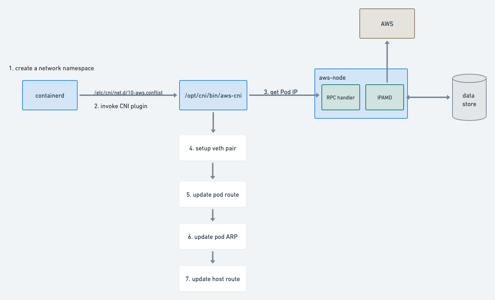

# aws-cni overview

I'll explain how aws-cni setups the container network from sourcecode 

- [How it works](#how-it-works)
  * [containerd](#containerd)
    + [create network namespace](#create-network-namespace)
    + [get CNI plugin](#get-cni-plugin)
    + [execute CNI plugin binary](#execute-cni-plugin-binary)
  * [aws-cni](#aws-cni)
    + [Elastic network interfaces](#elastic-network-interfaces)
    + [aws-cni bin](#aws-cni-bin)
    + [aws-node](#aws-node)
- [Packet flow](#packet-flow)


# How it works



## containerd

### create network namespace

[containerd](https://github.com/containerd/containerd/blob/main/pkg/cri/server/sandbox_run.go#L127)

it’s using [unshare](https://github.com/containerd/containerd/blob/main/pkg/netns/netns_linux.go#L53) system call to create network namespace

```go
go (func() {
		...
		err = unix.Unshare(unix.CLONE_NEWNET)
		if err != nil {
			return
		}
		..
		err = unix.Mount(getCurrentThreadNetNSPath(), nsPath, "none", unix.MS_BIND, "")
	})()
```

By default it will put file in `/var/run/netns/` , but docker is using `/var/run/docker/netns/` so you can’t see these ns with `ip netns` command. 

manually setup:

```bash
touch /var/run/netns/test
unshare --net=/var/run/netns/test

[root@ip-172-16-79-158 ec2-user]# ip netns ls
test
```

After network ns is created, CRI will complete sandbox object and [call CNI to setup network.](https://github.com/containerd/containerd/blob/main/pkg/cri/server/sandbox_run.go#L166)

```go
sandbox := sandboxstore.NewSandbox(
		sandboxstore.Metadata{
			ID:             id,
			Name:           name,
			Config:         config,
			RuntimeHandler: r.GetRuntimeHandler(),
		}
	)

...
sandbox.NetNS, err = netns.NewNetNS(netnsMountDir)
sandbox.NetNSPath = sandbox.NetNS.GetPath()

if err := c.setupPodNetwork(ctx, &sandbox); err != nil {
			return nil, fmt.Errorf("failed to setup network for sandbox %q: %w", id, err)
}
```

### get CNI plugin

It needs to [get a CNI plugin](https://github.com/containerd/containerd/blob/main/pkg/cri/server/sandbox_run.go#L367) first,

```go
func (c *criService) setupPodNetwork(ctx context.Context, sandbox *sandboxstore.Sandbox) error {
	var (
		id        = sandbox.ID
		config    = sandbox.Config
		path      = sandbox.NetNSPath
		netPlugin = c.getNetworkPlugin(sandbox.RuntimeHandler)
	)
	if netPlugin == nil {
		return errors.New("cni config not initialized")
	}
...
result, err := netPlugin.Setup(ctx, id, path, opts...)
...
}
```

containerd [loads CNI configs](https://github.com/containerd/containerd/blob/main/pkg/cri/server/service_linux.go#L62) when startup, default directory is `/etc/cni/net.d/` .

```go
	c.netPlugin = make(map[string]cni.CNI)
	for name, dir := range pluginDirs {
		max := c.config.NetworkPluginMaxConfNum
		if name != defaultNetworkPlugin {
			if m := c.config.Runtimes[name].NetworkPluginMaxConfNum; m != 0 {
				max = m
			}
		}
		i, err := cni.New(cni.WithMinNetworkCount(networkAttachCount),
			cni.WithPluginConfDir(dir),
			cni.WithPluginMaxConfNum(max),
			cni.WithPluginDir([]string{c.config.NetworkPluginBinDir}))
		if err != nil {
			return fmt.Errorf("failed to initialize cni: %w", err)
		}
		c.netPlugin[name] = i
	}
```

### execute CNI plugin binary

containerd uses [go-cni](https://github.com/containerd/containerd/tree/main/vendor/github.com/containerd/go-cni) to wrap CNI plugin.

```go
func (c *libcni) Setup(ctx context.Context, id string, path string, opts ...NamespaceOpts) (*Result, error) {
	if err := c.Status(); err != nil {
		return nil, err
	}
// it creates a namespace object not the actual linux namespace which is already created by containerd
	ns, err := newNamespace(id, path, opts...)
	if err != nil {
		return nil, err
	}
	result, err := c.attachNetworks(ctx, ns)
	if err != nil {
		return nil, err
	}
	return c.createResult(result)
}
```

eventually it invokes the actual [CNI plugin binary](https://github.com/containernetworking/cni/blob/master/pkg/invoke/raw_exec.go#L37).

```go
func (e *RawExec) ExecPlugin(ctx context.Context, pluginPath string, stdinData []byte, environ []string) ([]byte, error) {
	stdout := &bytes.Buffer{}
	stderr := &bytes.Buffer{}
	c := exec.CommandContext(ctx, pluginPath)
	...
	return stdout.Bytes(), nil
}
```

You can’t run cni binary to setup network directly, CNI provides [a CLI](https://github.com/containernetworking/cni/tree/master/cnitool) to execute manually. 

```bash
CNI_PATH=/opt/cni/bin cnitool add aws-cni /var/run/netns/test
```

## aws-cni

[Pod networking (CNI)](https://docs.aws.amazon.com/eks/latest/userguide/pod-networking.html)

### [Elastic network interfaces](https://docs.aws.amazon.com/AWSEC2/latest/UserGuide/using-eni.html)

network interfaces are actually Linux virtual NIC on the hypervisor. there are many ways to achieve, here’s an example of VLAN. 

```bash
DEVICE=eth0.510
BOOTPROTO=static
ONBOOT=yes
IPADDR=10.0.10.50
NETMASK=255.255.255.0
USERCTL=no
NETWORK=10.0.10.0
GATEWAY=10.0.10.254
VLAN=yes
```

see more about [VM](https://en.wikipedia.org/wiki/Kernel-based_Virtual_Machine).

see more about [datacenter network](https://www.oreilly.com/library/view/bgp-in-the/9781491983416/ch01.html).

> In [EC2-VPC](http://docs.aws.amazon.com/AWSEC2/latest/UserGuide/MultipleIP.html), each instance can have multiple elastic network interfaces (ENI) and each ENI can have multiple IPv4 or IPv6 addresses. Any packet which is destined to one of these addresses, EC2-VPC fabric will deliver the packet to the instance.
> 
- multiple ENI means multiple VNIC on hypervisor
- multiple addresses means adding routing rules for each ENI

**How many addresses are available?**

> Based on the instance type ([Limit](http://docs.aws.amazon.com/AWSEC2/latest/UserGuide/using-eni.html#AvailableIpPerENI)), each instance can have up to N ENIs and M addresses.
> 

Max IPs = min((N * M - N), subnet's free IP)

In case of our general nodes(m5a.8xlarge), maximum is  `8*30 - 8  = 232`  per node.

### aws-cni bin

[amazon-vpc-cni-k8s/cni.go at master · aws/amazon-vpc-cni-k8s](https://github.com/aws/amazon-vpc-cni-k8s/blob/master/cmd/routed-eni-cni-plugin/cni.go)

It provides two functions [add](https://github.com/aws/amazon-vpc-cni-k8s/blob/master/cmd/routed-eni-cni-plugin/cni.go#L114) and [del](https://github.com/aws/amazon-vpc-cni-k8s/blob/master/cmd/routed-eni-cni-plugin/cni.go#L269) to add or delete network for a pod.

**how add works**

1. get IP from IPAMD by grpc
    
    ```go
    // Set up a connection to the ipamD server.
    	conn, err := grpcClient.Dial(ipamdAddress, grpc.WithInsecure())
    	if err != nil {
    		log.Errorf("Failed to connect to backend server for container %s: %v",
    			args.ContainerID, err)
    		return errors.Wrap(err, "add cmd: failed to connect to backend server")
    	}
    	defer conn.Close()
    
    	c := rpcClient.NewCNIBackendClient(conn)
    
    	r, err := c.AddNetwork(context.Background(),
    		&pb.AddNetworkRequest{
    			ClientVersion:              version,
    			K8S_POD_NAME:               string(k8sArgs.K8S_POD_NAME),
    			K8S_POD_NAMESPACE:          string(k8sArgs.K8S_POD_NAMESPACE),
    			K8S_POD_INFRA_CONTAINER_ID: string(k8sArgs.K8S_POD_INFRA_CONTAINER_ID),
    			Netns:                      args.Netns,
    			ContainerID:                args.ContainerID,
    			NetworkName:                conf.Name,
    			IfName:                     args.IfName,
    		})
    ```
    
2. invoke [driver](https://github.com/aws/amazon-vpc-cni-k8s/blob/master/cmd/routed-eni-cni-plugin/driver/driver.go) to setup network
    
    ```go
    if r.PodVlanId != 0 {
    		hostVethName = generateHostVethName("vlan", string(k8sArgs.K8S_POD_NAMESPACE), string(k8sArgs.K8S_POD_NAME))
    
    		err = driverClient.SetupPodENINetwork(hostVethName, args.IfName, args.Netns, v4Addr, v6Addr, int(r.PodVlanId), r.PodENIMAC,
    			r.PodENISubnetGW, int(r.ParentIfIndex), mtu, log)
    	} else {
    		// build hostVethName
    		// Note: the maximum length for linux interface name is 15
    		hostVethName = generateHostVethName(conf.VethPrefix, string(k8sArgs.K8S_POD_NAMESPACE), string(k8sArgs.K8S_POD_NAME))
    
    		err = driverClient.SetupNS(hostVethName, args.IfName, args.Netns, v4Addr, v6Addr, int(r.DeviceNumber), r.VPCv4CIDRs, r.UseExternalSNAT, mtu, log)
    	}
    ```
    
    `PodVlanId` is used for network policy which is from pod annotation.
    
    ```go
    		val, branch := pod.Annotations["vpc.amazonaws.com/pod-eni"]
    		if branch {
    			// Parse JSON data
    			var podENIData []PodENIData
    			err := json.Unmarshal([]byte(val), &podENIData)
    			if err != nil || len(podENIData) < 1 {
    				log.Errorf("Failed to unmarshal PodENIData JSON: %v", err)
    			}
    			return &rpc.DelNetworkReply{
    				Success:   true,
    				PodVlanId: int32(podENIData[0].VlanID),
    				IPv4Addr:  podENIData[0].PrivateIP}, err
    		}
    ```
    
3. we are not using network policy, so [SetupNS](https://github.com/aws/amazon-vpc-cni-k8s/blob/master/cmd/routed-eni-cni-plugin/driver/driver.go#L271) is invoked.
    
    **Pod namespace**
    
    1. setup [veth pair](https://github.com/aws/amazon-vpc-cni-k8s/blob/master/cmd/routed-eni-cni-plugin/driver/driver.go#L348), similar with [this](https://www.notion.so/CNI-4128a96f89dc4267aa7e5b9fd9438605)
        
        This function works in pod network namespace.
        
        ```go
        func (createVethContext *createVethPairContext) run(hostNS ns.NetNS) error {
        	veth := &netlink.Veth{
        		LinkAttrs: netlink.LinkAttrs{
        			Name:  createVethContext.contVethName,
        			Flags: net.FlagUp,
        			MTU:   createVethContext.mtu,
        		},
        		PeerName: createVethContext.hostVethName,
        	}
        
        	if err := createVethContext.netLink.LinkAdd(veth); err != nil {
        		return err
        	}
        	...
        	if err = createVethContext.netLink.LinkSetUp(contVeth); err != nil {
        		return errors.Wrapf(err, "setup NS network: failed to set link %q up", createVethContext.contVethName)
        	}
        ...
        }
        ```
        
    2. add default route inside pod namespace.
        
        ```go
        // Add a default route via dummy next hop(169.254.1.1 or fe80::1). Then all outgoing traffic will be routed by this
        	// default route via dummy next hop (169.254.1.1 or fe80::1)
        	if err = createVethContext.netLink.RouteAdd(&netlink.Route{
        		LinkIndex: contVeth.Attrs().Index,
        		Scope:     netlink.SCOPE_UNIVERSE,
        		Dst:       defNet,
        		Gw:        gw,
        	}); err != nil {
        		return errors.Wrap(err, "setup NS network: failed to add default route")
        	}
        ```
        
        you can see inside pod
        
        ```bash
        [root@ip-172-16-70-154 ec2-user]# ip r
        default via 169.254.1.1 dev eth0
        169.254.1.1 dev eth0 scope link
        ```
        
    3. add IP
        
        ```go
        if err = createVethContext.netLink.AddrAdd(contVeth, addr); err != nil {
        		return errors.Wrapf(err, "setup NS network: failed to add IP addr to %q", createVethContext.contVethName)
        	}
        ```
        
        ```bash
        # ip a
        1: lo: <LOOPBACK,UP,LOWER_UP> mtu 65536 qdisc noqueue state UNKNOWN group default qlen 1000
            link/loopback 00:00:00:00:00:00 brd 00:00:00:00:00:00
            inet 127.0.0.1/8 scope host lo
               valid_lft forever preferred_lft forever
        3: eth0@if4: <BROADCAST,MULTICAST,UP,LOWER_UP> mtu 9001 qdisc noqueue state UP group default
            link/ether 7e:18:0d:b8:54:ff brd ff:ff:ff:ff:ff:ff link-netnsid 0
            inet 172.16.70.32/32 scope global eth0
               valid_lft forever preferred_lft forever
        ```
        
    4. update ARP for default gateway, `HardwareAddr` is the MAC of the other end of the veth pair
        
        ```go
        neigh := &netlink.Neigh{
        		LinkIndex:    contVeth.Attrs().Index,
        		State:        netlink.NUD_PERMANENT,
        		IP:           gwNet.IP,
        		HardwareAddr: hostVeth.Attrs().HardwareAddr,
        	}
        
        	if err = createVethContext.netLink.NeighAdd(neigh); err != nil {
        		return errors.Wrap(err, "setup NS network: failed to add static ARP")
        	}
        ```
        
        ```bash
        # Pod
        # ip nei
        169.254.1.1 dev eth0 lladdr aa:5a:d9:a2:6d:db PERMANENT
        # Host
        4: eni62d05cabd08@if3: <BROADCAST,MULTICAST,UP,LOWER_UP> mtu 9001 qdisc noqueue state UP group default
            link/ether aa:5a:d9:a2:6d:db brd ff:ff:ff:ff:ff:ff link-netnsid 1
            inet6 fe80::a85a:d9ff:fea2:6ddb/64 scope link
               valid_lft forever preferred_lft forever
        ```
        
    5. move one veth to host namespace
        
        ```go
        if err = createVethContext.netLink.LinkSetNsFd(hostVeth, int(hostNS.Fd())); err != nil {
        		return errors.Wrap(err, "setup NS network: failed to move veth to host netns")
        	}
        ```
        
    
    **Host namespace**
    
    [add route](https://github.com/aws/amazon-vpc-cni-k8s/blob/master/cmd/routed-eni-cni-plugin/driver/driver.go#L300)
    
    ```go
    func addContainerRule(netLink netlinkwrapper.NetLink, isToContainer bool, addr *net.IPNet, table int) error {
    	if addr == nil {
    		return errors.New("can't add container rules without an IP address")
    	}
    	containerRule := netLink.NewRule()
    	if isToContainer {
    		// Example: 512:	from all to 10.200.202.222 lookup main
    		containerRule.Dst = addr
    		containerRule.Priority = toContainerRulePriority
    	} else {
    		// Example: 1536:	from 10.200.202.222 to 10.200.0.0/16 lookup 2
    		containerRule.Src = addr
    		containerRule.Priority = fromContainerRulePriority
    	}
    	containerRule.Table = table
    
    	err := netLink.RuleDel(containerRule)
    	if err != nil && !containsNoSuchRule(err) {
    		return errors.Wrapf(err, "addContainerRule: failed to delete old container rule for %s", addr.String())
    	}
    
    	err = netLink.RuleAdd(containerRule)
    	if err != nil {
    		return errors.Wrapf(err, "addContainerRule: failed to add container rule for %s", addr.String())
    	}
    	return nil
    }
    ```
    

### aws-node

> Responsible for creating network interfaces and attaching the network interfaces to Amazon EC2 instances, assigning secondary IP addresses to network interfaces, and maintaining a warm pool of IP addresses on each node for assignment to Kubernetes pods when they are scheduled.
> 

Deployed as daemonset, see [configuration](https://github.com/aws/amazon-vpc-cni-k8s/blob/master/README.md#cni-configuration-variables)

```yaml
apiVersion: apps/v1
kind: DaemonSet
metadata:
	name: aws-node
  namespace: kube-system
...
spec:
		...
      containers:
      - env:
        - name: MINIMUM_IP_TARGET
          value: "15"
        - name: WARM_IP_TARGET
          value: "5"
...
```

Basically it has [two components](https://github.com/aws/amazon-vpc-cni-k8s/blob/master/cmd/aws-k8s-agent/main.go): 

```go
func _main() int {
	...
	ipamContext, err := ipamd.New(rawK8SClient, cacheK8SClient)
	// Pool manager
	go ipamContext.StartNodeIPPoolManager()
	...
	// Start the RPC listener
	err = ipamContext.RunRPCHandler(version.Version)
	...
}
```

[IPAMContext](https://github.com/aws/amazon-vpc-cni-k8s/blob/master/pkg/ipamd/ipamd.go#L230)

```go
type IPAMContext struct {
	// clients to access aws and k8s APIs
	awsClient            awsutils.APIs
	rawK8SClient         client.Client
	cachedK8SClient      client.Client
	// a storage to store IP
	dataStore            *datastore.DataStore
	...
	// configurations
	warmENITarget        int
	warmIPTarget         int
	enableManageUntaggedMode  bool
	enablePodIPAnnotation     bool
}
```

**[RPC handler](https://github.com/aws/amazon-vpc-cni-k8s/blob/master/pkg/ipamd/rpc_handler.go)**

A gRPC server to handle request from aws-cni bin.

```go
func (s *server) AddNetwork(ctx context.Context, in *rpc.AddNetworkRequest) (*rpc.AddNetworkReply, error) {
	...
	if s.ipamContext.enableIPv4 && ipv4Addr == "" ||
		s.ipamContext.enableIPv6 && ipv6Addr == "" {
		...
		ipamKey := datastore.IPAMKey{
			ContainerID: in.ContainerID,
			IfName:      in.IfName,
			NetworkName: in.NetworkName,
		}
		ipv4Addr, ipv6Addr, deviceNumber, err = s.ipamContext.dataStore.AssignPodIPAddress(ipamKey, s.ipamContext.enableIPv4, s.ipamContext.enableIPv6)
	}

	...
	if s.ipamContext.enableIPv4 && ipv4Addr != "" {
		pbVPCV4cidrs, err = s.ipamContext.awsClient.GetVPCIPv4CIDRs()
		if err != nil {
			return nil, err
		}
		...
		useExternalSNAT = s.ipamContext.networkClient.UseExternalSNAT()
		if !useExternalSNAT {
			for _, cidr := range s.ipamContext.networkClient.GetExcludeSNATCIDRs() {
				log.Debugf("CIDR SNAT Exclusion %s", cidr)
				pbVPCV4cidrs = append(pbVPCV4cidrs, cidr)
			}
		}
	} else if s.ipamContext.enableIPv6 && ipv6Addr != "" {
		...
	}

	...
	resp := rpc.AddNetworkReply{
		Success:         err == nil,
		IPv4Addr:        ipv4Addr,
		IPv6Addr:        ipv6Addr,
		DeviceNumber:    int32(deviceNumber),
		UseExternalSNAT: useExternalSNAT,
		VPCv4CIDRs:      pbVPCV4cidrs,
		VPCv6CIDRs:      pbVPCV6cidrs,
		PodVlanId:       int32(vlanID),
		PodENIMAC:       branchENIMAC,
		PodENISubnetGW:  podENISubnetGW,
		ParentIfIndex:   int32(trunkENILinkIndex),
	}
	...
}
```

**[NodeIPPoolManager](https://github.com/aws/amazon-vpc-cni-k8s/blob/master/pkg/ipamd/ipamd.go#L632)**

```go
func (c *IPAMContext) StartNodeIPPoolManager() {
	...
	for {
		// DISABLE_NETWORK_RESOURCE_PROVISIONING, default is false
		if !c.disableENIProvisioning {
			time.Sleep(sleepDuration)
			c.updateIPPoolIfRequired(ctx)
		}
		time.Sleep(sleepDuration)
		c.nodeIPPoolReconcile(ctx, nodeIPPoolReconcileInterval)
	}
}
```

- [Initialize datastore](https://github.com/aws/amazon-vpc-cni-k8s/blob/192f8472bd9524f739ef2b9d65d91a7ce3b04d09/pkg/ipamd/datastore/data_store.go#L336)
    
    ```go
    func New(rawK8SClient client.Client, cachedK8SClient client.Client) (*IPAMContext, error) {
    ...
    	checkpointer := datastore.NewJSONFile(dsBackingStorePath())
    	c.dataStore = datastore.NewDataStore(log, checkpointer, c.enablePrefixDelegation)
    ...
    }
    
    func NewDataStore(log logger.Logger, backingStore Checkpointer, isPDEnabled bool) *DataStore {
    	prometheusRegister()
    	return &DataStore{
    		eniPool:                  make(ENIPool),
    		log:                      log,
    		backingStore:             backingStore,
    		cri:                      cri.New(),
    		CheckpointMigrationPhase: checkpointMigrationPhase,
    		isPDEnabled:              isPDEnabled, // prefix enabled or not
    	}
    }
    ```
    
- [updateIPPoolIfRequired](https://github.com/aws/amazon-vpc-cni-k8s/blob/master/pkg/ipamd/ipamd.go#L650)
    - increase IP pool when it’s low
        1. check if need to increase
            
            ```go
            func (c *IPAMContext) isDatastorePoolTooLow() bool {
            	short, _, warmTargetDefined := c.datastoreTargetState()
            	if warmTargetDefined {
            		return short > 0
            	}
            	// there is no WARM_IP_TARGET defined and no MINIMUM_IP_TARGET
            	stats := c.dataStore.GetIPStats(ipV4AddrFamily)
            	available := stats.AvailableAddresses()
            
            	warmTarget := c.warmENITarget
            	totalIPs := c.maxIPsPerENI
            
            	if c.enablePrefixDelegation {
            		warmTarget = c.warmPrefixTarget
            		_, maxIpsPerPrefix, _ := datastore.GetPrefixDelegationDefaults()
            		totalIPs = maxIpsPerPrefix
            	}
            
            	poolTooLow := available < totalIPs*warmTarget || (warmTarget == 0 && available == 0)
            	...
            }
            ```
            
            - if [ENABLE_PREFIX_DELEGATION](https://github.com/aws/amazon-vpc-cni-k8s/blob/master/README.md#enable_prefix_delegation-v190)  is true
                
                 target = [WARM_PREFIX_TARGET](https://github.com/aws/amazon-vpc-cni-k8s/blob/master/README.md#warm_prefix_target-v190)   16  
                
                ```go
                func GetPrefixDelegationDefaults() (int, int, int) {
                	numPrefixesPerENI := 1
                	numIPsPerPrefix := 16
                	supportedPrefixLen := 28
                
                	return numPrefixesPerENI, numIPsPerPrefix, supportedPrefixLen
                }
                ```
                
            - if [ENABLE_PREFIX_DELEGATION](https://github.com/aws/amazon-vpc-cni-k8s/blob/master/README.md#enable_prefix_delegation-v190) is false
                
                target = maxIPsPerENI * `[WARM_ENI_TARGET](https://github.com/aws/amazon-vpc-cni-k8s/blob/master/README.md#warm_eni_target)`  
                
                ```go
                func (c *IPAMContext) GetIPv4Limit() (int, int, error) {
                	var maxIPsPerENI, maxPrefixesPerENI, maxIpsPerPrefix int
                	if !c.enablePrefixDelegation {
                		maxIPsPerENI = c.awsClient.GetENIIPv4Limit()
                		...
                }
                ```
                
        2. [increase IP pool](https://github.com/aws/amazon-vpc-cni-k8s/blob/192f8472bd9524f739ef2b9d65d91a7ce3b04d09/pkg/ipamd/ipamd.go#L756)
            
            ```go
            func (c *IPAMContext) increaseDatastorePool(ctx context.Context) {
            	...
            	short, _, warmIPTargetDefined := c.datastoreTargetState()
            	if warmIPTargetDefined && short == 0 {
            		log.Debugf("Skipping increase Datastore pool, warm target reached")
            		return
            	}
            
            	if !warmIPTargetDefined {
            		shortPrefix, warmTargetDefined := c.datastorePrefixTargetState()
            		if warmTargetDefined && shortPrefix == 0 {
            			log.Debugf("Skipping increase Datastore pool, warm prefix target reached")
            			return
            		}
            	}
            	...
            }
            ```
            
            - [decide how many new IP to add](https://github.com/aws/amazon-vpc-cni-k8s/blob/192f8472bd9524f739ef2b9d65d91a7ce3b04d09/pkg/ipamd/ipamd.go#L1727)
                
                ```go
                func (c *IPAMContext) datastoreTargetState() (short int, over int, enabled bool) {
                
                	if c.warmIPTarget == noWarmIPTarget && c.minimumIPTarget == noMinimumIPTarget {
                		return 0, 0, false
                	}
                ...
                }
                
                ```
                
                if [WARM_IP_TARGET](https://github.com/aws/amazon-vpc-cni-k8s/blob/master/README.md#warm_ip_target) and [MINIMUM_IP_TARGET](https://github.com/aws/amazon-vpc-cni-k8s/blob/master/README.md#minimum_ip_target-v160) are both 0 (which is default value), 
                
                ```go
                func (c *IPAMContext) datastorePrefixTargetState() (short int, enabled bool) {
                	if !c.warmPrefixTargetDefined() {
                		return 0, false
                	}
                	// /28 will consume 16 IPs so let's not allocate if not needed.
                	freePrefixesInStore := c.dataStore.GetFreePrefixes()
                	toAllocate := max(c.warmPrefixTarget-freePrefixesInStore, 0)
                	log.Debugf("Prefix target is %d, short of %d prefixes, free %d prefixes", c.warmPrefixTarget, toAllocate, freePrefixesInStore)
                
                	return toAllocate, true
                }
                
                func (c *IPAMContext) warmPrefixTargetDefined() bool {
                	return c.warmPrefixTarget >= defaultWarmPrefixTarget && c.enablePrefixDelegation
                }
                ```
                
                - if [ENABLE_PREFIX_DELEGATION](https://github.com/aws/amazon-vpc-cni-k8s/blob/master/README.md#enable_prefix_delegation-v190) is false, skip increasing
                - if [ENABLE_PREFIX_DELEGATION](https://github.com/aws/amazon-vpc-cni-k8s/blob/master/README.md#enable_prefix_delegation-v190) is true,  return diff between [WARM_PREFIX_TARGET](https://github.com/aws/amazon-vpc-cni-k8s/blob/master/README.md#warm_prefix_target-v190) and free prefixes
                - if [ENABLE_PREFIX_DELEGATION](https://github.com/aws/amazon-vpc-cni-k8s/blob/master/README.md#enable_prefix_delegation-v190) is false
                    
                    ```go
                    	stats := c.dataStore.GetIPStats(ipV4AddrFamily)
                    	available := stats.AvailableAddresses() //stats.TotalIPs - stats.AssignedIPs
                    
                    	short = max(c.warmIPTarget-available, 0)
                    	short = max(short, c.minimumIPTarget-stats.TotalIPs)
                    ```
                    
                    Initial pool size is the larger one of [WARM_IP_TARGET](https://github.com/aws/amazon-vpc-cni-k8s/blob/master/README.md#warm_ip_target)  and [MINIMUM_IP_TARGET](https://github.com/aws/amazon-vpc-cni-k8s/blob/master/README.md#minimum_ip_target-v160) , [WARM_IP_TARGET](https://github.com/aws/amazon-vpc-cni-k8s/blob/master/README.md#warm_ip_target) determines how many new to add when there’s no available IP in pool. 
                    
                - if [ENABLE_PREFIX_DELEGATION](https://github.com/aws/amazon-vpc-cni-k8s/blob/master/README.md#enable_prefix_delegation-v190) is true
                    
                    ```go
                    if c.enablePrefixDelegation {
                    		_, numIPsPerPrefix, _ := datastore.GetPrefixDelegationDefaults() // 16
                    		shortPrefix := datastore.DivCeil(short, numIPsPerPrefix) //(x + y - 1) / y
                    		...
                    		return shortPrefix, overPrefix, true
                    	}
                    ```
                    
                    it’s using /28 prefix (15 IPs)
                    
            - [assign new IP](https://github.com/aws/amazon-vpc-cni-k8s/blob/192f8472bd9524f739ef2b9d65d91a7ce3b04d09/pkg/ipamd/ipamd.go#L885)
                
                ```go
                func (c *IPAMContext) tryAssignCidrs() (increasedPool bool, err error) {
                	// get latest data everytime
                	short, _, warmIPTargetDefined := c.datastoreTargetState()
                	...
                
                	if !c.enablePrefixDelegation {
                		return c.tryAssignIPs()
                	} else {
                		return c.tryAssignPrefixes()
                	}
                }
                ```
                
                1. find an ENI
                2. call [aws api](https://docs.aws.amazon.com/AWSEC2/latest/APIReference/API_AssignPrivateIpAddresses.html) to allocate IP or IP prefix
                    
                    ```go
                    if cache.enablePrefixDelegation {
                    		needPrefixes := needIPs
                    		input = &ec2.AssignPrivateIpAddressesInput{
                    			NetworkInterfaceId: aws.String(eniID),
                    			Ipv4PrefixCount:    aws.Int64(int64(needPrefixes)),
                    		}
                    
                    	} else {
                    		input = &ec2.AssignPrivateIpAddressesInput{
                    			NetworkInterfaceId:             aws.String(eniID),
                    			SecondaryPrivateIpAddressCount: aws.Int64(int64(needIPs)),
                    		}
                    	}
                    ```
                    
                3. update datastore with new IP or IP prefix
                    
                    ```go
                    	ec2Addrs, err := c.awsClient.GetIPv4sFromEC2(eni.ID)
                    		if err != nil {
                    			ipamdErrInc("increaseIPPoolGetENIaddressesFailed")
                    			return true, errors.Wrap(err, "failed to get ENI IP addresses during IP allocation")
                    		}
                    
                    		c.addENIsecondaryIPsToDataStore(ec2Addrs, eni.ID)
                    ```
                    
    - decrease IP pool when it’s high
        
        it happens when there are too many available IPs.
        
        ```go
        	over = max(available-c.warmIPTarget, 0)
        	over = max(min(over, stats.TotalIPs-c.minimumIPTarget), 0)
        ```
        
    - [remove unnecessary ENI](https://github.com/aws/amazon-vpc-cni-k8s/blob/master/pkg/ipamd/ipamd.go#L658)
- [nodeIPPoolReconcile](https://github.com/aws/amazon-vpc-cni-k8s/blob/192f8472bd9524f739ef2b9d65d91a7ce3b04d09/pkg/ipamd/ipamd.go#L1262)
    
    reconcile  ENI and IP information from ec2 node metadata
    
    ```go
    // reconcile ENI
    func (c *IPAMContext) nodeIPPoolReconcile(ctx context.Context, interval time.Duration) {
    	...
    	allENIs, err := c.awsClient.GetAttachedENIs()
    	...
    	attachedENIs := c.filterUnmanagedENIs(allENIs)
    	currentENIs := c.dataStore.GetENIInfos().ENIs
    	trunkENI := c.dataStore.GetTrunkENI()
    	// Initialize the set with the known EFA interfaces
    	efaENIs := c.dataStore.GetEFAENIs()
    	...
    	for _, attachedENI := range attachedENIs {
    		...
    
    		// Add new ENI
    		log.Debugf("Reconcile and add a new ENI %s", attachedENI)
    		err = c.setupENI(attachedENI.ENIID, attachedENI, isTrunkENI, isEFAENI)
    		...
    	}
    	...
    }
    
    // reconcile IP
    func (c *IPAMContext) eniIPPoolReconcile(ipPool []string, attachedENI awsutils.ENIMetadata, eni string) {
    		...
    		ec2Addresses, err := c.awsClient.GetIPv4sFromEC2(eni)
    		...
    		err := c.dataStore.DelIPv4CidrFromStore(eni, ipv4Addr, true /* force */)
    		...
    }
    
    // reconcile IP prefix
    func (c *IPAMContext) eniPrefixPoolReconcile(ipPool []string, attachedENI awsutils.ENIMetadata, eni string) {
    		...
    		ec2Addresses, err := c.awsClient.GetIPv4PrefixesFromEC2(eni)
    		...
    		err = c.dataStore.DelIPv4CidrFromStore(eni, *ipv4Cidr, true /* force */)
    		...
    }
    ```
    

**[CNI Request](https://github.com/aws/amazon-vpc-cni-k8s/blob/192f8472bd9524f739ef2b9d65d91a7ce3b04d09/pkg/ipamd/datastore/data_store.go#L684)**

- add
    
    ```go
    ipv4Addr, ipv6Addr, deviceNumber, err = s.ipamContext.dataStore.AssignPodIPAddress(ipamKey, s.ipamContext.enableIPv4, s.ipamContext.enableIPv6)
    ```
    
    gPRC handler just gets IP from [datastore](https://github.com/aws/amazon-vpc-cni-k8s/blob/192f8472bd9524f739ef2b9d65d91a7ce3b04d09/pkg/ipamd/datastore/data_store.go#L743)
    
    ```go
    func (ds *DataStore) AssignPodIPv4Address(ipamKey IPAMKey) (ipv4address string, deviceNumber int, err error) {
    	// ds is global, always lock before any operation
    	ds.lock.Lock()
    	defer ds.lock.Unlock()
    	...
    	// check ENI one by one, return if avaiable IP is found
    	for _, eni := range ds.eniPool {
    		for _, availableCidr := range eni.AvailableIPv4Cidrs {
    			...
    			addr = availableCidr.IPAddresses[strPrivateIPv4]
    			...
    			return addr.Address, eni.DeviceNumber, nil
    		}
    	}
    }
    ```
    
- delete
    
    ```go
    func (s *server) DelNetwork(ctx context.Context, in *rpc.DelNetworkRequest) (*rpc.DelNetworkReply, error) {
    	...
    	eni, ip, deviceNumber, err := s.ipamContext.dataStore.UnassignPodIPAddress(ipamKey)
    	...
    }
    
    func (ds *DataStore) UnassignPodIPAddress(ipamKey IPAMKey) (e *ENI, ip string, deviceNumber int, err error) {
    	...
    	// find eni and ip
    	eni, availableCidr, addr := ds.eniPool.FindAddressForSandbox(ipamKey)
    	...
    	// remove from datastore
    	ds.unassignPodIPAddressUnsafe(addr)
    	...
    }
    ```
    

both Add and Del are just updating datastore, there’s no aws API call.

# Packet flow

- https://etude01.com/asymmetric-routing/
- https://github.com/aws/amazon-vpc-cni-k8s/blob/master/docs/cni-proposal.md#solution-components)
