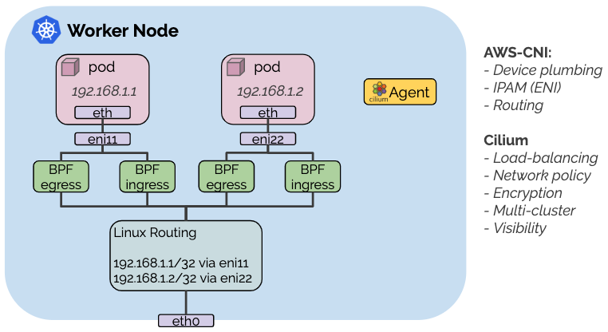
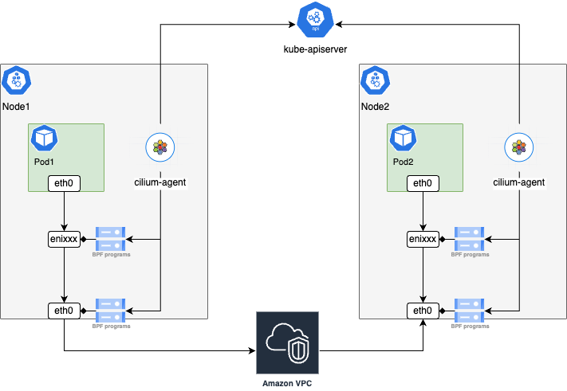
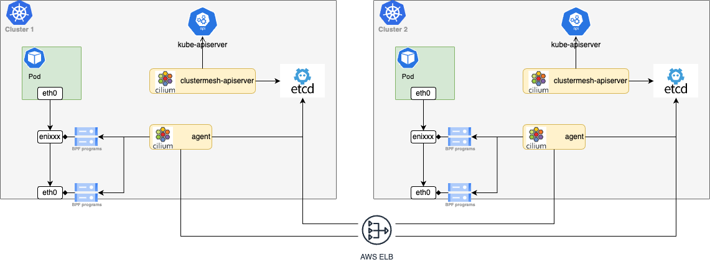

# Cilium Deep Dive
- [Architecture](#architecture)
   * [cilium-operator](#cilium-operator)
      + [Initialize command](#initialize-command)
      + [Start the operator](#start-the-operator)
   * [clustermesh-apiserver](#clustermesh-apiserver)
      + [Setup](#setup)
      + [Responsibility](#responsibility)
   * [cilium-agent](#cilium-agent)
      + [Setup](#setup-1)
      + [Agent Start](#agent-start)
- [Pod networking](#pod-networking)
   * [aws-cni](#aws-cni)
   * [Datapath](#datapath)
      + [Inside the pod](#inside-the-pod)
      + [On the host](#on-the-host)
- [k8s Service balancing (kube-proxy replacement)](#k8s-service-balancing-kube-proxy-replacement)
   * [Datapath](#datapath-1)
      + [TX](#tx)
      + [RX](#rx)
   * [BPF map operation](#bpf-map-operation)
      + [Init maps](#init-maps)
      + [Sync maps with k8s resources](#sync-maps-with-k8s-resources)
   * [Troubleshooting](#troubleshooting)
- [Clustermesh](#clustermesh)
   * [clustermesh-apiserver](#clustermesh-apiserver-1)
   * [cilium-agent](#cilium-agent-1)
      + [Initialize ClusterMesh](#initialize-clustermesh)
      + [Watch config changes](#watch-config-changes)
      + [Connect to the etcd services](#connect-to-the-etcd-services)
      + [Watch remote resources](#watch-remote-resources)
      + [Sync to service cache](#sync-to-service-cache)
- [External etcd consideration](#external-etcd-consideration)
   * [kvstoremesh-operator](#kvstoremesh-operator)
   * [cilium-agent](#cilium-agent-2)
- [Reference](#reference)
# Architecture

```bash
$ cilium status
    /¯¯\
 /¯¯\__/¯¯\    Cilium:             OK
 \__/¯¯\__/    Operator:           OK
 /¯¯\__/¯¯\    Envoy DaemonSet:    disabled (using embedded mode)
 \__/¯¯\__/    Hubble Relay:       disabled
    \__/       ClusterMesh:        OK

Deployment        cilium-operator          Desired: 2, Ready: 2/2, Available: 2/2
DaemonSet         cilium                   Desired: 2, Ready: 2/2, Available: 2/2
Deployment        clustermesh-apiserver    Desired: 1, Ready: 1/1, Available: 1/1
```

## cilium-operator

### Initialize command

```go
func main() {
	operatorHive := hive.New(cmd.Operator)

	cmd.Execute(cmd.NewOperatorCmd(operatorHive))
}
```

Cilium is using cobra and a framework called [hive](https://docs.cilium.io/en/latest/contributing/development/hive/) to initialize configurations.

The config is through a configmap which are used by all cilium components .

```yaml
╰─ k get cm -n kube-system cilium-config -o yaml

apiVersion: v1
data:
  agent-not-ready-taint-key: node.cilium.io/agent-not-ready
  arping-refresh-period: 30s
  ...
```

The `[option](https://github.com/cilium/cilium/blob/main/pkg/option/config.go#L4082)` object is [created](https://github.com/cilium/cilium/blob/main/operator/cmd/root.go#L174) to store the config

```go
func NewOperatorCmd(h *hive.Hive) *cobra.Command {
	...

	cobra.OnInitialize(option.InitConfig(cmd, "Cilium-Operator", "cilium-operators", h.Viper()))

	return cmd
}
```

### Start the operator

It’s using client-go leader election for [HA](https://github.com/cilium/cilium/blob/main/operator/cmd/root.go#L271).

```bash
╰─ k get lease cilium-operator-resource-lock -n kube-system
NAME                            HOLDER                                                       AGE
cilium-operator-resource-lock   ip-10-3-116-232.ap-northeast-1.compute.internal-JiNhCkOAFs   88d
```

`[OnStart](https://github.com/cilium/cilium/blob/main/operator/cmd/root.go#L412)` is the function called once the operator starts leading.

- Start EndpointSlice controller if `enable-cilium-endpoint-slice` is enabled
    
    > In most cases, [this](https://docs.cilium.io/en/latest/network/kubernetes/ciliumendpointslice/) reduces load on the control plane and can sustain larger-scaled cluster using the same master resource.
    > 
    
    But it’s [disabled](https://github.com/cilium/cilium/blob/main/install/kubernetes/cilium/values.yaml#L675) by default
    
    ```yaml
    # -- Enable CiliumEndpointSlice feature.
    enableCiliumEndpointSlice: false
    ```
    
- IPAM
    
    It is disabled since we are using aws-cni for pod networking.
    
- [External etcd](https://docs.cilium.io/en/latest/installation/k8s-install-external-etcd/) operations
    - [Sync cilium](https://github.com/cilium/cilium/blob/main/operator/cmd/root.go#L506)  [shared k8s services](https://github.com/cilium/cilium/blob/main/pkg/k8s/service.go#L44) to the external etcd.
        
        ```go
        if legacy.clientset.IsEnabled() && operatorOption.Config.SyncK8sServices {
        			operatorWatchers.StartSynchronizingServices(legacy.ctx, &legacy.wg, operatorWatchers.ServiceSyncParameters{
        				ServiceSyncConfiguration: option.Config,
        
        				Clientset:  legacy.clientset,
        				Services:   legacy.resources.Services,
        				Endpoints:  legacy.resources.Endpoints,
        				SharedOnly: true,
        			})
        	...
        }
        ```
        
        The clustermesh feature requires this setting and is [enabled](https://github.com/cilium/cilium/blob/main/operator/cmd/flags.go#L253) by default.
        
    - [Sync k8s nodes](https://github.com/cilium/cilium/blob/main/operator/cmd/root.go#L610)
        
        It’s only used for ENI mode
        
    - Heartbeat with the external etcd
        
        [It updates heartbeat key](https://github.com/cilium/cilium/blob/main/operator/cmd/root.go#L591) every minute
        
        ```go
        go func() {
        		hbTimer, hbTimerDone := inctimer.New()
        		defer hbTimerDone()
        		for {
        			ctx, cancel := context.WithTimeout(context.Background(), defaults.LockLeaseTTL)
        			err := kvstore.Client().Update(ctx, kvstore.HeartbeatPath, []byte(time.Now().Format(time.RFC3339)), true)
        			if err != nil {
        				log.WithError(err).Warning("Unable to update heartbeat key")
        			}
        			cancel()
        			<-hbTimer.After(kvstore.HeartbeatWriteInterval)
        		}
        	}()
        ```
        
    - Garbage collection
        
        Cleanup unused objects in the external etcd
        
- Network policy operation
    
    We’re not using it
    
- CiliumEndpoint GC
    
    It [deletes](https://github.com/cilium/cilium/blob/main/operator/cmd/k8s_cep_gc.go#L36) the CiliumEndpoint objects if the corresponding pod does not exist 
    
- Run ingress controller if it’s enabled
    
    We’re using [AWS Load Balancer Controller](https://www.notion.so/AWS-Load-Balancer-Controller-ca65c9cddc1a49db9b52391172621870?pvs=21) 
    
- Run gateway API controller if it’s enabled
    
    It provides the [Gateway API feature](https://cilium.io/use-cases/gateway-api/)  ********but we are not using
    
- Run Envoy lb controller if it’s enabled
    
    We’re not using it
    

<aside>
💡 Especially in Dev clusters, we’re not using most of its features. Even it’s down there should be no impact at all.

</aside>

## clustermesh-apiserver

### Setup

- containers
    
    It has 3 containers
    
    - etcd-init
        
        It initializes the etcd configurations.
        
        ```yaml
        initContainers:
              - args:
                - |
                  rm -rf /var/run/etcd/*;
                  /usr/local/bin/etcd --data-dir=/var/run/etcd --name=clustermesh-apiserver --listen-client-urls=http://127.0.0.1:2379 --advertise-client-urls=http://127.0.0.1:2379 --initial-cluster-token=clustermesh-apiserver --initial-cluster-state=new --auto-compaction-retention=1 &
                  export rootpw=`head /dev/urandom | tr -dc A-Za-z0-9 | head -c 16`;
                  echo $rootpw | etcdctl --interactive=false user add root;
                  etcdctl user grant-role root root;
                  ...
                  exit
                command:
                - /bin/sh
                - -c
                name: etcd-init
        ```
        
    - etcd
        
        The program runs an etcd server that is exposed on port `2379`.
        
        ```yaml
        containers:
              - args:
                - --data-dir=/var/run/etcd
                - --name=clustermesh-apiserver
                - --client-cert-auth
                - --trusted-ca-file=/var/lib/etcd-secrets/ca.crt
                - --cert-file=/var/lib/etcd-secrets/tls.crt
                - --key-file=/var/lib/etcd-secrets/tls.key
                - --listen-client-urls=https://127.0.0.1:2379,https://[$(HOSTNAME_IP)]:2379
                - --advertise-client-urls=https://[$(HOSTNAME_IP)]:2379
                - --initial-cluster-token=clustermesh-apiserver
                - --auto-compaction-retention=1
                command:
                - /usr/local/bin/etcd
                name: etcd
        ```
        
        <aside>
        💡 [cilium external etcd setup](https://docs.cilium.io/en/latest/installation/k8s-install-external-etcd/) is for cilium-agent, clustermesh-apiserver is always using a sidecar etcd.
        
        </aside>
        
    - clustermesh-apiserver
        
        The settings used are in the cilium-config configmap.
        
        ```yaml
        cluster-id: '1'
        cluster-name: xxx
        identity-allocation-mode: crd
        ```
        
- k8s service
    
    It exposes the etcd endpoint through aws-lb.
    
    ```bash
    ╰─ k get svc clustermesh-apiserver
    
    NAME                    TYPE           CLUSTER-IP            EXTERNAL-IP                                                                          PORT(S)          AGE
    clustermesh-apiserver   LoadBalancer   fd8b:bab:fcd3::f676   xxx.elb.ap-northeast-1.amazonaws.com   2379:32491/TCP   81d
    ```
    

### Responsibility

It [synchronize](https://github.com/cilium/cilium/blob/main/clustermesh-apiserver/main.go#L565) CiliumIdentities, CiliumEndpoints, CiliumNodes and Kubernetes services from k8s datastore to etcd.

```go
func startServer(startCtx hive.HookContext, clientset k8sClient.Clientset, backend kvstore.BackendOperations, resources apiserverK8s.Resources) {
	...
	if mockFile != "" {
		if err := readMockFile(ctx, mockFile, backend); err != nil {
			log.WithError(err).Fatal("Unable to read mock file")
		}
	} else {
		go synchronize(ctx, resources.CiliumIdentities, newIdentitySynchronizer(ctx, backend))
		go synchronize(ctx, resources.CiliumNodes, newNodeSynchronizer(ctx, backend))
		go synchronize(ctx, resources.CiliumSlimEndpoints, newEndpointSynchronizer(ctx, backend))
		operatorWatchers.StartSynchronizingServices(ctx, &sync.WaitGroup{}, operatorWatchers.ServiceSyncParameters{
			ServiceSyncConfiguration: cfg,
			Clientset:                clientset,
			Services:                 resources.Services,
			Endpoints:                resources.Endpoints,
			Backend:                  backend,
			SharedOnly:               !cfg.enableExternalWorkloads,
		})
	}
	log.Info("Initialization complete")
}
```

```bash
level=info msg="Upserting endpoint in etcd" endpoint=kube-system/coredns-probe-1b-b ipAddr="2406:da14:2:7716:a5ff::4" subsys=clustermesh-apiserver
level=info msg="Upserting endpoint in etcd" endpoint=kube-system/coredns-probe-1b-a ipAddr="2406:da14:2:7716:a5ff::3" subsys=clustermesh-apiserver
level=info msg="Deleting endpoint from etcd" endpoint=kube-system/coredns-probe-1b-a ipAddr="2406:da14:2:7716:a5ff::3" subsys=clustermesh-apiserver
level=info msg="Deleting endpoint from etcd" endpoint=kube-system/coredns-probe-1b-b ipAddr="2406:da14:2:7716:a5ff::4" subsys=clustermesh-apiserver
level=info msg="Upserting identity in etcd" identity=91697 subsys=clustermesh-apiserver
```

- CiliumIdentities are used for network policy
- CiliumNodes are used for ENI networking mode
- CiliumSlimEndpoints are only available when `enable-cilium-endpoint-slice` is enabled

So we only care about [shared k8s services](https://github.com/cilium/cilium/blob/main/pkg/k8s/service.go#L44)

```go
func StartSynchronizingServices(ctx context.Context, wg *sync.WaitGroup, cfg ServiceSyncParameters) {
	...

	// Start synchronizing ServiceCache to kvstore
	wg.Add(1)
	go func() {
		defer wg.Done()

		// Wait for kvstore
		<-kvstoreReady

		log.Info("Starting to synchronize Kubernetes services to kvstore")
		k8sServiceHandler(ctx, cfg.LocalClusterName(), cfg.SharedOnly, cfg.LocalClusterID())
	}()
}

func k8sServiceHandler(ctx context.Context, clusterName string, shared bool, clusterID uint32) {
	serviceHandler := func(event k8s.ServiceEvent) {
		defer event.SWG.Done()

		svc := k8s.NewClusterService(event.ID, event.Service, event.Endpoints)
		svc.Cluster = clusterName
		svc.ClusterID = clusterID
		...
		if shared && !event.Service.Shared {
			// The annotation may have been added, delete an eventual existing service
			kvs.DeleteKey(ctx, &svc)
			return
		}
		...
}
```

<aside>
💡 The name is a little confusing, clustermesh-apiserver actually doesn’t provide api service. cilium-agent operates the etcd directly, and we need to adjust the resources used by etcd container based on the cluster scale.

</aside>

## cilium-agent

### Setup

It has 7 init containers for initialization.

- config
    
    ```yaml
    - command:
      - cilium
      - build-config
      name: config
    ```
    
    It reads config from confgimap `cilium-config` and [creates config files](https://github.com/cilium/cilium/blob/cc94abe1afb8cf5e6479603b12ba89fcfeb7e387/cilium/cmd/build-config.go#L72) for each option
    
    ```bash
    /home/cilium# ls /tmp/cilium/config-map/
    agent-not-ready-taint-key            enable-health-checking                       monitor-aggregation-flags
    arping-refresh-period                enable-host-legacy-routing                   monitor-aggregation-interval
    auto-direct-node-routes              enable-ipv4
    ...
    
    /home/cilium# cat /tmp/cilium/config-map/enable-ipv6
    true
    ```
    
- mount-cgroup
    
    [It checks](https://github.com/cilium/cilium/blob/8a3148af0270de84d754ba032ce397359d1a3c75/tools/mount/main.go#L23) if the cilium [cgroup2](https://docs.kernel.org/admin-guide/cgroup-v2.html) root mount point is mounted and if not [mounts it](https://github.com/cilium/cilium/blob/main/pkg/cgroups/cgroups_linux.go#L18). 
    
    ```yaml
    - command:
      - sh
      - -ec
      - |
        cp /usr/bin/cilium-mount /hostbin/cilium-mount;
        nsenter --cgroup=/hostproc/1/ns/cgroup --mount=/hostproc/1/ns/mnt "${BIN_PATH}/cilium-mount" $CGROUP_ROOT;
        rm /hostbin/cilium-mount
    ```
    
- apply-sysctl-overwrites
    
    It installs [cilium-sysctlfix](https://github.com/cilium/cilium/blob/8a3148af0270de84d754ba032ce397359d1a3c75/tools/sysctlfix/main.go) tool.
    
    > This tool attempts to write a sysctl config file to the sysctl config directory with the highest precedence so we can overwrite any other config and ensure correct sysctl options for Cilium to function.
    > 
    
    ```yaml
    - command:
      - sh
      - -ec
      - |
        cp /usr/bin/cilium-sysctlfix /hostbin/cilium-sysctlfix;
        nsenter --mount=/hostproc/1/ns/mnt "${BIN_PATH}/cilium-sysctlfix";
        rm /hostbin/cilium-sysctlfix
    ```
    
- mount-bpf-fs
    
    ```yaml
    - args:
      - mount | grep "/sys/fs/bpf type bpf" || mount -t bpf bpf /sys/fs/bpf
    ```
    
    `/sys/fs/bpf` is a virtual filesystem, each file represents a bpf object. This is used for multiple processes to [share the eBPF map object](https://yunazuno.hatenablog.com/entry/2017/04/09/112939).
    
- clean-cilium-state
    
    It executes a [script](https://github.com/cilium/cilium/blob/main/images/cilium/init-container.sh) to [cleanup state](https://docs.cilium.io/en/stable/cmdref/cilium_cleanup/).
    
    ```yaml
    - command:
      - /init-container.sh
    ```
    
- install-cni-binaries
    
    It [copies binary files](https://github.com/cilium/cilium/blob/main/plugins/cilium-cni/install-plugin.sh) to `/host/opt/cni/bin`
    
    ```yaml
    - command:
      - /install-plugin.sh
    ```
    

`cilium-agent` installs CNI config and starts the main process

```yaml
		- args:
        - --config-dir=/tmp/cilium/config-map
        command:
        - cilium-agent
			name: cilium-agent
			lifecycle:
          postStart:
            exec:
              command:
              - /cni-install.sh
              - --enable-debug=false
              - --cni-exclusive=true
              - --log-file=/var/run/cilium/cilium-cni.log
          preStop:
            exec:
              command:
              - /cni-uninstall.sh
```

### Agent Start

1. [create](https://github.com/cilium/cilium/blob/main/daemon/cmd/daemon_main.go#L1666) the daemon object
    
    > [Daemon](https://github.com/cilium/cilium/blob/main/daemon/cmd/daemon.go#L111) is the cilium daemon that is in charge of perform all necessary plumbing
    > 
    
    It contains all the required parameters and functions
    
    ```go
    type Daemon struct {
    	ctx              context.Context
    	clientset        k8sClient.Clientset
    	...
    	clustermesh *clustermesh.ClusterMesh
    	ipam *ipam.IPAM
    	endpointManager endpointmanager.EndpointManager
    ...
    }
    ```
    
2. `[newDaemon](https://github.com/cilium/cilium/blob/main/daemon/cmd/daemon.go#L403)` creates the object and also starts some handlers.
    - [start](https://github.com/cilium/cilium/blob/main/daemon/cmd/daemon.go#L548C58-L548C78) an [event queue](https://github.com/cilium/cilium/blob/main/pkg/eventqueue/eventqueue.go#L34) to listen events
    - create [clusterMesh](https://github.com/cilium/cilium/blob/main/pkg/clustermesh/clustermesh.go#L134) to watch shared services
    - create [a watcher](https://github.com/cilium/cilium/blob/main/daemon/cmd/daemon.go#L645) to watch k8s resources
    - [init BPF maps](https://github.com/cilium/cilium/blob/main/daemon/cmd/daemon.go#L708)
    - [watch](https://github.com/cilium/cilium/blob/main/daemon/cmd/daemon.go#L751C25-L751C25) shared k8s services
    - prepare for [kube-proxy replacement](https://github.com/cilium/cilium/blob/main/daemon/cmd/daemon.go#L751)
    - init [kvstore](https://github.com/cilium/cilium/blob/main/daemon/cmd/daemon.go#L1041) when using external etcd
    - [watch nodes](https://github.com/cilium/cilium/blob/main/daemon/cmd/daemon.go#L1109)
3. `[startDaemon](https://github.com/cilium/cilium/blob/main/daemon/cmd/daemon_main.go#L1690)` starts the old unmodular part of the cilium-agent
    - [connection tracking garbage collection](https://github.com/cilium/cilium/blob/main/pkg/maps/ctmap/gc/gc.go#L36)
        
        ```go
        gc.Enable(option.Config.EnableIPv4, option.Config.EnableIPv6,
        		restoredEndpoints.restored, d.endpointManager,
        		d.datapath.LocalNodeAddressing())
        ```
        
    - [cleanup](https://github.com/cilium/cilium/blob/main/daemon/cmd/daemon_main.go#L1742) stale cilium endpoint objects
    - [start health check](https://github.com/cilium/cilium/blob/main/daemon/cmd/daemon_main.go#L1818)
        
        cilium agent is [checking each other's status](https://github.com/cilium/cilium/blob/main/daemon/cmd/status.go#L634) by [http](https://github.com/cilium/cilium/blob/main/daemon/cmd/daemon_main.go#L1826).
        

# Pod networking

We’re not using cilium for pod networking instead it is done by [AWS CNI](https://docs.cilium.io/en/stable/installation/cni-chaining-aws-cni/), because of two main reasons

- cilium doesn’t support IPv6
- aws-cni networking is handled by AWS which reduces our operation cost



> **Advantages of the model**
> 
> - Pods are assigned ENI IPs which are directly routable in the AWS VPC. This simplifies communication of pod traffic within VPCs and avoids the need for SNAT.
> - Pod IPs are assigned a security group. The security groups for pods are configured per node which allows to create node pools and give different security group assignments to different pods. See section [AWS ENI](https://docs.cilium.io/en/stable/network/concepts/ipam/eni/#ipam-eni) for more details.

Also all the disadvantages are gone with IPv6

> **Disadvantages of this model**
> 
> - The number of ENI IPs is limited per instance. The limit depends on the EC2 instance type. This can become a problem when attempting to run a larger number of pods on very small instance types.
> - Allocation of ENIs and ENI IPs requires interaction with the EC2 API which is subject to rate limiting. This is primarily mitigated via the operator design, see section [AWS ENI](https://docs.cilium.io/en/stable/network/concepts/ipam/eni/#ipam-eni) for more details.

## Datapath

### Inside the pod

```bash
# ip a
1: lo: <LOOPBACK,UP,LOWER_UP> mtu 65536 qdisc noqueue qlen 1000
    link/loopback 00:00:00:00:00:00 brd 00:00:00:00:00:00
    inet 127.0.0.1/8 scope host lo
       valid_lft forever preferred_lft forever
    inet6 ::1/128 scope host 
       valid_lft forever preferred_lft forever
3: eth0@if43021: <BROADCAST,MULTICAST,UP,LOWER_UP,M-DOWN> mtu 9001 qdisc noqueue 
    link/ether 0a:0a:77:f1:79:4d brd ff:ff:ff:ff:ff:ff
    inet6 2406:da14:8ba:1a00:af45::31/128 scope global 
       valid_lft forever preferred_lft forever
    inet6 fe80::80a:77ff:fef1:794d/64 scope link 
       valid_lft forever preferred_lft forever
5: v4if0@if43022: <BROADCAST,MULTICAST,UP,LOWER_UP,M-DOWN> mtu 9001 qdisc noqueue 
    link/ether 12:47:b0:48:04:26 brd ff:ff:ff:ff:ff:ff
    inet 169.254.174.176/22 brd 169.254.175.255 scope global v4if0
       valid_lft forever preferred_lft forever
```

There are two veth pair devices, one is for IPv4 and the other is for IPv6 connection.

```bash
3: eth0@if43021
5: v4if0@if43022
```

Routing table

```bash
# ip r
default via 169.254.172.1 dev v4if0 
169.254.172.0/22 via 169.254.172.1 dev v4if0  src 169.254.174.176
169.254.172.1 dev v4if0 scope link  src 169.254.174.176

# ip -6 r
2406:da14:8ba:1a00:af45::31 dev eth0  metric 256 
fe80::1 dev eth0  metric 1024 
fe80::/64 dev eth0  metric 256 
default via fe80::1 dev eth0  metric 1024 
multicast ff00::/8 dev eth0  metric 256
```

### On the host

We can see the other end of the veth pair

```bash
# ip -6 a |grep 43021 -A 3
43021: eni161d6f0e0eb@dummy0: <BROADCAST,MULTICAST,UP,LOWER_UP,M-DOWN> mtu 9001 state UP qlen 1000
    inet6 fe80::dcfb:89ff:fe0a:4aad/64 scope link
       valid_lft forever preferred_lft forever

# ip a |grep 43022 -A 3
43022: vetha0a7a2cb@if5: <BROADCAST,MULTICAST,UP,LOWER_UP> mtu 9001 qdisc noqueue state UP group default
    link/ether 6e:82:9e:28:af:42 brd ff:ff:ff:ff:ff:ff link-netnsid 48
    inet 169.254.172.1/32 scope link vetha0a7a2cb
       valid_lft forever preferred_lft forever
```

BPF program is attached to the device by cilium

```bash
# tc filter show dev eni161d6f0e0eb ingress
filter protocol all pref 1 bpf chain 0
filter protocol all pref 1 bpf chain 0 handle 0x1 cil_from_container-eni161d6f0e0eb direct-action not_in_hw id 307197 tag bc2850e07bdbe41f jited
# tc filter show dev eni161d6f0e0eb egress
filter protocol all pref 1 bpf chain 0
filter protocol all pref 1 bpf chain 0 handle 0x1 cil_to_container-eni161d6f0e0eb direct-action not_in_hw id 307482 tag 3d2629fde49da242 jited
```

Routing table

```bash
# TX
default via fe80::475:8eff:fe99:dc9f dev eth0 proto ra metric 1024 expires 1796sec hoplimit 255 pref medium
default via 10.3.112.1 dev eth0

# RX
2406:da14:8ba:1a00:af45::31 dev eni161d6f0e0eb metric 1024 pref medium
169.254.174.176 dev vetha0a7a2cb scope link
```

# k8s Service balancing (kube-proxy replacement)



## Datapath

### TX

1. The packet is passed to the veth pair end on the host
    
    ```bash
    # ip -6 r
    default via fe80::1 dev eth0  metric 1024 
    
    # ip -6 a |grep 43021 -A 3
    43021: eni161d6f0e0eb@dummy0: <BROADCAST,MULTICAST,UP,LOWER_UP,M-DOWN> mtu 9001 state UP qlen 1000
        inet6 fe80::dcfb:89ff:fe0a:4aad/64 scope link
           valid_lft forever preferred_lft forever
    ```
    
2. [cgroup BPF program](https://github.com/cilium/cilium/blob/b4c8e039fa4cbb5a760c76999edf389076408af6/bpf/bpf_sock.c#L1112) is executed when using syscall connect
    
    It get [the backend pod](https://github.com/cilium/cilium/blob/b4c8e039fa4cbb5a760c76999edf389076408af6/bpf/bpf_sock.c#L1053) of the k8s service
    
    ```go
    static __always_inline struct lb6_backend *__lb6_lookup_backend(__u32 backend_id)
    {
    	return map_lookup_elem(&LB6_BACKEND_MAP, &backend_id);
    }
    ```
    
3. The [cil_from_container](https://github.com/cilium/cilium/blob/main/bpf/bpf_lxc.c#L1346) BPF program handles all the packets from the container
    
    ```bash
    # tc filter show dev eni161d6f0e0eb ingress
    filter protocol all pref 1 bpf chain 0
    filter protocol all pref 1 bpf chain 0 handle 0x1 cil_from_container-eni161d6f0e0eb direct-action not_in_hw id 307197 tag bc2850e07bdbe41f jited
    ```
    
    > Attachment/entry point is ingress for veth.
    > 
    > 
    > It corresponds to packets leaving the container.
    > 
    
    ```c
    int cil_from_container(struct __ctx_buff *ctx)
    {
    	...
    	switch (proto) {
    #ifdef ENABLE_IPV6
    	case bpf_htons(ETH_P_IPV6):
    		edt_set_aggregate(ctx, LXC_ID);
    		ep_tail_call(ctx, CILIUM_CALL_IPV6_FROM_LXC);
    		ret = DROP_MISSED_TAIL_CALL;
    		break;
    #endif /* ENABLE_IPV6 */
    	...
    	}
    ...
    }
    ```
    
    Eventually [tail_handle_ipv6](https://github.com/cilium/cilium/blob/3cfe559a2dcd0e80a40cb6b91023d24b50456a56/bpf/bpf_lxc.c#L760)  is called for IPv6.
    
    1. Check the IP in `cilium_ipcache`
        
        ```c
        if (1) {
        		const union v6addr *daddr = (union v6addr *)&ip6->daddr;
        		struct remote_endpoint_info *info;
        
        		info = lookup_ip6_remote_endpoint(daddr, 0);
        		if (info && info->sec_identity) {
        			*dst_sec_identity = info->sec_identity;
        			tunnel_endpoint = info->tunnel_endpoint;
        			encrypt_key = get_min_encrypt_key(info->key);
        		} else {
        			*dst_sec_identity = WORLD_ID;
        		}
        		...
        		cilium_dbg(ctx, info ? DBG_IP_ID_MAP_SUCCEED6 : DBG_IP_ID_MAP_FAILED6,
        			   daddr->p4, *dst_sec_identity);
        	}
        ```
        
        It gets the pod IP from [ipcache map](https://github.com/cilium/cilium/blob/main/bpf/lib/eps.h#L71)
        
        ```c
        #define lookup_ip6_remote_endpoint(addr, cluster_id) \
        	ipcache_lookup6(&IPCACHE_MAP, addr, V6_CACHE_KEY_LEN, cluster_id)
        
        ipcache_lookup6(const void *map, const union v6addr *addr,
        		__u32 prefix, __u32 cluster_id)
        {
        	struct ipcache_key key = {
        		.lpm_key = { IPCACHE_PREFIX_LEN(prefix), {} },
        		.family = ENDPOINT_KEY_IPV6,
        		.ip6 = *addr,
        	};
        
        	/* Check overflow */
        	if (cluster_id > UINT8_MAX)
        		return NULL;
        
        	key.cluster_id = (__u8)cluster_id;
        
        	ipv6_addr_clear_suffix(&key.ip6, prefix);
        	return map_lookup_elem(map, &key);
        }
        ```
        
    2. Create/update [conntrack record](https://github.com/cilium/cilium/blob/main/bpf/bpf_lxc.c#L493)
        
        ```c
        switch (ct_status) {
        	case CT_NEW:
        ct_recreate6:
        		/* New connection implies that rev_nat_index remains untouched
        		 * to the index provided by the loadbalancer (if it applied).
        		 * Create a CT entry which allows to track replies and to
        		 * reverse NAT.
        		 */
        		ct_state_new.src_sec_id = SECLABEL;
        		ret = ct_create6(get_ct_map6(tuple), &CT_MAP_ANY6, tuple, ctx,
        				 CT_EGRESS, &ct_state_new, proxy_port > 0, from_l7lb,
        				 ext_err);
        		...
        	}
        ```
        
        <aside>
        💡 There are a lot condition checking about `ENABLE_NODEPORT`,  `ENABLE_ROUTING`  etc. They are for [routing](https://docs.cilium.io/en/stable/network/concepts/routing/) use. In our case, all of them are disabled
        
        </aside>
        
    3. DNAT and encapsulation         
        Pass packet to IP protocol handler 
    
    3.  Host egress
    
    ```bash
    # tc filter show dev eth0 egress
    filter protocol all pref 1 bpf chain 0
    filter protocol all pref 1 bpf chain 0 handle 0x1 cil_to_netdev-eth0 direct-action not_in_hw id 307890 tag 6ae328638dbe48f9 jited
    ```
    
    > to-netdev is attached as a tc egress filter to one or more physical devices
    > 
    > 
    > managed by Cilium (e.g., eth0). This program is only attached when:
    > 
    > - the host firewall is enabled, or
    > - BPF NodePort is enabled, or
    > - WireGuard encryption is enabled
    
    It’s disabled in our cluster.
    

### RX

1. The packet is handled by [ingress BPF program](https://github.com/cilium/cilium/blob/main/bpf/bpf_host.c#L1310) on eth0
    
    ```bash
    # tc filter show dev eth0 ingress
    filter protocol all pref 1 bpf chain 0
    filter protocol all pref 1 bpf chain 0 handle 0x1 cil_from_netdev-eth0 direct-action not_in_hw id 307883 tag ce64dc67f0563fb3 jited
    ```
    
    > from-netdev is attached as a tc ingress filter to one or more physical devices managed by Cilium (e.g., eth0). This program is only attached when:
    > 
    > - the host firewall is enabled, or
    > - BPF NodePort is enabled, or
    > - L2 announcements are enabled, or
    > - WireGuard's host-to-host encryption and BPF NodePort are enabled
    
    It’s disabled in our cluster.
    
2. tc [ingress BPF](https://www.notion.so/Cilium-Deep-Dive-7396f352fb3b4ecaa557effd54e4ea8a?pvs=21)
    
    Perform [SNAT](https://github.com/cilium/cilium/blob/main/bpf/bpf_lxc.c#L539) by checking the conntrack map created before since the src is the actual pod IP instead of service IP
    
    ```go
    static __always_inline int lb6_rev_nat(struct __ctx_buff *ctx, int l4_off,
    				       __u16 index, struct ipv6_ct_tuple *tuple, int flags)
    {
    	struct lb6_reverse_nat *nat;
    
    	nat = lb6_lookup_rev_nat_entry(ctx, index);
    	if (nat == NULL)
    		return 0;
    
    	return __lb6_rev_nat(ctx, l4_off, tuple, flags, nat);
    }
    ```
    
3. tc [egress BPF](https://github.com/cilium/cilium/blob/main/bpf/bpf_lxc.c#L2146)
    
    ```bash
    # tc filter show dev eni161d6f0e0eb egress
    filter protocol all pref 1 bpf chain 0
    filter protocol all pref 1 bpf chain 0 handle 0x1 cil_to_container-eni161d6f0e0eb direct-action not_in_hw id 307482 tag 3d2629fde49da242 jited
    ```
    
    > Attached to the lxc device on the way to the container, only if endpoint routes are enabled.
    > 
    
    It’s [disabled](https://github.com/smartnews/ops-spaas/blob/master/addons/network/cilium/charts/v1.13.1/values.yaml#L736) in our cluster.
    

<aside>
💡 I didn’t cover all the BPF programs, you can see them with these commands

```bash
/home/cilium# bpftool net
xdp:

tc:
enib53e1fce2d2(63489) clsact/ingress cil_from_container-enib53e1fce2d2 id 385426
enib53e1fce2d2(63489) clsact/egress cil_to_container-enib53e1fce2d2 id 385422
eni46740019d4e(28673) clsact/ingress cil_from_container-eni46740019d4e id 307187
eni46740019d4e(28673) clsact/egress cil_to_container-eni46740019d4e id 307391
eth0(2) clsact/ingress cil_from_netdev-eth0 id 307883
eth0(2) clsact/egress cil_to_netdev-eth0 id 307890
eni344c20dd393(63491) clsact/ingress cil_from_container-eni344c20dd393 id 385438
...
/home/cilium# bpftool cgroup list /run/cilium/cgroupv2
ID       AttachType      AttachFlags     Name           
307172   cgroup_inet6_connect                 cil_sock6_connect
307176   cgroup_inet6_post_bind                 cil_sock6_post_bind
307180   cgroup_udp6_sendmsg                 cil_sock6_sendmsg
307184   cgroup_udp6_recvmsg                 cil_sock6_recvmsg
```

</aside>

## BPF map operation

### Init maps

cilium-agent [initialized](https://github.com/cilium/cilium/blob/main/daemon/cmd/datapath.go#L304) all the maps when start.

```c
func (d *Daemon) initMaps() error {
	if err := lxcmap.LXCMap().OpenOrCreate(); err != nil {
		return fmt.Errorf("initializing lxc map: %w", err)
	}
	if err := ipcachemap.IPCacheMap().Recreate(); err != nil {
		return fmt.Errorf("initializing ipcache map: %w", err)
	}
	if option.Config.TunnelingEnabled() {
		if err := tunnel.TunnelMap().Recreate(); err != nil {
			return fmt.Errorf("initializing tunnel map: %w", err)
		}
	}
	if err := d.svc.InitMaps(option.Config.EnableIPv6, option.Config.EnableIPv4,
		option.Config.EnableSocketLB, option.Config.RestoreState); err != nil {
		log.WithError(err).Fatal("Unable to initialize service maps")
	}
	for _, ep := range d.endpointManager.GetEndpoints() {
		ep.InitMap()
	}
	...
}
```

we also can see the created maps on the host

```bash
[# ls /sys/fs/bpf/tc/globals/
cilium_call_policy  cilium_calls_00841  cilium_calls_01541  cilium_calls_02641
...
```

we can use [cilium bpf](https://docs.cilium.io/en/latest/cmdref/cilium_bpf/) command to see the content

```bash
/home/cilium# cilium bpf ct list global | head -5
TCP IN 2406:da14:8ba:1a00::6b1c:51218 -> 2406:da14:8ba:1a00:af45::1:3101 expires=6255646 RxPackets=10 RxBytes=1128 RxFlagsSeen=0x1b LastRxReport=6255636 TxPackets=10 TxBytes=1156 TxFlagsSeen=0x1b LastTxReport=6255636 Flags=0x0013 [ RxClosing TxClosing SeenNonSyn ] RevNAT=0 SourceSecurityID=1 IfIndex=0 
TCP IN 2406:da14:8ba:1a00::6b1c:49368 -> 2406:da14:8ba:1a00:af45::29:8181 expires=6255421 RxPackets=5 RxBytes=565 RxFlagsSeen=0x1b LastRxReport=6255411 TxPackets=5 TxBytes=575 TxFlagsSeen=0x1b LastTxReport=6255411 Flags=0x0013 [ RxClosing TxClosing SeenNonSyn ] RevNAT=0 SourceSecurityID=1 IfIndex=0 
TCP IN 2406:da14:8ba:1a00::6b1c:57770 -> 2406:da14:8ba:1a00:af45::1f:8080 expires=6246714 RxPackets=5 RxBytes=567 RxFlagsSeen=0x1b LastRxReport=6246704 TxPackets=5 TxBytes=575 TxFlagsSeen=0x1b LastTxReport=6246704 Flags=0x0013 [ RxClosing TxClosing SeenNonSyn ] RevNAT=0 SourceSecurityID=1 IfIndex=0 
TCP IN 2406:da14:8ba:1a01:b814:519a:f405:fa8a:24210 -> 2406:da14:8ba:1a00:af45::a:8080 expires=6248536 RxPackets=5 RxBytes=586 RxFlagsSeen=0x1b LastRxReport=6248526 TxPackets=5 TxBytes=639 TxFlagsSeen=0x1b LastTxReport=6248526 Flags=0x0013 [ RxClosing TxClosing SeenNonSyn ] RevNAT=0 SourceSecurityID=2 IfIndex=0 
TCP OUT 2406:da14:8ba:1a00:af45::14:34828 -> 2406:da14:8ba:1a00::6b1c:10250 expires=6246349 RxPackets=13 RxBytes=23595 RxFlagsSeen=0x1a LastRxReport=6246338 TxPackets=10 TxBytes=2708 TxFlagsSeen=0x1f LastTxReport=6246339 Flags=0x0013 [ RxClosing TxClosing SeenNonSyn ] RevNAT=0 SourceSecurityID=6557618 IfIndex=0
```

### Sync maps with k8s resources

1. It [watches](https://github.com/cilium/cilium/blob/685439cf1c493d2c2685af496b79dfcba73a6b40/pkg/k8s/watchers/watcher.go#L543) many kinds of k8s resources including k8s services.
    
    ```go
    func (k *K8sWatcher) enableK8sWatchers(ctx context.Context, resourceNames []string) error {
    	...
    	for _, r := range resourceNames {
    		switch r {
    			...
    		case resources.K8sAPIGroupServiceV1Core:
    			k.servicesInit()
    	...
    }
    ```
    
2. It watches k8s service [events](https://github.com/cilium/cilium/blob/main/pkg/k8s/watchers/service.go#L29)
    
    ```go
    func (k *K8sWatcher) servicesInit() {
    	...
    	go k.serviceEventLoop(&synced, swgSvcs)
    	...
    }
    
    func (k *K8sWatcher) serviceEventLoop(synced *atomic.Bool, swg *lock.StoppableWaitGroup) {
    	...
    	events := k.resources.Services.Events(ctx)
    	for {
    		select {
    		..
    		case event, ok := <-events:
    			...
    			switch event.Kind {
    			case resource.Upsert:
    				svc := event.Object
    				k.k8sResourceSynced.SetEventTimestamp(apiGroup)
    				err = k.upsertK8sServiceV1(svc, swg)
    			...
    			}
    			event.Done(err)
    		}
    	}
    }
    ```
    
3. Updates [service cache](https://github.com/cilium/cilium/blob/main/pkg/k8s/watchers/service.go#L66)
    
    It adds(or deletes) the service to the cache and send an event.
    
    ```go
    func (k *K8sWatcher) upsertK8sServiceV1(svc *slim_corev1.Service, swg *lock.StoppableWaitGroup) error {
    	svcID := k.K8sSvcCache.UpdateService(svc, swg)
    	...
    }
    
    func (s *ServiceCache) UpdateService(k8sSvc *slim_corev1.Service, swg *lock.StoppableWaitGroup) ServiceID {
    	svcID, newService := ParseService(k8sSvc, s.nodeAddressing)
    	...
    	s.services[svcID] = newService
    	...
    	if serviceReady {
    		swg.Add()
    		s.Events <- ServiceEvent{
    			Action:       UpdateService,
    			ID:           svcID,
    			...
    		}
    	}
    
    	return svcID
    }
    ```
    
4. `[k8sServiceHandler`](https://github.com/cilium/cilium/blob/main/pkg/k8s/watchers/watcher.go#L616) handles the service event
    
    ```go
    func (k *K8sWatcher) k8sServiceHandler() {
    	eventHandler := func(event k8s.ServiceEvent) {
    		...
    		switch event.Action {
    		case k8s.UpdateService:
    			if err := k.addK8sSVCs(event.ID, event.OldService, svc, event.Endpoints); err != nil {
    				scopedLog.WithError(err).Error("Unable to add/update service to implement k8s event")
    			}
    
    			...
    		case k8s.DeleteService:
    			if err := k.delK8sSVCs(event.ID, event.Service, event.Endpoints); err != nil {
    				scopedLog.WithError(err).Error("Unable to delete service to implement k8s event")
    			}
    			...
    		}
    	}
    	for {
    		select {
    		case <-k.stop:
    			return
    		case event, ok := <-k.K8sSvcCache.Events:
    			if !ok {
    				return
    			}
    			eventHandler(event)
    		}
    	}
    }
    ```
    
5. [Sync](https://github.com/cilium/cilium/blob/main/pkg/k8s/watchers/watcher.go#L966) the service to [maps](https://github.com/cilium/cilium/blob/main/pkg/service/service.go#L690)
    
    ```go
    func (s *Service) upsertServiceIntoLBMaps(svc *svcInfo, isExtLocal, isIntLocal bool,
    	prevBackendCount int, newBackends []*lb.Backend, obsoleteBackendIDs []lb.BackendID,
    	prevSessionAffinity bool, prevLoadBalancerSourceRanges []*cidr.CIDR,
    	obsoleteSVCBackendIDs []lb.BackendID, scopedLog *logrus.Entry) error {
    	...
    	// Add new backends into BPF maps
    	for _, b := range newBackends {
    		scopedLog.WithFields(logrus.Fields{
    			logfields.BackendID:     b.ID,
    			logfields.BackendWeight: b.Weight,
    			logfields.L3n4Addr:      b.L3n4Addr,
    		}).Debug("Adding new backend")
    
    		if err := s.lbmap.AddBackend(b, b.L3n4Addr.IsIPv6()); err != nil {
    			return err
    		}
    	}
    	...
    }
    ```
    

## Troubleshooting

We can check the lb list on the node

```bash
# cilium bpf lb list

SERVICE ADDRESS                    BACKEND ADDRESS (REVNAT_ID) (SLOT)
[fd8b:bab:fcd3::d941]:7979         [::]:0 (40) (0) [ClusterIP, non-routable]                  
                                   [2406:da14:8ba:1a00:af45::f]:7979 (40) (1)                 
[fd8b:bab:fcd3::89e2]:9090         [::]:0 (17) (0) [ClusterIP, non-routable]                  
                                   [2406:da14:8ba:1a00:af45::11]:9090 (17) (1)                
[::]:8126                          [::]:0 (56) (0) [HostPort, non-routable]                   
                                   [2406:da14:8ba:1a00:4c0f::2]:8126 (56) (1)                 
[fd8b:bab:fcd3::a697]:9090         [2406:da14:8ba:1a00:af45::3]:9090 (8) (2)                  
                                   [2406:da14:8ba:1a00:af45::4]:9090 (8) (1)                  
                                   [2406:da14:8ba:1a00:af45::33]:9090 (8) (3)                 
                                   [::]:0 (8) (0) [ClusterIP, non-routable]
```

This [command](https://github.com/cilium/cilium/blob/main/cilium/cmd/bpf_lb_list.go#L123) retrieves the information from [4 maps](https://github.com/cilium/cilium/blob/main/pkg/maps/lbmap/ipv6.go#L21)

```go
/home/cilium# cilium map list
Name                       Num entries   Num errors   Cache enabled
cilium_lb6_source_range    0             0            true
cilium_lb6_services_v2     53            0            true
cilium_lb6_backends_v3     18            0            true
cilium_lb6_reverse_nat     58            0            true
```

Check if the backend is in `ipcache` map

```bash
/home/cilium# cilium map get cilium_ipcache | grep 2406:da14:8ba:1a00:af45::4
2406:da14:8ba:1a00:af45::4/128               identity=6614317 encryptkey=0 tunnelendpoint=0.0.0.0 nodeid=38780   sync
```

Check the `conntrack` map

```bash
/home/cilium# cilium map get cilium_lb6_reverse_nat
Key     Value                              State   Error
34      [fd8b:bab:fcd3::65d0]:9090         sync    
8       [fd8b:bab:fcd3::a697]:9090         sync    
37      [::]:31559                         sync
```

Other tools

[cilium monitor — Cilium 1.14.0 documentation](https://docs.cilium.io/en/stable/cmdref/cilium_monitor/)

# Clustermesh


Basically it works like aws-lb-controller

## [clustermesh-apiserver](https://www.notion.so/Cilium-Deep-Dive-7396f352fb3b4ecaa557effd54e4ea8a?pvs=21)

- sync shared k8s service to clustermesh-apiserver sidecar etcd
- expose etcd service to cilium-agent

## cilium-agent

### Initialize [ClusterMesh](https://github.com/cilium/cilium/blob/main/pkg/clustermesh/clustermesh.go#L84)

It [creates](https://github.com/cilium/cilium/blob/main/daemon/cmd/daemon_main.go#L1631) the [ClusterMesh cache](https://github.com/cilium/cilium/blob/main/pkg/clustermesh/clustermesh.go#L134)  first which contains the endpoints and credentials of all clustermesh-apiserver services.

```go
func NewClusterMesh(c Configuration) ClusterMesh {
	return ClusterMesh{
		conf:     c,
		clusters: map[string]*remoteCluster{},
	}
}
```

The config is mounted in cilium-agent pod, as you can see it can access all etcd services(the clustermesh-apiserver etcd) of each cluster.

```bash
/home/cilium# ls /var/lib/cilium/clustermesh/
kafka-0-dev-tokyo                     kafka-0-dev-tokyo.etcd-client.key     kafka-1-dev-tokyo.etcd-client.crt
kafka-0-dev-tokyo.etcd-client-ca.crt  kafka-1-dev-tokyo                     kafka-1-dev-tokyo.etcd-client.key
kafka-0-dev-tokyo.etcd-client.crt     kafka-1-dev-tokyo.etcd-client-ca.crt

/home/cilium# cat /var/lib/cilium/clustermesh/kafka-0-dev-tokyo
endpoints:
- https://clustermesh-apiserver-kafka-0.dev.smartnews.net:2379
trusted-ca-file: /var/lib/cilium/clustermesh/kafka-0-dev-tokyo.etcd-client-ca.crt
key-file: /var/lib/cilium/clustermesh/kafka-0-dev-tokyo.etcd-client.key
cert-file: /var/lib/cilium/clustermesh/kafka-0-dev-tokyo.etcd-client.crt
```

clustermesh-apiserver endpoint is generated from [cluster name](https://github.com/smartnews/ops-spaas/blob/master/addons/network/cilium/kubernetes/lib/cilium/main.libsonnet#L70) and using aws lb, the [etcd certs](https://github.com/smartnews/ops-spaas/blob/master/addons/network/cilium/kubernetes/lib/cilium/main.libsonnet#L72) are also set by us.

```yaml
external-dns.alpha.kubernetes.io/hostname: clustermesh-apiserver-kafka-0.dev.smartnews.net
service.beta.kubernetes.io/aws-load-balancer-ip-address-type: dualstack
service.beta.kubernetes.io/aws-load-balancer-scheme: internal
service.beta.kubernetes.io/aws-load-balancer-type: nlb-ip
```

### Watch config changes

It watches the config changes(add or remove a cluster) and [update the config](https://github.com/cilium/cilium/blob/main/pkg/clustermesh/internal/config.go#L75).

```go
func (cm *ClusterMesh) Start(hive.HookContext) error {
	w, err := createConfigDirectoryWatcher(cm.conf.ClusterMeshConfig, cm)
	if err != nil {
		return fmt.Errorf("unable to create config directory watcher: %w", err)
	}

	cm.configWatcher = w

	if err := cm.configWatcher.watch(); err != nil {
		return fmt.Errorf("unable to start config directory watcher: %w", err)
	}

	return nil
}
```

### Connect to the etcd services

For each etcd endpoint in the config make a [connection](https://github.com/cilium/cilium/blob/main/pkg/clustermesh/internal/remote_cluster.go#L141).

```go
func (rc *remoteCluster) onInsert() {
	...
	go func() {
		for {
			val := <-rc.changed
			if val {
				rc.getLogger().Info("etcd configuration has changed, re-creating connection")
				rc.restartRemoteConnection()
			} else {
				rc.getLogger().Info("Closing connection to remote etcd")
				return
			}
		}
	}()
}

func (rc *remoteCluster) restartRemoteConnection() {
	rc.controllers.UpdateController(rc.remoteConnectionControllerName,
		controller.ControllerParams{
			DoFunc: func(ctx context.Context) error {
				...
				backend, errChan := kvstore.NewClient(ctx, kvstore.EtcdBackendName,
					rc.makeEtcdOpts(), &extraOpts)
				...

				config, err := rc.getClusterConfig(ctx, backend, false)
				...
				go func() {
					rc.Run(ctx, backend, config, ready)
					cancel()
					rc.wg.Done()
				}()
				...
		},
	)
}
```

### Watch remote resources

It [watches](https://github.com/cilium/cilium/blob/main/pkg/clustermesh/remote_cluster.go#L64) the shared services in all etcd clusters

```go
func (rc *remoteCluster) Run(ctx context.Context, backend kvstore.BackendOperations, config *cmtypes.CiliumClusterConfig, ready chan<- error) {
	...
	mgr.Register(adapter(nodeStore.NodeStorePrefix), func(ctx context.Context) {
		rc.remoteNodes.Watch(ctx, backend, path.Join(adapter(nodeStore.NodeStorePrefix), rc.name))
	})

	mgr.Register(adapter(serviceStore.ServiceStorePrefix), func(ctx context.Context) {
		rc.remoteServices.Watch(ctx, backend, path.Join(adapter(serviceStore.ServiceStorePrefix), rc.name))
	})
	...

	close(ready)
	mgr.Run(ctx)
}
```

Eventually it uses etcdv3 client to [watch](https://github.com/cilium/cilium/blob/main/pkg/kvstore/etcd.go#L782) the target [etcd path](https://github.com/cilium/cilium/blob/main/pkg/service/store/store.go#L22) (`cilium/state/services/v1`)

```go
ServiceStorePrefix = path.Join(kvstore.BaseKeyPrefix, "state", "services", "v1")
```

### Sync to service cache

It [merges](https://github.com/cilium/cilium/blob/main/pkg/service/store/store.go#L147) the endpoints to local service cache.

```go
func (s *ServiceCache) MergeClusterServiceUpdate(service *serviceStore.ClusterService, swg *lock.StoppableWaitGroup) {
	...
	var oldService *Service
	svc, ok := s.services[id]
	if !ok || !svc.EqualsClusterService(service) {
		oldService = svc
		svc = ParseClusterService(service)
		s.services[id] = svc
		scopedLog.Debugf("Added new service %v", svc)
	}
	s.mergeServiceUpdateLocked(service, oldService, swg)
}
```

At last [[Sync](https://github.com/cilium/cilium/blob/main/pkg/k8s/watchers/watcher.go#L966) the service to [maps](https://github.com/cilium/cilium/blob/main/pkg/service/service.go#L690)](https://www.notion.so/Sync-the-service-to-maps-77d228ab4543481daa0dfd3f1b922544?pvs=21) 

<aside>
💡 The pods of other clusters are marked as external endpoints

</aside>

## kvstoremesh-operator

A new container called kvstoremesh is added to clustermesh-apiserver pod

```yaml

          command:
            - /usr/bin/kvstoremesh
          env:
            - name: CLUSTER_NAME
              valueFrom:
                configMapKeyRef:
                  key: cluster-name
                  name: cilium-config
            - name: CLUSTER_ID
              valueFrom:
                configMapKeyRef:
                  key: cluster-id
                  name: cilium-config
          name: kvstoremesh
```

It’s doing similar work like cilium agent, [syncing](https://github.com/cilium/cilium/blob/v1.14.1/pkg/clustermesh/kvstoremesh/remote_cluster.go#L77) k8s service from remote etcd service and store them into the local etcd.

## cilium-agent

There’s no code change, the only difference is the endpoint of remote etcd services is changed to local k8s service.

```bash
/home/cilium# cat /var/lib/cilium/clustermesh/common-0-dev-tokyo
endpoints:
- https://clustermesh-apiserver-common-0.dev.smartnews.net:2379
trusted-ca-file: /var/lib/cilium/clustermesh/common-0-dev-tokyo.etcd-client-ca.crt
key-file: /var/lib/cilium/clustermesh/common-0-dev-tokyo.etcd-client.key
cert-file: /var/lib/cilium/clustermesh/common-0-dev-tokyo.etcd-client.crt

/home/cilium# cat /var/lib/cilium/clustermesh/common-0-dev-tokyo 
endpoints:
- https://clustermesh-apiserver.kube-system.svc:2379
trusted-ca-file: /var/lib/cilium/clustermesh/common-etcd-client-ca.crt
key-file: /var/lib/cilium/clustermesh/common-etcd-client.key
cert-file: /var/lib/cilium/clustermesh/common-etcd-client.crtroot
```

# Reference

[Welcome to Cilium’s documentation! — Cilium 1.13.4 documentation](https://docs.cilium.io/en/stable/)

[A multi-cluster shared services architecture with Amazon EKS using Cilium ClusterMesh | Amazon Web Services](https://aws.amazon.com/blogs/containers/a-multi-cluster-shared-services-architecture-with-amazon-eks-using-cilium-clustermesh/)

[Cilium ClusterMesh: A Hands-on Guide](https://arthurchiao.art/blog/cilium-clustermesh/)

[KubeCon Cilium Talks](https://youtube.com/playlist?list=PLDg_GiBbAx-nNfg06Usmn9b7sLB5f11Tf)

[Amazon EKS launches IPv6 support | Amazon Web Services](https://aws.amazon.com/blogs/containers/amazon-eks-launches-ipv6-support/)

[Deep Dive into Cilium Multi-cluster](https://cilium.io/blog/2019/03/12/clustermesh/)
