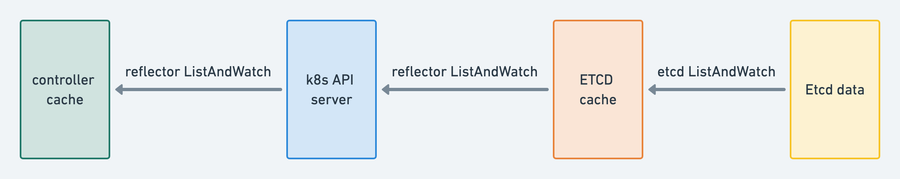
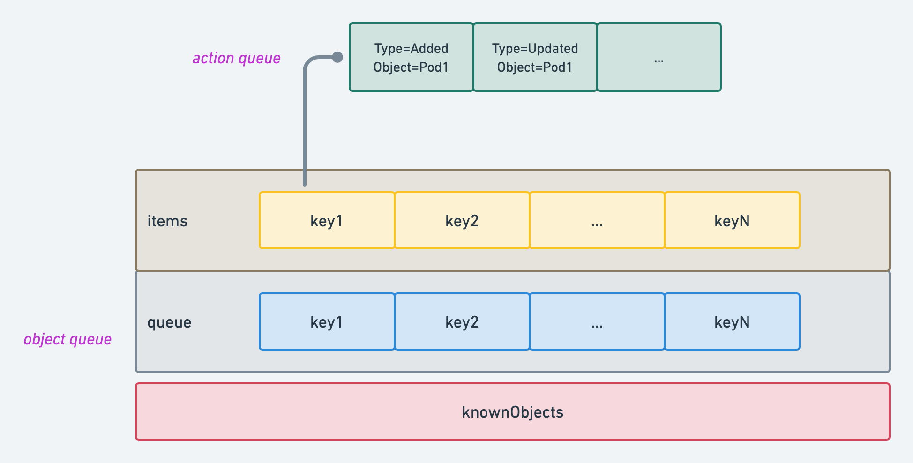
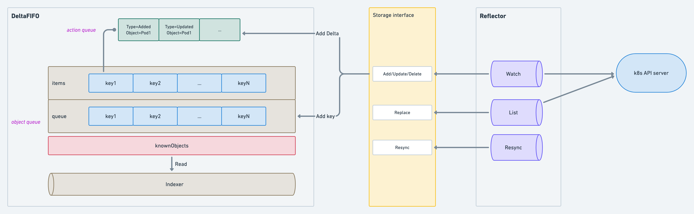
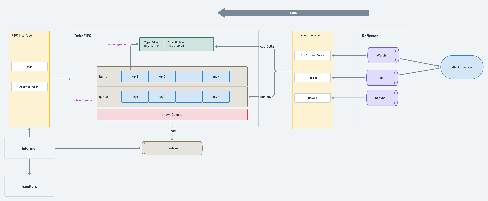
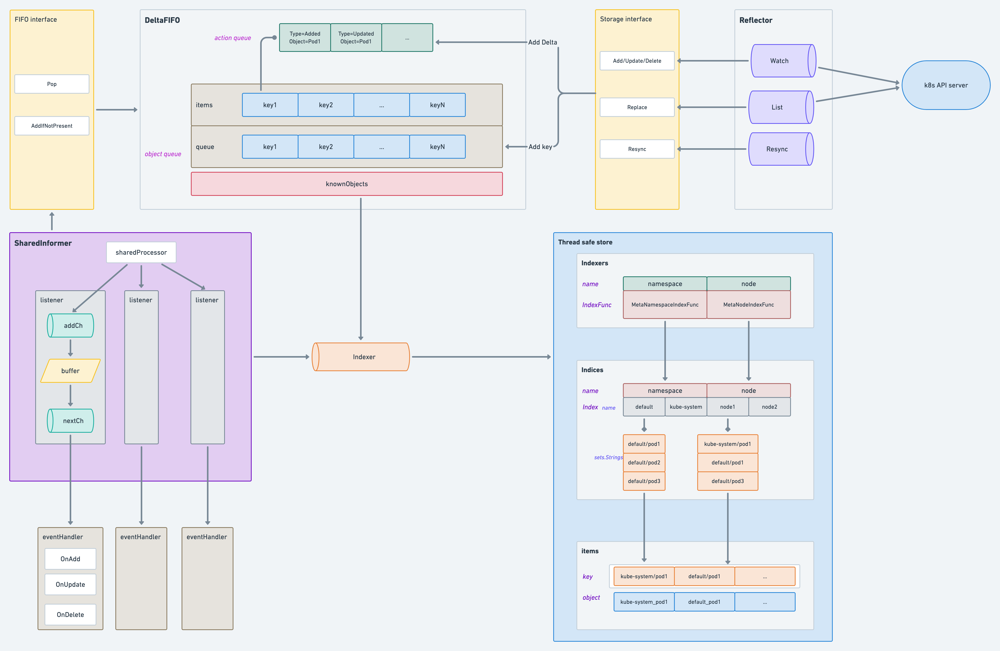

# client-go deep dive

[client-go](https://github.com/kubernetes/client-go) is a golang package to talk to a k8s cluster. I will deep dive into source code to explain how client-go works in k8s controllers.

Basically I’ll cover all the components in [this graph](https://github.com/kubernetes/sample-controller/blob/master/docs/controller-client-go.md)

- [Controller](#controller)
- [Reflector](#reflector)
  - [Initialization](#initialization)
  - [ListAndWatch](#listandwatch)
- [DeltaFIFO](#deltafifo)
  - [Initialization](#initialization)
  - [Concepts](#concepts)
  - [Store functions](#store-functions)
  - [FIFO functions](#fifo-functions)
  - [Architecture](#architecture)
- [Informer](#informer)
  - [Indexer](#indexer)
  - [Thread safe store](#thread-safe-store)
  - [ResourceEventHandlers](#resourceeventhandlers)
  - [Architecture](#architecture)
- [Workqueue](#workqueue)
  - [Initialization](#initialization)
  - [Processing](#processing)
  - [Retrying](#retrying)
  - [Architecture](#architecture)
- [Consumer](#consumer)
- [Architecture](#architecture)

# Controller

> Controller is a low-level controller that is parameterized by a Config and used in sharedIndexInformer.
> 

Controller is the entry point of an operator, a controller is created when the informer [runs](https://github.com/kubernetes/client-go/blob/master/tools/cache/shared_informer.go#L397).

```go
informer := cache.NewSharedIndexInformer(
		&cache.ListWatch{
				ListFunc: func(options meta_v1.ListOptions) (runtime.Object, error) {
								return client.CoreV1().Pods("default").List(options)
             },
        WatchFunc: func(options meta_v1.ListOptions) (watch.Interface, error) {
                return client.CoreV1().Pods("default").Watch(options)
             },
      },
      &api_v1.Pod{},
      300, 
      cache.Indexers{},
)

func (c *Controller) Run(stopCh <-chan struct{}) {
      defer c.queue.ShutDown()
      go c.informer.Run(stopCh)
			...
}

func (s *sharedIndexInformer) Run(stopCh <-chan struct{}) {
	...

	func() {
		s.startedLock.Lock()
		defer s.startedLock.Unlock()

		s.controller = New(cfg)
		s.controller.(*controller).clock = s.clock
		s.started = true
	}()
	...
	s.controller.Run(stopCh)
}
```

It starts two goroutines

- [reflector Run](https://github.com/kubernetes/client-go/blob/master/tools/cache/reflector.go#L218) (producer)
- [processLoop](https://github.com/kubernetes/client-go/blob/master/tools/cache/controller.go#L182) (consumer)

```go
func (c *controller) Run(stopCh <-chan struct{}) {
	...

	var wg wait.Group

	wg.StartWithChannel(stopCh, r.Run)

	wait.Until(c.processLoop, time.Second, stopCh)
	wg.Wait()
}
```

# Reflector

> When the reflector receives notification about existence of new resource instance through the watch API, it gets the newly created object using the corresponding listing API and puts it in the Delta Fifo queue inside the *watchHandler*
 function.
> 

Reflector itself doesn’t know the data source(how to list and watch).

- In case of controllers, the data source is k8s API server, it reflects data from k8s API server to DeltaFIFO.
- In case of [k8s API server](https://github.com/liFeixiang/deep-dive-into-k8s/blob/master/01-apiserver/07-storage-and-cache.md#overview), the data source is ETCD, It reflects data from ETCD to API cache.

## Initialization

Reflector is created internally which is hidden from users. in our sample controller, we only created an informer.

A reflector is created when the controller [runs](https://github.com/kubernetes/client-go/blob/master/tools/cache/controller.go#L134).

```go
func (s *sharedIndexInformer) Run(stopCh <-chan struct{}) {
	...
	fifo := NewDeltaFIFOWithOptions(DeltaFIFOOptions{
		KnownObjects:          s.indexer,
		EmitDeltaTypeReplaced: true,
	})

	cfg := &Config{
		Queue:            fifo,
		ListerWatcher:    s.listerWatcher,
		ObjectType:       s.objectType,
		FullResyncPeriod: s.resyncCheckPeriod,
		...
	}
	...
	s.controller.Run(stopCh)
}

func (c *controller) Run(stopCh <-chan struct{}) {
	...
	r := NewReflector(
		c.config.ListerWatcher,
		c.config.ObjectType,
		c.config.Queue,
		c.config.FullResyncPeriod,
	)
	r.WatchListPageSize = c.config.WatchListPageSize
	...
}
```

Reflector type is defined [here](https://github.com/kubernetes/client-go/blob/master/tools/cache/reflector.go#L49) (It’s well commented).  let’s focus on the parameters here

- c.config.[ListerWatcher](https://github.com/kubernetes/client-go/blob/master/tools/cache/listwatch.go#L43)
    
    from user input which defines how/what to list and watch, in our example it lists and watches pods in default namespace.
    
    ```go
    ListFunc: func(options meta_v1.ListOptions) (runtime.Object, error) {
    				return client.CoreV1().Pods("default").List(options)},
    WatchFunc: func(options meta_v1.ListOptions) (watch.Interface, error) {
             return client.CoreV1().Pods("default").Watch(options)},
    ```
    
- c.config.ObjectType
    
    k8s resource kind, from user input.
    
- c.config.Queue
    
    a [DeltaFIFO](https://github.com/kubernetes/client-go/blob/master/tools/cache/delta_fifo.go#L97) which is created internally, reflector uses it as data store.
    
- c.config.FullResyncPeriod
    
    resync interval, from user user input.
    

## ListAndWatch

ListAndWatch is the core function of [reflector](https://github.com/kubernetes/client-go/blob/master/tools/cache/reflector.go#L254).

> ListAndWatch first lists all items and get the resource version at the moment of call and then use the resource version to watch.
> 

### List

```go
func (r *Reflector) ListAndWatch(stopCh <-chan struct{}) error {
	options := metav1.ListOptions{ResourceVersion: r.relistResourceVersion()}
	if err := func() error {
		...
		go func() {
			...
			// create pager
			pager := pager.New(pager.SimplePageFunc(func(opts metav1.ListOptions) (runtime.Object, error) {
				return r.listerWatcher.List(opts)
			}))
			...
			// get list 
			list, paginatedResult, err = pager.List(context.Background(), options)
			..
		}()
		// update data store
		...
		if err := r.syncWith(items, resourceVersion); err != nil {
			return fmt.Errorf("unable to sync list result: %v", err)
		}
		r.setLastSyncResourceVersion(resourceVersion)
	}(); err != nil {
		return err
	}
...
}
```

1. set pagination
    
    It tries to do pagination(in case of controllers, it is supported by [k8s API pagination](https://kubernetes.io/docs/reference/using-api/api-concepts/#retrieving-large-results-sets-in-chunkshttps://kubernetes.io/docs/reference/using-api/api-concepts/#retrieving-large-results-sets-in-chunks)), but most time page size is 0 which means it tries to get all the data at once.
    
    ```go
    case r.WatchListPageSize != 0:
    		pager.PageSize = r.WatchListPageSize
    case r.paginatedResult:
    case options.ResourceVersion != "" && options.ResourceVersion != "0":
    		pager.PageSize = 0
    ```
    
    `WatchListPageSize` is from config but there’s no parameter for user to set when creating informer which is always 0.
    
    > NOTE: It should be used carefully as paginated lists are always served directly from etcd, which is significantly less efficient and may lead to serious performance and scalability problems.
    > 
    
    [k8s API](https://github.com/liFeixiang/deep-dive-into-k8s/blob/master/01-apiserver/07-storage-and-cache.md#StorageWithCacher)  is also using client-go cache, this warning is for k8s API server not controllers.
    
    
2. get list
    
    [pager](https://github.com/kubernetes/client-go/blob/master/tools/pager/pager.go#L76) simply calls List function which is from input.
    
    ```go
    func(options meta_v1.ListOptions) (runtime.Object, error) {return client.CoreV1().Pods("default").List(options)}
    ```
    
    `PageSize` usually is 0,  so there’s only one API call.
    
    ```go
    func (p *ListPager) List(ctx context.Context, options metav1.ListOptions) (runtime.Object, bool, error) {
    	if options.Limit == 0 {
    		options.Limit = p.PageSize
    	}
    	...
    	for {
    		select {
    		case <-ctx.Done():
    			return nil, paginatedResult, ctx.Err()
    		default:
    		}
    
    		obj, err := p.PageFn(ctx, options)
    		...
    		if len(m.GetContinue()) == 0 && list == nil {
    			return obj, paginatedResult, nil
    		}
    		...
    	}
    }
    ```
    
3. save data with resource version
    
    `ResourceVersion` is very important which is used by `Watch`  to tell if the object is changed or not.
    
    1. get `ResourceVersion` from metadata
        
        ```go
        listMetaInterface, err := meta.ListAccessor(list)
        resourceVersion = listMetaInterface.GetResourceVersion()
        ```
        
    2. get items from list
        
        ```go
        items, err := meta.ExtractList(list)
        if err != nil {
        	return fmt.Errorf("unable to understand list result %#v (%v)", list, err)}
        ```
        
    3. update data in [DeltaFIFO](https://github.com/kubernetes/client-go/blob/master/tools/cache/delta_fifo.go#L97)
        
        ```go
        // syncWith replaces the store's items with the given list.
        func (r *Reflector) syncWith(items []runtime.Object, resourceVersion string) error {
        	found := make([]interface{}, 0, len(items))
        	for _, item := range items {
        		found = append(found, item)
        	}
        	return r.store.Replace(found, resourceVersion)
        }
        ```
        
    4. save `ResourceVersion`
        
        ```go
        func (r *Reflector) setLastSyncResourceVersion(v string) {
        	r.lastSyncResourceVersionMutex.Lock()
        	defer r.lastSyncResourceVersionMutex.Unlock()
        	r.lastSyncResourceVersion = v
        }
        ```
        

### Resync

It simply calls DeltaFIFO [Reysnc](https://github.com/kubernetes/client-go/blob/master/tools/cache/delta_fifo.go#L661) at interval of `FullResyncPeriod` .

```go
go func() {
	...
	for {
		...
			if r.ShouldResync == nil || r.ShouldResync() {
				klog.V(4).Infof("%s: forcing resync", r.name)
				if err := r.store.Resync(); err != nil {
					resyncerrc <- err
					return
				}
			}
			cleanup()
			resyncCh, cleanup = r.resyncChan()
		}
	}()
```

### Watch

- start  to watch with `Watch` function
- call `watchHandler` to handle result

```go
for {
		...
		timeoutSeconds := int64(minWatchTimeout.Seconds() * (rand.Float64() + 1.0))
		options = metav1.ListOptions{
			ResourceVersion: resourceVersion,
			...
		}
		start := r.clock.Now()
		w, err := r.listerWatcher.Watch(options)
		...
		if err := r.watchHandler(start, w, &resourceVersion, resyncerrc, stopCh); err != nil {
			...
			return nil
		}
	}
```

- `Watch` function is from input
    
    ```go
    func(options meta_v1.ListOptions) (watch.Interface, error) {return client.CoreV1().Pods("default").Watch(options)}
    ```
    
- [watchHandler](https://github.com/kubernetes/client-go/blob/master/tools/cache/reflector.go#L460) update data store based on the event type
    
    ```go
    for {
    		...
    			newResourceVersion := meta.GetResourceVersion()
    			switch event.Type {
    			case watch.Added:
    				err := r.store.Add(event.Object)
    			case watch.Modified:
    				err := r.store.Update(event.Object)
    			case watch.Deleted:
    				err := r.store.Delete(event.Object)
    			...
    			}
    			...
    		}
    }
    ```
    

### Dataflow



# DeltaFIFO

## Initialization

DeltaFIFO is created when informer starts to [run](https://github.com/kubernetes/client-go/blob/master/tools/cache/shared_informer.go#L404).

```go
func (s *sharedIndexInformer) Run(stopCh <-chan struct{}) {
	...
	fifo := NewDeltaFIFOWithOptions(DeltaFIFOOptions{
		KnownObjects:          s.indexer,
		EmitDeltaTypeReplaced: true,
	})
	...
}

func NewDeltaFIFOWithOptions(opts DeltaFIFOOptions) *DeltaFIFO {
	if opts.KeyFunction == nil {
		opts.KeyFunction = MetaNamespaceKeyFunc
	}

	f := &DeltaFIFO{
		items:        map[string]Deltas{},
		queue:        []string{},
		keyFunc:      opts.KeyFunction,
		knownObjects: opts.KnownObjects,

		emitDeltaTypeReplaced: opts.EmitDeltaTypeReplaced,
	}
	f.cond.L = &f.lock
	return f
}
```

## Concepts

```go
type DeltaFIFO struct {
	items map[string]Deltas
	queue []string
	knownObjects KeyListerGetter
	...
}
```



### Delta

Delta means changes of k8s resources(Added, Updated etc.),

DeltaFIFO uses it to store the changed object and change type by implementing [store](https://github.com/kubernetes/client-go/blob/master/tools/cache/store.go#L39) interface.

```go
type Delta struct {
	Type   DeltaType
	Object interface{}
}

type DeltaType string

const (
	Added   DeltaType = "Added"
	Updated DeltaType = "Updated"
	Deleted DeltaType = "Deleted"
	Replaced DeltaType = "Replaced"
	Sync DeltaType = "Sync"
)
```

### FIFO

It implemented [FIFO](https://github.com/kubernetes/client-go/blob/master/tools/cache/fifo.go#L52) interface.

```go
func (f *DeltaFIFO) Pop(process PopProcessFunc) (interface{}, error) {
	...
}

func (f *DeltaFIFO) AddIfNotPresent(obj interface{}) error {
	...
}
...
```

### KnownObjects

knownObject is an [indexer](https://github.com/kubernetes/client-go/blob/master/tools/cache/index.go#L35),

```go
// cache.Indexers{}, 
// type Indexers map[string]IndexFunc
func NewSharedIndexInformer(lw ListerWatcher, exampleObject runtime.Object, defaultEventHandlerResyncPeriod time.Duration, indexers Indexers) SharedIndexInformer {
		...
		indexer:  NewIndexer(DeletionHandlingMetaNamespaceKeyFunc, indexers),
		..
}

func NewIndexer(keyFunc KeyFunc, indexers Indexers) Indexer {
	return &cache{
		cacheStorage: NewThreadSafeStore(indexers, Indices{}),
		keyFunc:      keyFunc,
	}
}

func NewThreadSafeStore(indexers Indexers, indices Indices) ThreadSafeStore {
	return &threadSafeMap{
		items:    map[string]interface{}{},
		indexers: indexers,
		indices:  indices,
	}
}
```

It implemented [KeyListerGetter](https://github.com/kubernetes/client-go/blob/master/tools/cache/delta_fifo.go#L707) interface which simply invokes [threadSafeMap functions](https://github.com/kubernetes/client-go/blob/master/tools/cache/thread_safe_store.go#L94).

```go
func (c *cache) ListKeys() []string {
	return c.cacheStorage.ListKeys()
}

func (c *cache) GetByKey(key string) (item interface{}, exists bool, err error) {
	item, exists = c.cacheStorage.Get(key)
	return item, exists, nil
}
```

## Store functions

### Add/Update/Delete

These 3 functions are similar they all invoke a common function [queueActionLocked](https://github.com/kubernetes/client-go/blob/master/tools/cache/delta_fifo.go#L409) .

```go
func (f *DeltaFIFO) queueActionLocked(actionType DeltaType, obj interface{}) error {
	// get key
	id, err := f.KeyOf(obj)
	if err != nil {
		return KeyError{obj, err}
	}
  // merge actions
	oldDeltas := f.items[id]
	newDeltas := append(oldDeltas, Delta{actionType, obj})
	newDeltas = dedupDeltas(newDeltas)

	// store
	if len(newDeltas) > 0 {
		if _, exists := f.items[id]; !exists {
			f.queue = append(f.queue, id)
		}
		f.items[id] = newDeltas
		f.cond.Broadcast()
	} else {
		...
	}
	return nil
}
```

1. get  key of the object, key format is `namespace/name` .
    
    ```go
    func MetaNamespaceKeyFunc(obj interface{}) (string, error) {
    	if key, ok := obj.(ExplicitKey); ok {
    		return string(key), nil
    	}
    	meta, err := meta.Accessor(obj)
    	if err != nil {
    		return "", fmt.Errorf("object has no meta: %v", err)
    	}
    	if len(meta.GetNamespace()) > 0 {
    		return meta.GetNamespace() + "/" + meta.GetName(), nil
    	}
    	return meta.GetName(), nil
    }
    ```
    
2. merge multiple `Delete` actions into one
    
    ```go
    func dedupDeltas(deltas Deltas) Deltas {
    	...
    	if out := isDup(a, b); out != nil {
    		deltas[n-2] = *out
    		return deltas[:n-1]
    	}
    	return deltas
    }
    
    func isDup(a, b *Delta) *Delta {
    	if out := isDeletionDup(a, b); out != nil {
    		return out
    	}
    	return nil
    }
    
    func isDeletionDup(a, b *Delta) *Delta {
    	if b.Type != Deleted || a.Type != Deleted {
    		return nil
    	}
    	if _, ok := b.Object.(DeletedFinalStateUnknown); ok {
    		return a
    	}
    	return b
    }
    ```
    
3. store deltas, add key into queue if it’s new.
    
    ```go
    if _, exists := f.items[id]; !exists {
    	f.queue = append(f.queue, id)
    }
    f.items[id] = newDeltas
    f.cond.Broadcast()
    ```
    

### Replace/Resync

It adds `Sync` action for all the target resources which will rebuild the indexer(knownObjects)

```go
func (f *DeltaFIFO) Replace(list []interface{}, _ string) error {
	f.lock.Lock()
	defer f.lock.Unlock()
	keys := make(sets.String, len(list))
	action := Sync

	// compare keys between list and indexer,
  // add Delete action for deleted objects
	for _, item := range list {
		key, err := f.KeyOf(item)
		if err != nil {
			return KeyError{item, err}
		}
		keys.Insert(key)
		if err := f.queueActionLocked(action, item); err != nil {
			return fmt.Errorf("couldn't enqueue object: %v", err)
		}
	}
	...
	// in case of missing delete event
	knownKeys := f.knownObjects.ListKeys()
	queuedDeletions := 0
	for _, k := range knownKeys {
		if keys.Has(k) {
			continue
		}
		deletedObj, exists, err := f.knownObjects.GetByKey(k)
		...
		queuedDeletions++
		if err := f.queueActionLocked(Deleted, DeletedFinalStateUnknown{k, deletedObj}); err != nil {
			return err
		}
	}
...

	return nil
}
```

## FIFO functions

### Pop

```go
func (f *DeltaFIFO) Pop(process PopProcessFunc) (interface{}, error) {
	f.lock.Lock()
	defer f.lock.Unlock()
	for {
		...
		// get key from queue
		id := f.queue[0]
		f.queue = f.queue[1:]
		depth := len(f.queue)
		
		// get deltas from items
		item, ok := f.items[id]
		delete(f.items, id)
		
		// handle deltas
		err := process(item)
		...
	}
}
```

the object is removed before `process`, so if `process` fails user must put it back.

### AddIfNotPresent

- add key into queue
- add delta into items

```go
func (f *DeltaFIFO) AddIfNotPresent(obj interface{}) error {
	deltas, ok := obj.(Deltas)
	if !ok {
		return fmt.Errorf("object must be of type deltas, but got: %#v", obj)
	}
	id, err := f.KeyOf(deltas)
	if err != nil {
		return KeyError{obj, err}
	}
	f.lock.Lock()
	defer f.lock.Unlock()
	f.addIfNotPresent(id, deltas)
	return nil
}

func (f *DeltaFIFO) addIfNotPresent(id string, deltas Deltas) {
	f.populated = true
	if _, exists := f.items[id]; exists {
		return
	}

	f.queue = append(f.queue, id)
	f.items[id] = deltas
	f.cond.Broadcast()
}
```

## Architecture



# Informer

Informer is the consumer of DeltaFIFO .

```go
func (c *controller) processLoop() {
	for {
		obj, err := c.config.Queue.Pop(PopProcessFunc(c.config.Process))
		if err != nil {
			if err == ErrFIFOClosed {
				return
			}
			if c.config.RetryOnError {
				// This is the safe way to re-enqueue.
				c.config.Queue.AddIfNotPresent(obj)
			}
		}
	}
}
```

It pops object from DeltaFIFO and handle it by [Process](https://github.com/kubernetes/client-go/blob/master/tools/cache/shared_informer.go#L566)

```go
func (s *sharedIndexInformer) Run(stopCh <-chan struct{}) {
	...
	cfg := &Config{
		...
		Process:           s.HandleDeltas,
		WatchErrorHandler: s.watchErrorHandler,
	}
...
}

func (s *sharedIndexInformer) HandleDeltas(obj interface{}) error {
	s.blockDeltas.Lock()
	defer s.blockDeltas.Unlock()

	if deltas, ok := obj.(Deltas); ok {
		return processDeltas(s, s.indexer, s.transform, deltas)
	}
	return errors.New("object given as Process argument is not Deltas")
}
```

`HandleDeltas` does locking and simple invokes [processDeltas](https://github.com/kubernetes/client-go/blob/master/tools/cache/controller.go#L412)

```go
func processDeltas(
	// Object which receives event notifications from the given deltas
	handler ResourceEventHandler,
	clientState Store,
	transformer TransformFunc,
	deltas Deltas,
) error {
for _, d := range deltas {
		obj := d.Object
		...
		switch d.Type {
		case Sync, Replaced, Added, Updated:
			if old, exists, err := clientState.Get(obj); err == nil && exists {
				if err := clientState.Update(obj); err != nil {
					return err
				}
				handler.OnUpdate(old, obj)
			} else {
				if err := clientState.Add(obj); err != nil {
					return err
				}
				handler.OnAdd(obj)
			}
		case Deleted:
			if err := clientState.Delete(obj); err != nil {
				return err
			}
			handler.OnDelete(obj)
		}
	}
	return nil
}
```

- invoke the indexer
- invoke the handler




## Indexer

`clientState` is the indexer(also is the `knownobjects`).

```go
func NewIndexer(keyFunc KeyFunc, indexers Indexers) Indexer {
	return &cache{
		cacheStorage: NewThreadSafeStore(indexers, Indices{}),
		// MetaNamespaceKeyFunc
		keyFunc:      keyFunc,
	}
}
```

It implemented [Indexer](https://github.com/kubernetes/client-go/blob/master/tools/cache/index.go#L35) interface,

1. get key from object: `namespace/name`
2. invoke storage function

```go
func (c *cache) Add(obj interface{}) error {
	key, err := c.keyFunc(obj)
	if err != nil {
		return KeyError{obj, err}
	}
	c.cacheStorage.Add(key, obj)
	return nil
}
...
```

## Thread safe store

It’s used to store objects and keys.

```go
func NewThreadSafeStore(indexers Indexers, indices Indices) ThreadSafeStore {
	return &threadSafeMap{
		items:    map[string]interface{}{},
		indexers: indexers,
		indices:  indices,
	}
}
```

- Indexers
    
    It stores index functions to create indices. e.g. `Indexers{"namespace": MetaNamespaceIndexFunc}` has one index function which creates index by namespace.
    
    ```go
    // Indexers maps a name to an IndexFunc
    type Indexers map[string]IndexFunc
    // IndexFunc knows how to compute the set of indexed values for an object.
    type IndexFunc func(obj interface{}) ([]string, error)
    // MetaNamespaceIndexFunc is a default index function that indexes based on an object's namespace
    func MetaNamespaceIndexFunc(obj interface{}) ([]string, error) {
    	meta, err := meta.Accessor(obj)
    	if err != nil {
    		return []string{""}, fmt.Errorf("object has no meta: %v", err)
    	}
    	return []string{meta.GetNamespace()}, nil
    }
    ```
    
- Indices
    
    It stores indices created by the indexers.
    
    ```go
    // Indices maps a name to an Index
    type Indices map[string]Index
    // Index maps the indexed value to a set of keys in the store that match on that value
    // sets.String is a set of strings, type String map[string]Empty
    type Index map[string]sets.String
    ```
    

### Architecture


### Add/Update

```go
func (c *threadSafeMap) Add(key string, obj interface{}) {
	c.Update(key, obj)
}

func (c *threadSafeMap) Update(key string, obj interface{}) {
	c.lock.Lock()
	defer c.lock.Unlock()
	oldObject := c.items[key]
	c.items[key] = obj
	c.updateIndices(oldObject, obj, key)
}
```

1. get the old object from `items`
2. put the new object to `items`
3. update the indices

### Delete

```go
func (c *threadSafeMap) Delete(key string) {
	c.lock.Lock()
	defer c.lock.Unlock()
	if obj, exists := c.items[key]; exists {
		c.updateIndices(obj, nil, key)
		delete(c.items, key)
	}
}
```

1. get the object from `items`
2. update the indices
3. delete the object the `items`

### updateIndices

```go
func (c *threadSafeMap) updateIndices(oldObj interface{}, newObj interface{}, key string) {
	var oldIndexValues, indexValues []string
	var err error
	// create an index for each indexer
	for name, indexFunc := range c.indexers {
		// e.g.  indexFunc: MetaNamespaceIndexFunc,
		// IndexValues: ["default"]
		if oldObj != nil {
			oldIndexValues, err = indexFunc(oldObj)
		} else {
			oldIndexValues = oldIndexValues[:0]
		}
		...
		if newObj != nil {
			indexValues, err = indexFunc(newObj)
		} else {
			indexValues = indexValues[:0]
		}

		// e.g. indices["namespace"]
		index := c.indices[name]
		// create a new index if it's a new object
		if index == nil {
			index = Index{}
			c.indices[name] = index
		}
		// remove key for Delete
		for _, value := range oldIndexValues {
			if len(indexValues) == 1 && value == indexValues[0] {
				continue
			}
			c.deleteKeyFromIndex(key, value, index)
		}
		// add key for Add
		for _, value := range indexValues {
			if len(oldIndexValues) == 1 && value == oldIndexValues[0] {
				continue
			}
			c.addKeyToIndex(key, value, index)
		}
	}
}
```

## ResourceEventHandlers

SharedInformer implemented [ResourceEventHandler](https://github.com/kubernetes/client-go/blob/master/tools/cache/shared_informer.go#L577) interface,

```go
// Conforms to ResourceEventHandler
func (s *sharedIndexInformer) OnAdd(obj interface{}) {
	s.cacheMutationDetector.AddObject(obj)
	s.processor.distribute(addNotification{newObj: obj}, false)
}

// Conforms to ResourceEventHandler
func (s *sharedIndexInformer) OnUpdate(old, new interface{}) {
	...
	s.cacheMutationDetector.AddObject(new)
	s.processor.distribute(updateNotification{oldObj: old, newObj: new}, isSync)
}

// Conforms to ResourceEventHandler
func (s *sharedIndexInformer) OnDelete(old interface{}) {
	s.processor.distribute(deleteNotification{oldObj: old}, false)
}
```

It basically calls `cacheMutationDetector.AddObject` and `processor.distribute` , they are created when the shared informer is initialized. 

```go
func NewSharedIndexInformer(lw ListerWatcher, exampleObject runtime.Object, defaultEventHandlerResyncPeriod time.Duration, indexers Indexers) SharedIndexInformer {
	realClock := &clock.RealClock{}
	sharedIndexInformer := &sharedIndexInformer{
		processor:                       &sharedProcessor{clock: realClock},
		...
		cacheMutationDetector:           NewCacheMutationDetector(fmt.Sprintf("%T", exampleObject)),
	}
	return sharedIndexInformer
}

func (s *sharedIndexInformer) Run(stopCh <-chan struct{}) {
	...
	processorStopCh := make(chan struct{})
	var wg wait.Group
	defer wg.Wait()              // Wait for Processor to stop
	defer close(processorStopCh) // Tell Processor to stop
	wg.StartWithChannel(processorStopCh, s.cacheMutationDetector.Run)
	wg.StartWithChannel(processorStopCh, s.processor.run)
	...
}
```

### cacheMutationDetector

it’s actually disabled by default, we can ignore.

```go
var mutationDetectionEnabled = false

func init() {
	mutationDetectionEnabled, _ = strconv.ParseBool(os.Getenv("KUBE_CACHE_MUTATION_DETECTOR"))
}

func NewCacheMutationDetector(name string) MutationDetector {
	if !mutationDetectionEnabled {
		return dummyMutationDetector{}
	}
	klog.Warningln("Mutation detector is enabled, this will result in memory leakage.")
	return &defaultCacheMutationDetector{name: name, period: 1 * time.Second, retainDuration: 2 * time.Minute}
}
```

### sharedProcessor

```go
// sharedProcessor has a collection of processorListener and can
// distribute a notification object to its listeners.  There are two
// kinds of distribute operations.  The sync distributions go to a
// subset of the listeners that (a) is recomputed in the occasional
// calls to shouldResync and (b) every listener is initially put in.
// The non-sync distributions go to every listener.
type sharedProcessor struct {
	listenersStarted bool
	listenersLock    sync.RWMutex
	listeners        []*processorListener
	syncingListeners []*processorListener
	clock            clock.Clock
	wg               wait.Group
}
```

SharedInformer started a goroutine for `sharedProcessor.run`  which simply [invokes](https://github.com/kubernetes/client-go/blob/master/tools/cache/shared_informer.go#L659) all listeners `run` and `pop` .

```go
func (p *sharedProcessor) run(stopCh <-chan struct{}) {
	func() {
		...
		for _, listener := range p.listeners {
			p.wg.Start(listener.run)
			p.wg.Start(listener.pop)
		}
		p.listenersStarted = true
	}()
	...
}
```

But where are these listeners from?

listeners are created when [handlers are registered](https://www.notion.so/k8s-controller-basics-187f572fd705434e8680ba4f01365c52) to sharedInformer.

```go
informer.AddEventHandler(cache.ResourceEventHandlerFuncs{
      AddFunc: func(obj interface{}) {
             key, err := cache.MetaNamespaceKeyFunc(obj)
             if err == nil {
                    queue.Add(key)
             }
      },
})

func (s *sharedIndexInformer) AddEventHandler(handler ResourceEventHandler) {
	s.AddEventHandlerWithResyncPeriod(handler, s.defaultEventHandlerResyncPeriod)
}

func (s *sharedIndexInformer) AddEventHandlerWithResyncPeriod(handler ResourceEventHandler, resyncPeriod time.Duration) {
	...
	listener := newProcessListener(handler, resyncPeriod, determineResyncPeriod(resyncPeriod, s.resyncCheckPeriod), s.clock.Now(), initialBufferSize)

	if !s.started {
		s.processor.addListener(listener)
		return
	}
	...
}
```

- listener.run
    
    get notification from channel and call handler function based on event type.
    
    ```go
    func (p *processorListener) run() {
    	stopCh := make(chan struct{})
    	wait.Until(func() {
    		for next := range p.nextCh {
    			switch notification := next.(type) {
    			case updateNotification:
    				p.handler.OnUpdate(notification.oldObj, notification.newObj)
    			case addNotification:
    				p.handler.OnAdd(notification.newObj)
    			case deleteNotification:
    				p.handler.OnDelete(notification.oldObj)
    			default:
    				utilruntime.HandleError(fmt.Errorf("unrecognized notification: %T", next))
    			}
    		}
    		// the only way to get here is if the p.nextCh is empty and closed
    		close(stopCh)
    	}, 1*time.Second, stopCh)
    }
    ```
    
- listener.pop
    1. get notification from `addCh`
    2. add to buffer
    3. get notification from buffer and add to `nextCh` which will be consumed by `run`.
    
    ```go
    func (p *processorListener) add(notification interface{}) {
    	p.addCh <- notification
    }
    
    func (p *processorListener) pop() {
    	...
    	var nextCh chan<- interface{}
    	var notification interface{}
    	for {
    		select {
    		case nextCh <- notification:
    			// Notification dispatched
    			var ok bool
    			notification, ok = p.pendingNotifications.ReadOne()
    			if !ok { // Nothing to pop
    				nextCh = nil // Disable this select case
    			}
    		case notificationToAdd, ok := <-p.addCh:
    			if !ok {
    				return
    			}
    			if notification == nil { // No notification to pop (and pendingNotifications is empty)
    				// Optimize the case - skip adding to pendingNotifications
    				notification = notificationToAdd
    				nextCh = p.nextCh
    			} else { // There is already a notification waiting to be dispatched
    				p.pendingNotifications.WriteOne(notificationToAdd)
    			}
    		}
    	}
    }
    ```
    

the sharedProcessor sends events to all listeners by `[processor.distribute](https://github.com/kubernetes/client-go/blob/master/tools/cache/shared_informer.go#L644)` .

```go
func (p *sharedProcessor) distribute(obj interface{}, sync bool) {
	p.listenersLock.RLock()
	defer p.listenersLock.RUnlock()

	if sync {
		for _, listener := range p.syncingListeners {
			listener.add(obj)
		}
	} else {
		for _, listener := range p.listeners {
			listener.add(obj)
		}
	}
}
```

### Architecture


## Architecture



# Workqueue

## Initialization

```go
queue := workqueue.NewRateLimitingQueue(workqueue.DefaultControllerRateLimiter())
// NewRateLimitingQueue constructs a new workqueue with rateLimited queuing ability
func NewRateLimitingQueue(rateLimiter RateLimiter) RateLimitingInterface {
	return &rateLimitingType{
		DelayingInterface: NewDelayingQueue(),
		rateLimiter:       rateLimiter,
	}
}
```

### rateLimiter

```go
type RateLimiter interface {
	// When gets an item and gets to decide how long that item should wait
	When(item interface{}) time.Duration
	// Forget indicates that an item is finished being retried.  Doesn't matter whether it's for failing
	// or for success, we'll stop tracking it
	Forget(item interface{})
	// NumRequeues returns back how many failures the item has had
	NumRequeues(item interface{}) int
}
```

client-go provides five implementations,

- BucketRateLimiter
    
    ```go
    func (r *BucketRateLimiter) When(item interface{}) time.Duration {
    	return r.Limiter.Reserve().Delay()
    }
    // e.g. 100 items at max, allow 10 new items every second 
    BucketRateLimiter{Limiter: rate.NewLimiter(rate.Limit(10), 100)}
    ```
    
- ItemExponentialFailureRateLimiter
    
    delay is increased when failure happens
    
- ItemFastSlowRateLimiter
    
    it provides two delays, fast at first and slow after a certain tries.
    
- MaxOfRateLimiter
    
    a collection of multiple rate limiters, using the worst one.
    
    ```go
    func DefaultControllerRateLimiter() RateLimiter {
    	return NewMaxOfRateLimiter(
    		NewItemExponentialFailureRateLimiter(5*time.Millisecond, 1000*time.Second),
    		// 10 qps, 100 bucket size.  This is only for retry speed and its only the overall factor (not per item)
    		&BucketRateLimiter{Limiter: rate.NewLimiter(rate.Limit(10), 100)},
    	)
    }
    ```
    
- WithMaxWaitRateLimiter
    
    it adds a max delay to other limiters
    
    ```go
    func (w WithMaxWaitRateLimiter) When(item interface{}) time.Duration {
    	delay := w.limiter.When(item)
    	if delay > w.maxDelay {
    		return w.maxDelay
    	}
    	return delay
    }
    ```
    

### delayingQueue

[delayingQueue](https://github.com/kubernetes/client-go/blob/master/util/workqueue/delaying_queue.go#L30) is a normal queue with `AddAfter` function.

```go
type DelayingInterface interface {
	Interface
	// AddAfter adds an item to the workqueue after the indicated duration has passed
	AddAfter(item interface{}, duration time.Duration)
}

type Type struct {
	// queue defines the order in which we will work on items. Every
	// element of queue should be in the dirty set and not in the
	// processing set.
	queue []t
	// dirty defines all of the items that need to be processed.
	dirty set
	// Things that are currently being processed are in the processing set.
	// These things may be simultaneously in the dirty set. When we finish
	// processing something and remove it from this set, we'll check if
	// it's in the dirty set, and if so, add it to the queue.
	processing set
...
}
```

## Processing

```go
func (c *Controller) processNextItem() bool {
    key, quit := c.queue.Get()
    if quit {
       return false
    }
    defer c.queue.Done(key)

	  err := c.processItem(key.(string))
		if err == nil {
        // No error, tell the queue to stop tracking history
        c.queue.Forget(key)
     } else if c.queue.NumRequeues(key) < maxRetries {
        // requeue the item to work on later
				c.queue.AddRateLimited(key)
     } else {
        // err != nil and too many retries
        c.queue.Forget(key)
        utilruntime.HandleError(err)
     }
     return true
}
```

[https://whimsical.com/workqueue-add-EbDvUemF13E9LxecCCzHFf](https://whimsical.com/workqueue-add-EbDvUemF13E9LxecCCzHFf)

## Retrying

worker should retry if something goes wrong

### AddRateLimited

```go
func (q *rateLimitingType) AddRateLimited(item interface{}) {
	q.DelayingInterface.AddAfter(item, q.rateLimiter.When(item))
}

func (q *delayingType) AddAfter(item interface{}, duration time.Duration) {
	...
	if duration <= 0 {
		q.Add(item)
		return
	}

	select {
	case <-q.stopCh:
		// unblock if ShutDown() is called
	case q.waitingForAddCh <- &waitFor{data: item, readyAt: q.clock.Now().Add(duration)}:
	}
}
```

retrying is done by sending a `waitFor` object to [delaying queue](https://github.com/kubernetes/client-go/blob/master/util/workqueue/delaying_queue.go#L75) `waitingForAddCh` .

```go
type delayingType struct {
	...
	// waitingForAddCh is a buffered channel that feeds waitingForAdd
	waitingForAddCh chan *waitFor
}

// waitFor holds the data to add and the time it should be added
type waitFor struct {
	data    t
	readyAt time.Time
	// index in the priority queue (heap)
	index int
}

func newDelayingQueue(clock clock.WithTicker, q Interface, name string) *delayingType {
	ret := &delayingType{
		Interface:       q,
		clock:           clock,
		heartbeat:       clock.NewTicker(maxWait),
		stopCh:          make(chan struct{}),
		waitingForAddCh: make(chan *waitFor, 1000),
		metrics:         newRetryMetrics(name),
	}

	go ret.waitingLoop()
	return ret
}
```

`waitingForAddCh` stores keys(1000 at max) require retrying, these keys are handled in `[waitingLoop](https://github.com/kubernetes/client-go/blob/master/util/workqueue/delaying_queue.go#L189)` .

[https://whimsical.com/workqueue-retrying-TcGEZMycRtZqUSo1P614yG](https://whimsical.com/workqueue-retrying-TcGEZMycRtZqUSo1P614yG)

### Reset delay

> Remember to call Forget! If you don't, you may end up tracking failures forever.
> 

Depends on the rate limiter you’re using, it may increase delay based on failures.

```go
func (r *ItemExponentialFailureRateLimiter) When(item interface{}) time.Duration {
	...
	exp := r.failures[item]
	r.failures[item] = r.failures[item] + 1

	backoff := float64(r.baseDelay.Nanoseconds()) * math.Pow(2, float64(exp))
	...
}

func (r *ItemExponentialFailureRateLimiter) NumRequeues(item interface{}) int {
	return r.failures[item]
}

func (r *ItemExponentialFailureRateLimiter) Forget(item interface{}) {
	delete(r.failures, item)
}
```

## Architecture

[https://whimsical.com/workqueue-arch-9UNfwG5sSc33Qo99fn25md](https://whimsical.com/workqueue-arch-9UNfwG5sSc33Qo99fn25md)

# Consumer

Once the operator gets the key, it needs to get the object by the key.

```go
func (c *Controller) processItem(key string) error {
    obj, exists, err := c.informer.GetIndexer().GetByKey(key)
    // handle the object
}

func (c *cache) GetByKey(key string) (item interface{}, exists bool, err error) {
	item, exists = c.cacheStorage.Get(key)
	return item, exists, nil
}

func (c *threadSafeMap) Get(key string) (item interface{}, exists bool) {
	c.lock.RLock()
	defer c.lock.RUnlock()
	item, exists = c.items[key]
	return item, exists
}
```

# Architecture

[https://whimsical.com/client-go-arch-65BF6bjBEkUgiEgY5cnYgX](https://whimsical.com/client-go-arch-65BF6bjBEkUgiEgY5cnYgX)
