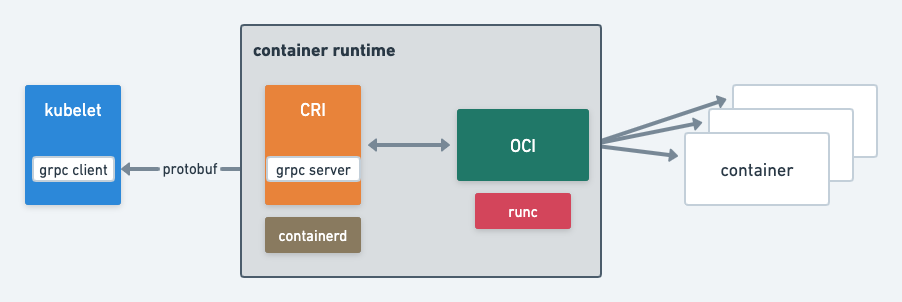
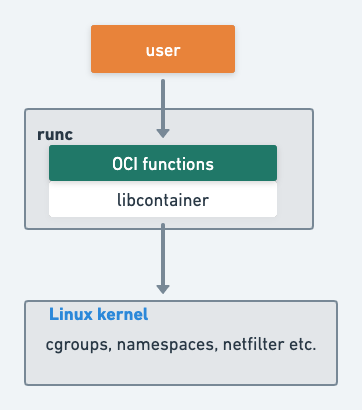
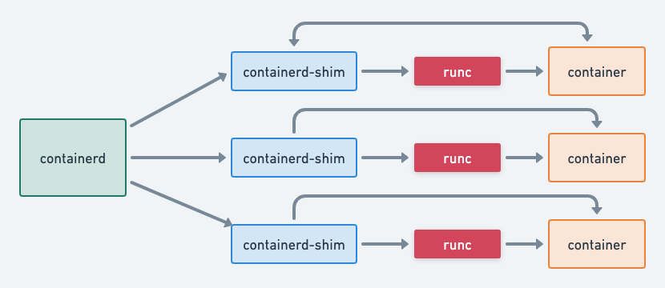
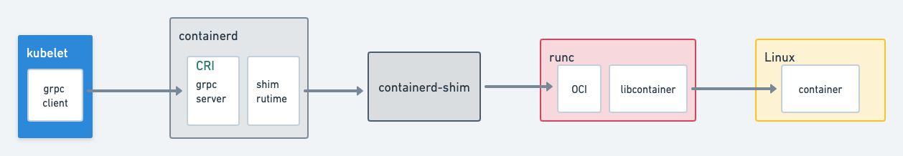

# Overview
kubelet is using a concept called CRI (Container Runtime Interface) for interacting with concrete container runtimes. Simply speaking, CRI provides an abstraction between kubelet and a specific runtime implementation.



Let’s start with some concepts.

- [Concepts](#concepts)
  * [Container](#container)
    + [what is container?](#what-is-container)
    + [namespaces](#namespaces)
    + [cgroups](#cgroups)
  * [OCI](#oci)
    + [How it works](#how-it-works)
    + [runc container](#runc-container)
  * [CRI](#cri)
    + [containerd](#containerd)
    + [shim](#shim)
    + [docker](#docker)
- [Summary](#summary)

# Concepts

## Container

### what is container

Linux kernel provides features(like `namespaces` , `cgroups`) to create isolated process which are called container.

### namespaces

[namespaces(7) - Linux manual page](https://man7.org/linux/man-pages/man7/namespaces.7.html)

[nsenter](https://man7.org/linux/man-pages/man1/nsenter.1.html) can be used to enter a namespace.

- PID namespace
    It isolates PID numbers, the first process gets the PID 1 inside the namespace.
    
    
    `lsns` will show all the namespaces.
    
    ```bash
    lsns
    ...
    
    4026533813 pid         1 25961 root      /bin/cortex -target=ingester -config.file=/etc/cortex/cortex.yaml -blocks-storage.bucket-store.index-cache.backend=memcached -blocks-storage.bucket-store.index-cache.memcached.addresses=dns+corte
    ```
    
    cortex is a docker container.
    
    ```bash
    [root@ip-10-0-249-28 ec2-user]# docker ps|grep cortex
    ebf6d4c42819        quay.io/cortexproject/cortex                                                                       "/bin/cortex -target…"   6 days ago          Up 6 days                               k8s_ingester_cortex-ingester-4_monitoring_e36c16a9-b290-4e88-8a9f-1c7ba2f22b14_0
    f1946287cf7e        602401143452.dkr.ecr.ap-northeast-1.amazonaws.com/eks/pause:3.1-eksbuild.1                         "/pause"                 6 days ago          Up 6 days                               k8s_POD_cortex-ingester-4_monitoring_e36c16a9-b290-4e88-8a9f-1c7ba2f22b14_0
    [root@ip-10-0-249-28 ec2-user]# docker inspect ebf6d4c42819 --format {{.State.Pid}}
    25961
    ```
    
    Inside the namespace, we can see its PID is 1.
    
    ```bash
    [root@ip-10-0-249-28 ec2-user]# nsenter -n -m -t 25961 ps -ef
    PID   USER     TIME  COMMAND
        1 root     13d14 /bin/cortex -target=ingester -config.file=/etc/cortex/cortex.yaml -blocks-storage.bucket-store.index-cache.backend=memcached -blocks-storage.bucket-store.index-cache.memcached.addresses=dns+cortex-memcached-blocks-
    ```

    💡 need to use `-m`  option , because the `ps` command works by reading files in the [proc filesystem](https://en.wikipedia.org/wiki/Procfs#Linux).
    
    
- Mount namespace
    
    It isolates the mount points,  each mount namespace has an independent list of mount points inside.
    
    
- Network namespace
    
    Each network namespace has an independent network stack: like routing table, iptable rules, fdb etc.
    
    you can check network stack with namespace using `ip netns` (it won’t work when using docker, because docker doesn’t create symlink),
    
    [ip-netns(8) - Linux manual page](https://man7.org/linux/man-pages/man8/ip-netns.8.html)
    
    or `nsenter` .
    
    [nsenter(1) - Linux manual page](https://man7.org/linux/man-pages/man1/nsenter.1.html)
    
    ```bash
    # we can only see network resource of this container
    [root@ip-10-0-249-28 ec2-user]# nsenter -n -m -t 25961 ip a
    1: lo: <LOOPBACK,UP,LOWER_UP> mtu 65536 qdisc noqueue state UNKNOWN qlen 1000
        link/loopback 00:00:00:00:00:00 brd 00:00:00:00:00:00
        inet 127.0.0.1/8 scope host lo
           valid_lft forever preferred_lft forever
    3: eth0@if23: <BROADCAST,MULTICAST,UP,LOWER_UP,M-DOWN> mtu 9001 qdisc noqueue state UP
        link/ether 26:50:e0:ec:a3:f8 brd ff:ff:ff:ff:ff:ff
        inet 10.0.252.107/32 scope global eth0
           valid_lft forever preferred_lft forever
    [root@ip-10-0-249-28 ec2-user]# nsenter -n -m -t 25961 ip r
    default via 169.254.1.1 dev eth0
    169.254.1.1 dev eth0 scope link
    ```
    

with tool like [unshare](https://man7.org/linux/man-pages/man1/unshare.1.html), it’s easy to create a process with namespaces.

```bash
unshare --user --pid --map-root-user --mount-proc --fork /bin/cortex
```

### cgroups

It limits, accounts for, and isolates the resource usage (CPU, memory, disk I/O, network, and so on) of a collection of processes. (k8s resource requests and limits feature depends on it)

```bash
# cgroups settings
[root@ip-10-0-249-28 ec2-user]# ls /sys/fs/cgroup/
blkio  cpu  cpu,cpuacct  cpuacct  cpuset  devices  freezer  hugetlb  memory  net_cls  net_cls,net_prio  net_prio  perf_event  pids  systemd
```

see usage [here](https://www.kernel.org/doc/html/latest/admin-guide/cgroup-v1/cgroups.html#usage-examples-and-syntax).

*If you want to know how it’s implemented by kernel, see [Linux kernel implementation](https://sites.cs.ucsb.edu/~rich/class/cs293b-cloud/papers/lxc-namespace.pdf)*

## OCI

[OCI](https://opencontainers.org/) is a standard for container runtimes which defines [specs](https://github.com/opencontainers/runtime-spec) of implementation.

 [runc](https://github.com/opencontainers/runc) is one of the implementations which wraps `libcontainer` (made by Docker to access kernel).

💡 runc is just a CLI, there’s no daemon process to monitor runc containers



### How it works

- [create process with namespaces](https://github.com/opencontainers/runc/blob/master/libcontainer/nsenter/nsexec.c) (similar syscalls with unshare)
    
    ```c
    static void update_uidmap(const char *path, int pid, char *map, size_t map_len)
    {
    	if (map == NULL || map_len == 0)
    		return;
    
    	write_log(DEBUG, "update /proc/%d/uid_map to '%s'", pid, map);
    	if (write_file(map, map_len, "/proc/%d/uid_map", pid) < 0) {
    		if (errno != EPERM)
    			bail("failed to update /proc/%d/uid_map", pid);
    		write_log(DEBUG, "update /proc/%d/uid_map got -EPERM (trying %s)", pid, path);
    		if (try_mapping_tool(path, pid, map, map_len))
    			bail("failed to use newuid map on %d", pid);
    	}
    }
    ...
    static int clone_parent(jmp_buf *env, int jmpval)
    {
    	struct clone_t ca = {
    		.env = env,
    		.jmpval = jmpval,
    	};
    
    	return clone(child_func, ca.stack_ptr, CLONE_PARENT | SIGCHLD, &ca);
    }
    ```
    
- [set cgroups](https://github.com/opencontainers/runc/tree/master/libcontainer/cgroups)(by editing `/sys/fs/cgroup/`)
    
    ```go
    const (
    	cgroupfsDir    = "/sys/fs/cgroup"
    	cgroupfsPrefix = cgroupfsDir + "/"
    )
    ...
    func openFile(dir, file string, flags int) (*os.File, error) {
    	...
    	if err != nil {
    		err = &os.PathError{Op: "openat2", Path: path, Err: err}
    		fdStr := strconv.Itoa(cgroupFd)
    		fdDest, _ := os.Readlink("/proc/self/fd/" + fdStr)
    		if fdDest != cgroupfsDir {
    			err = fmt.Errorf("cgroupFd %s unexpectedly opened to %s != %s: %w",
    				fdStr, fdDest, cgroupfsDir, err)
    		}
    		return nil, err
    	}
    
    	return os.NewFile(uintptr(fd), path), nil
    }
    ```
    

### runc container

runc requires a spec file to run a container,  and it will create a state file after run.docker container state file is in `/var/run/docker/runtime-runc/moby/$ID` .

take cortex as an example:

```json
{
  "id": "ebf6d4c428198eb8953301d9298da25bb9a21a268c34c90448525d104211165d",
  "init_process_pid": 25961,
  "init_process_start": 22517,
  "created": "2021-12-22T07:04:09.035323743Z",
  "config": {
    "mounts": [
      {
        "source": "proc",
        "destination": "/proc",
				...
      },
		...
	],
  "cgroup_paths": {
		...
    "pids": "/sys/fs/cgroup/pids/kubepods/besteffort/pode36c16a9-b290-4e88-8a9f-1c7ba2f22b14/ebf6d4c428198eb8953301d9298da25bb9a21a268c34c90448525d104211165d"
  },
  "external_descriptors": [
    "/dev/null",
    "pipe:[140583]",
    "pipe:[140584]"
  ],
}
```

## CRI

with runc we can run, stop, xx containers, but we need a tool(container manger) to automate this process. CRI defines specification for such software which make it easier for k8s to use different container runtimes.  [containerd](https://github.com/containerd/containerd) is one of the implementations.

### containerd

- it provides [grpc](https://github.com/containerd/containerd/tree/main/pkg/cri) API for k8s(kubelet) to use
- it uses [shim](https://github.com/containerd/containerd/tree/main/runtime/v2) to manage runc containes

### shim

containers can be long running but container manager itself (containerd) may need to restart, update or just crash due to some reasons.  We don’t want to kill or lose control of managed containers when it happens, but runc is just a CLI.  shim is to solve this problem.



On the host it’s easy to see in process tree

```bash
root      8701  0.6  0.0 7512944 64608 ?       Ssl  Dec22  66:45 /usr/bin/containerd
root     11674  0.1  0.0 710756 10144 ?        Sl   Dec22  17:40  \_ containerd-shim -namespace moby -workdir /var/lib/containerd/io.containerd.runtime.v1.linux/moby/51126e311b957d58f6a10f76428c12f95842f32b2a89e34b239e8371c6080b72 -addr
root     11713  0.0  0.0  11556  2712 ?        Ss   Dec22   0:00  |   \_ bash /app/entrypoint.sh
root     11781  0.7  0.0 834168 102736 ?       Sl   Dec22  71:38  |       \_ ./aws-k8s-agent
root     11782  0.0  0.0   4240   772 ?        S    Dec22   0:00  |       \_ tee -i aws-k8s-agent.log
root     25881  0.0  0.0 709092  6160 ?        Sl   Dec22   0:25  \_ containerd-shim -namespace moby -workdir /var/lib/containerd/io.containerd.runtime.v1.linux/moby/ebf6d4c428198eb8953301d9298da25bb9a21a268c34c90448525d104211165d -addr
root     25961  226  9.5 52092268 25018556 ?   Ssl  Dec22 22771:15  |   \_ /bin/cortex -target=ingester -config.file=/etc/cortex/cortex.yaml -blocks-storage.bucket-store.index-cache.backend=memcached -blocks-storage.bucket-store.index-c
```

### docker

docker uses containerd internally but it doesn’t implement CRI. Kubernetes uses a component called ***dockershim***, which allows it to support Docker.

<aside>
💡 From 1.20 dockershim is [deprecated](https://kubernetes.io/blog/2020/12/02/dont-panic-kubernetes-and-docker/), fortunately EKS supports containerd now we should apply this change when upgrading k8s.

</aside>

[Amazon EKS now supports Kubernetes 1.21 | Amazon Web Services](https://aws.amazon.com/blogs/containers/amazon-eks-1-21-released/)

# Summary


