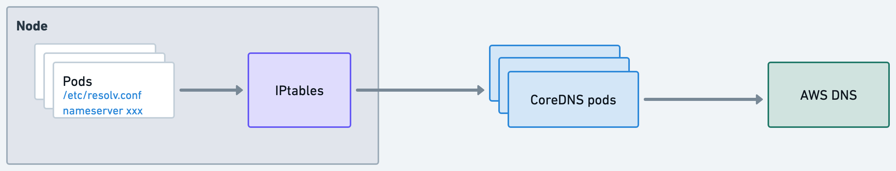
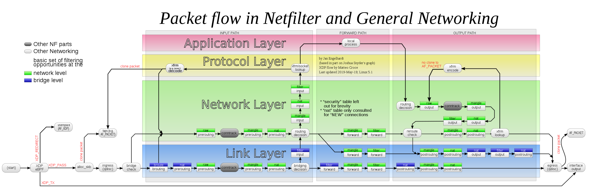

# NodeLocal DNSCache


# Background

In EKS, coredns forwards external dns query to AWS DNS server which could cause some issues like exceeding AWS limits, unbalanced queries etc. To solve these problems, we decided to introduce nodelocal dns cache. See more benefits [here](https://kubernetes.io/docs/tasks/administer-cluster/nodelocaldns/#motivation).

# IPv4

## Without local cache



1. Pods will send DNS query to the nameserver in `/etc/resolv.conf` which was set by kubelet.
2. DNS server IP is the service IP of kube-dns, queries will be forwarded to coredns pods based on iptables rules
    
    ```bash
    KUBE-SVC-TCOU7JCQXEZGVUNU  udp  --  any    any     anywhere             ip-10-100-0-10.us-west-2.compute.internal  /* kube-system/kube-dns:dns cluster IP */ udp dpt:domain
    ...
    KUBE-SEP-PDC7IXG3SBFGMFKI  all  --  any    any     anywhere             anywhere             /* kube-system/kube-dns:dns */ statistic mode random probability 0.12500000000
    ```
    
3. CoreDNS forwards requests to AWS DNS for external domains
    
    ```yaml
    .:53 {
            errors
            health
            kubernetes cluster.local in-addr.arpa ip6.arpa {
              pods insecure
              fallthrough in-addr.arpa ip6.arpa
            }
            prometheus :9153
            forward . /etc/resolv.conf
            cache 30
            loop
            reload
            loadbalance
        }
    ```
    

## With  local cache

### Components

- node-local-dns
    
    ```bash
    k get ds -n kube-system node-local-dns
    NAME             DESIRED   CURRENT   READY   UP-TO-DATE   AVAILABLE   NODE SELECTOR   AGE
    node-local-dns   8         8         8       8            8           <none>          20m
    ```
    
    node-local-dns pod [setups network](https://github.com/kubernetes/dns/blob/master/cmd/node-cache/app/cache_app.go#L74) once it starts.
    
    - it creates a dummy interface with two IP
        
        ```bash
        4671: nodelocaldns: <BROADCAST,NOARP> mtu 1500 qdisc noop state DOWN group default
            link/ether 7a:86:da:e5:7a:fc brd ff:ff:ff:ff:ff:ff
            inet 169.254.20.10/32 scope global nodelocaldns
               valid_lft forever preferred_lft forever
            inet 10.100.0.10/32 scope global nodelocaldns
               valid_lft forever preferred_lft forever
        ```
        
        `169.254.20.10` is a local IP which is only used for health check in our case.
        
        `10.100.0.10` is the `kube-dns` service cluster IP.
        
    - it listens on these two IP
        
        ```bash
        tcp        0      0 10.100.0.10:53          0.0.0.0:*               LISTEN      6267/node-cache
        tcp        0      0 169.254.20.10:53        0.0.0.0:*               LISTEN      6267/node-cache
        udp        0      0 10.100.0.10:53          0.0.0.0:*                           6267/node-cache
        udp        0      0 169.254.20.10:53        0.0.0.0:*                           6267/node-cache
        ```
        
    - it adds [iptables](https://github.com/kubernetes/enhancements/blob/master/keps/sig-network/1024-nodelocal-cache-dns/README.md#iptables-notrack) rules in raw and filter table for kube-dns service IP
        
        ```bash
        # iptables -t raw -nL
        Chain PREROUTING (policy ACCEPT)
        target     prot opt source               destination
        CT         udp  --  0.0.0.0/0            10.100.0.10          udp dpt:53 NOTRACK
        CT         tcp  --  0.0.0.0/0            10.100.0.10          tcp dpt:53 NOTRACK
        CT         udp  --  0.0.0.0/0            169.254.20.10        udp dpt:53 NOTRACK
        CT         tcp  --  0.0.0.0/0            169.254.20.10        tcp dpt:53 NOTRACK
        
        Chain OUTPUT (policy ACCEPT)
        target     prot opt source               destination
        3 NOTRACK
        CT         udp  --  0.0.0.0/0            10.100.0.10          udp dpt:53 NOTRACK
        CT         tcp  --  0.0.0.0/0            10.100.0.10          tcp dpt:53 NOTRACK
        CT         udp  --  10.100.0.10          0.0.0.0/0            udp spt:53 NOTRACK
        CT         tcp  --  10.100.0.10          0.0.0.0/0            tcp spt:53 NOTRACK3 
        CT         udp  --  0.0.0.0/0            169.254.20.10        udp dpt:53 NOTRACK
        CT         tcp  --  0.0.0.0/0            169.254.20.10        tcp dpt:53 NOTRACK
        CT         udp  --  169.254.20.10        0.0.0.0/0            udp spt:53 NOTRACK
        CT         tcp  --  169.254.20.10        0.0.0.0/0            tcp spt:53 NOTRACK
        ```
        
        **since raw rules are evaluated before nat rules, so the dns query will forward to the node-local-dns pod on the host. (that’s why no need to change kubelet config)**
        
        
        
- kube-dns-upstream
    
    it’s same with the `kube-dns` service. creating it is just to avoid dependency.
    
    ```yaml
    apiVersion: v1
    kind: Service
    metadata:
      name: kube-dns-upstream
      namespace: kube-system
      labels:
        k8s-app: kube-dns
        kubernetes.io/cluster-service: "true"
        kubernetes.io/name: "KubeDNSUpstream"
    spec:
      ports:
      - name: dns
        port: 53
        protocol: UDP
        targetPort: 53
      - name: dns-tcp
        port: 53
        protocol: TCP
        targetPort: 53
      selector:
        k8s-app: kube-dns
    ```
    

### Architecture


node-local-dns will forward internal queries to CoreDNS pods by kube-dns-upstream service,

and forward external queries to AWS DNS.

```json
cluster.local:53 {
        errors
        cache {
                success 9984 60
                denial 9984 5
        }
        reload
        loop
        bind 169.254.20.10 10.100.0.10
        forward . __PILLAR__CLUSTER__DNS__ {
                force_tcp
        }
        prometheus :9253
        health 169.254.20.10:8080
        }
.:53 {
        errors
        cache 300
        reload
        loop
        bind 169.254.20.10 10.100.0.10
        forward . /etc/resolv.conf
        prometheus :9253
}
```
