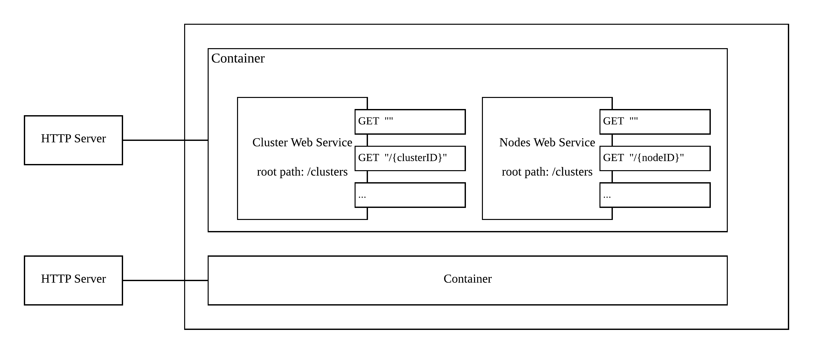

# Overview
k8s apiserver is using [go-restful](https://github.com/emicklei/go-restful) framework.


# Design
* Route: match http request, e.g. `GET "/clusters"`
* Web Sevice: consist of routes, e.g. Custer Web Service consists of routes like `GET /Clusters`, `POST /Clusters` etc.
* Container: consist of web services. one container is bond to one http server.
* Filter: middleware feature, can be used on container, webservice or route level.

# How to use
## 1. create resrouce type

```go
type Cluster struct {
	ID string
}

func (c Cluster) getClustersHandler (request *restful.Request, response *restful.Response){
	...
}
//other handler function
...
``` 

## 2. create web service for cluster

```go
clusterws := new(restful.WebService)
clusterws ws.
	Path("/Clusters").
	Consumes(restful.MIME_JSON).
	Produces(restful.MIME_JSON)
```

## 3. set handlers for each route

```go
clusterws.Route(ws.POST("").To(c.getClustersHandler))
// other routes
...
```

## 4. create container

```go
container := restful.NewContainer()
// add web services to container
container.Add(clusterws)
container.Add(nodews)
...
```

## 5. start http server

```go
// bind container to a http server
server := &http.Server{Addr: ":80", Handler: container}
log.Fatal(server.ListenAndServe())
```

## use filter

```go
// a filter to authenticate
func auth(req *restful.Request, resp *restful.Response, chain *restful.FilterChain) {
	// authentication logic
	...
	chain.ProcessFilter(req, resp)
}

// use it on container level
container.Filter(auth)

// on web service level
clusterws.Filter(auth)

// on route level
clusterws.Route(ws.POST("").Filter(auth).To(c.getClustersHandler))

```
