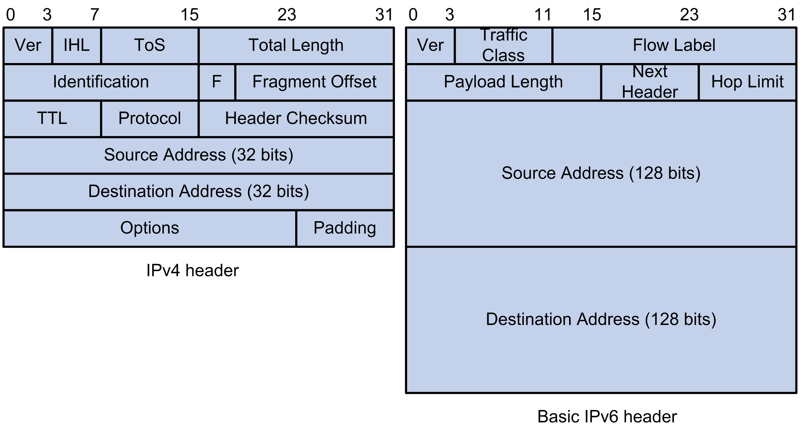

# Packet

## Header



IPv6 header only has information for forwarding.

- **Traffic Class**: ToS in IPv4, for quality of service control.  Linux kernel uses it to prioritize outgoing packets.
    
    ```go
    // it's possible to set in a golang app
    conn, err := ipv6.NewConn(client.Transport.(*http.Transport).DialContext, nil)
    conn.SetTrafficClass(0x10)
    ```
    
    [golang implementation](https://pkg.go.dev/golang.org/x/net/ipv6#Conn.SetTrafficClass)
    
- **Flow Label**: Linux kernel creates a flow hash with [flow label](https://git.kernel.org/pub/scm/linux/kernel/git/torvalds/linux.git/tree/net/ipv6/ip6_output.c?h=v6.3#n315), source address and destination address. This flow hash is then used to select a specific flow handler (e.g. set QoS parameters), but this feature is not widely supported by many network devices.
    
    ```go
    // it's possible to set in a golang app
    dialer := &net.Dialer{
            Control:   func(network, address string, c syscall.RawConn) error {
                var f ipv6Flow
                f.Label = 12345 // Set the flow label to 12345
                return ipv6TrafficClass(c.Control, &f)
            },
        }
    ```
    
- **Hop Limit**: Same with IPv4 TTL.
- **Next Header**: Like Protocol field in IPv4 it indicates upper-layer protocol in the payload(e.g. 6 is TCP, 3A is ICMPv6). The Linux kernel uses it to route the packet to the appropriate protocol handler.
- **Payload Length**: It doesn’t include the main header(extension headers are included) unlike IPv4. Linux kernel pass it to protocol handlers(e.g. TCP handler uses it to identify the data portion of the TCP segment.). Usually the value is 1500 byte due to [MTU](https://docs.aws.amazon.com/AWSEC2/latest/UserGuide/network_mtu.html#jumbo_frame_instances) (In AWS it’s ****9001 MTU**** ).
- **Fragment/PMTU**
    - With IPv4 most network layer devices are allowed to fragment packets.  e.g. the packet size is 1500 but the router MTU is 1400, then the router will fragment the packet to 2(1400 and 100). ***Identification***, ***Flags*** and ***Fragmentation Offset*** are used during the process.
    - But In IPv6, routers do not fragment packets.When a packet is larger than the MTU, the router discards the packet and sends an ICMPv6 "Packet Too Big" message back to the sender. The Linux kernel performs [Path MTU discovery](https://docs.aws.amazon.com/vpc/latest/userguide/vpc-network-acls.html#path_mtu_discovery) to decide the packet size if there’s no cache.
        
        > If the maximum transmission unit (MTU) between hosts in your subnets is different, or your instances communicate with peers over the internet, you must add the following network ACL rule, both inbound and outbound. This ensures that Path MTU Discovery can function correctly and prevent packet loss.
        > 

## Address

IPv6 addresses are assigned to interfaces not to the nodes. e.g. when using IPv4, we usually describe like this node has 1 public interface(public address) and 1 private interface(private address), but with IPv6 we would say this interface has a global address and a scoped address.

### Subnetting

Unlike IPv4 you have no choice but to subnet due to address limitation, the main reason for IPv6 subnetting is for purposes. Generally `/48` is for one organization (`/56` for a AWS VPC).

e.g. we’re using  `2406:da14:2:7700::/64` for one EKS cluster, `2406:da14:2000` is the AWS network address,  `7700` is the subnet ID.

### Address Types

```bash
eth0: flags=4163<UP,BROADCAST,RUNNING,MULTICAST>  mtu 9001
        inet 172.16.147.137  netmask 255.255.255.0  broadcast 172.16.147.255
        inet6 fe80::815:62ff:fe63:3031  prefixlen 64  scopeid 0x20<link>
        inet6 2406:da14:2:7701:134f:8c13:9083:d054  prefixlen 128  scopeid 0x0<global>
        ether 0a:15:62:63:30:31  txqueuelen 1000  (Ethernet)
        RX packets 381638275  bytes 182230646915 (169.7 GiB)
        RX errors 0  dropped 0  overruns 0  frame 0
        TX packets 502916278  bytes 835655725697 (778.2 GiB)
        TX errors 0  dropped 0 overruns 0  carrier 0  collisions 0

lo: flags=73<UP,LOOPBACK,RUNNING>  mtu 65536
        inet 127.0.0.1  netmask 255.0.0.0
        inet6 ::1  prefixlen 128  scopeid 0x10<host>
        loop  txqueuelen 1000  (Local Loopback)
        RX packets 70621491  bytes 5862167716 (5.4 GiB)
        RX errors 0  dropped 0  overruns 0  frame 0
        TX packets 70621491  bytes 5862167716 (5.4 GiB)
        TX errors 0  dropped 0 overruns 0  carrier 0  collisions 0
```

- Unicast
    - global
        
        Same to IPv4 public address which starts with `2000::/3` 
        
    - link local
        
        It is auto-configured on any interface using prefix `fe80::/10` ,  this address can be used without requiring a router(same switch).
        
    - loopback
        
        `::1/128` , same with IPv4 `127.0.0.1`
        
- Multicast
    
    Similar to IPv4 multicast, the destinations are a set of interfaces**,** identified by a single multicast address(`ff00::/8` is used) known as a multicast group**.** Basically it’s one way communication, the sender usually uses UDP to send the data. (e.g. streaming service)
    
    [Working with multicast - Amazon VPC](https://docs.aws.amazon.com/vpc/latest/tgw/working-with-multicast.html)
    
- Anycast
    
    An anycast address is  assigned to more than one interface belonging to different IPv6 enabled nodes. Packets sent to an anycast address are delivered to the "nearest" interface based on the routing. The address is in the same scope with unicast, and the device must be configured to recognize that the address is used for anycast. (e.g. DNS server)
    
    ```bash
    ip addr add 2001:db8::1/64 dev eth0 anycast
    ```
    

# Protocol

TCP and UDP keep untouched in IPv6, but ICMP, IGMP and ARP are replaced by ICMPv6.

## ****Neighbor Discovery****

### ****Solicited-node Multicast****

When an interface is configured with an IPv6 unicast address, a solicited-node multicast address is also automatically configured by the Linux kernel. 

`ff02::1:ff00:0/104` is used as prefix, the left 24 bits is from the unicast address.

for example, `83:d054` is taken from the unicast address

```bash
unicast address: 2406:da14:2:7701:134f:8c13:9083:d054
multicast address: ff02::1:ff83:d054

# get the multicast addresses assgined to an interface
$ ip -6 maddr show dev eth0
2: eth0
	 inet6 ff02::1:ff00:0
	 inet6 ff05::2
	 inet6 ff01::2
	 inet6 ff02::2
	 inet6 ff02::1:ff83:d054
	 inet6 ff02::1:ff63:3031
	 inet6 ff02::1
	 inet6 ff01::1
```

### ICMPv6 discovery packets

```bash
# tcpdump -i eth0 icmp6
tcpdump: verbose output suppressed, use -v or -vv for full protocol decode
listening on eth0, link-type EN10MB (Ethernet), capture size 262144 bytes
03:25:32.976673 IP6 fe80::ce4:acff:fe9a:a89 > 2406:da14:2:7702::f89b: ICMP6, neighbor solicitation, who has 2406:da14:2:7702::f89b, length 32
03:25:32.976725 IP6 2406:da14:2:7702::f89b > fe80::ce4:acff:fe9a:a89: ICMP6, neighbor advertisement, tgt is 2406:da14:2:7702::f89b, length 32
03:25:36.632586 IP6 gateway > ff02::1: ICMP6, router advertisement, length 56
03:25:46.632688 IP6 gateway > ff02::1: ICMP6, router advertisement, length 56
03:25:53.782290 IP6 2406:da14:2:7702::4f45 > 2406:da14:2:7701::a2ed: ICMP6, echo request, seq 25776, length 24
03:25:53.782351 IP6 2406:da14:2:7702::4f45 > 2406:da14:2:7702::f89b: ICMP6, echo request, seq 25776, length 24
03:25:53.782415 IP6 2406:da14:2:7702::4f45 > 2406:da14:2:7701:134f:8c13:9083:d054: ICMP6, echo request, seq 25776, length 24
03:25:53.782743 IP6 2406:da14:2:7702::f89b > 2406:da14:2:7702::4f45: ICMP6, echo reply, seq 25776, length 24
```

- ****Neighbor Solicitation****
    
    This packet is used to get MAC address of an unicast address which is similar to ARP request. It’s sent to the solicited-node multicast address of the target address.
    
    e.g. node1 wants to talk to node2
    
    ```bash
    # node1
    eth0: flags=4163<UP,BROADCAST,RUNNING,MULTICAST>  mtu 9001
            inet 172.16.148.249  netmask 255.255.255.0  broadcast 172.16.148.255
            inet6 fe80::ce4:acff:fe9a:a89  prefixlen 64  scopeid 0x20<link>
            inet6 2406:da14:2:7702::4f45  prefixlen 128  scopeid 0x0<global>
            ether 0e:e4:ac:9a:0a:89  txqueuelen 1000  (Ethernet)
    
    # node2 
    eth0: flags=4163<UP,BROADCAST,RUNNING,MULTICAST>  mtu 9001
            inet 172.16.147.137  netmask 255.255.255.0  broadcast 172.16.147.255
            inet6 fe80::815:62ff:fe63:3031  prefixlen 64  scopeid 0x20<link>
            inet6 2406:da14:2:7701:134f:8c13:9083:d054  prefixlen 128  scopeid 0x0<global>
            ether 0a:15:62:63:30:31  txqueuelen 1000  (Ethernet)
    ```
    
    then the packet would like 
    
    ```bash
    # src MAC is node1 MAC, dst MAC is the multicast MAC which uses prefix 33:33
    Ethernet II, Src: 0e:e4:ac:9a:0a:89, Dst: 33:33:FF:83:D0:54
    # dst address is the solicited-node multicast address 
    Internet Protocol Version 6, Src: 2406:da14:2:7702::4f45, Dst: ff02::1:ff83:d054
    Internet Control Message Protocol v6
        Type: Neighbor Solicitation (135)
        Code: 0
        Checksum: 0x149d [correct]
        Reserved: 00000000
        Target Address: 2406:da14:2:7701:134f:8c13:9083:d054
        ICMPv6 Option (Source link-layer address : 0e:e4:ac:9a:0a:89)
    ```
    
    node2 will process this packet because only it is subscribed to this multicast group(if the switch doesn’t know the target node(MLD support or not), it will broadcast to all nodes but other nodes will just discard the packet).
    
- ****Neighbor Advertisement****
    
    This is the response packet to the solicitation packet which is similar to the ARP reply.
    
    ```bash
    Ethernet II, Src: 0a:15:62:63:30:31, Dst: 0e:e4:ac:9a:0a:89
    # the dst address is the unicast address of node1
    Internet Protocol Version 6, Src: 2406:da14:2:7701:134f:8c13:9083:d054, Dst: 2406:da14:2:7702::4f45
    Internet Control Message Protocol v6
        Type: Neighbor Advertisement (136)
        Code: 0
        Checksum: 0x4cc6 [correct]
        Flags: 0x60000000
            0... .... .... .... .... .... .... .... = Router: Not set
            .1.. .... .... .... .... .... .... .... = Solicited: Set
            ..1. .... .... .... .... .... .... .... = Override: Set
            ...0 0000 0000 0000 0000 0000 0000 0000 = Reserved: 0
        Target Address: 2406:da14:2:7701:134f:8c13:9083:d054
        ICMPv6 Option (Target link-layer address : 0a:15:62:63:30:31)
    ```
    
    like ARP table, there’s also an IPv6 neighbor cache.
    
    ```bash
    [root@ip-172-16-148-249 ec2-user]# ip -6 neigh show
    2406:da14:2:7702:91b6::20 dev enid03c769fde5 lladdr 9a:6d:28:da:cf:76 REACHABLE
    2406:da14:2:7702:91b6::2 dev enib9040540273 lladdr 0e:27:85:78:f2:6b REACHABLE
    fe80::cd5:beff:fe1d:214d dev eth0 lladdr 0e:d5:be:1d:21:4d router extern_learn  REACHABLE
    ```
    
- ****Router Advertisement****
    
    Routers advertise their presence periodically by this packet. It’s using multicast address `ff02::1` which means all the nodes in this network will process the packets.
    
    ```bash
    Ethernet II, Src: 0e:d5:be:1d:21:4d (0e:d5:be:1d:21:4d), Dst: IPv6mcast_00:00:00:01 (33:33:00:00:00:01)
    Internet Protocol Version 6, Src: fe80::cd5:beff:fe1d:214d (fe80::cd5:beff:fe1d:214d), Dst: ff02::1 (ff02::1)
    Internet Control Message Protocol v6
        Type: Router Advertisement (134)
        Code: 0
        Checksum: 0xe25a [correct]
        Cur hop limit: 255
        Flags: 0x80
            1... .... = Managed address configuration: Set
            .0.. .... = Other configuration: Not set
            ..0. .... = Home Agent: Not set
            ...0 0... = Prf (Default Router Preference): Medium (0)
            .... .0.. = Proxy: Not set
            .... ..0. = Reserved: 0
        Router lifetime (s): 1800
        Reachable time (ms): 0
        Retrans timer (ms): 0
        ICMPv6 Option (Source link-layer address : 0e:d5:be:1d:21:4d)
            Type: Source link-layer address (1)
            Length: 1 (8 bytes)
            Link-layer address: 0e:d5:be:1d:21:4d (0e:d5:be:1d:21:4d)
        ICMPv6 Option (Prefix information : 2406:da14:2:7702::/64)
            Type: Prefix information (3)
            Length: 4 (32 bytes)
            Prefix Length: 64
            Flag: 0x80
                1... .... = On-link flag(L): Set
                .0.. .... = Autonomous address-configuration flag(A): Not set
                ..0. .... = Router address flag(R): Not set
                ...0 0000 = Reserved: 0
            Valid Lifetime: 4294967295 (Infinity)
            Preferred Lifetime: 4294967295 (Infinity)
            Reserved
            Prefix: 2406:da14:2:7702:: (2406:da14:2:7702::)
    ```
    
- ****Router Solicitation****
    
    routers send Router Advertisement packets periodically, but nodes can request Router Advertisement by sending Neighbor Solicitation.
    

## Address Configuration

Basically there are two ways to get an IPv6 address to configure an interface.

### ****SLAAC****

Stateless Address Auto-configuration, auto-configure a unique IPv6 address without tracking which address is assigned to which node(no server or any network device keeps such information).

1. Configure link local address
    
    This address is generated from the MAC address
    
    ```bash
    eth0: flags=4163<UP,BROADCAST,RUNNING,MULTICAST>  mtu 9001
            inet6 fe80::ce4:acff:fe9a:a89  prefixlen 64  scopeid 0x20<link>
            ether 0e:e4:ac:9a:0a:89  txqueuelen 1000  (Ethernet)
    ```
    
2. Duplicate Address Detection
    
    Make sure that the address is actually unique in the local segment. Send [****Neighbor Solicitation****](https://www.notion.so/Neighbor-Solicitation-015b0cad7fa84c0b8ec4976d4330fd27?pvs=21) to see if there’s [****Neighbor Advertisement****](https://www.notion.so/Neighbor-Advertisement-79a7bc40ac0c4c3d851b5882306506e5?pvs=21) . 
    
3. Get global unicast address
    
    Request [****Router Advertisement****](https://www.notion.so/Router-Advertisement-a50621c7b19a40ab92a2ba535f7f5486?pvs=21) to get a global prefix.
    
    ```bash
        ICMPv6 Option (Prefix information : 2406:da14:2:7702::/64)
            Type: Prefix information (3)
            Length: 4 (32 bytes)
            Prefix Length: 64
            Flag: 0x80
                1... .... = On-link flag(L): Set
                .0.. .... = Autonomous address-configuration flag(A): Not set
                ..0. .... = Router address flag(R): Not set
                ...0 0000 = Reserved: 0
            Valid Lifetime: 4294967295 (Infinity)
            Preferred Lifetime: 4294967295 (Infinity)
            Reserved
            Prefix: 2406:da14:2:7702:: (2406:da14:2:7702::)
    ```
    
    As long as router advertisement returns this prefix, the address will remain valid. If it stops the address can become deprecated after the `Valid Lifetime`. 
    
    The unicast address is the combination of the prefix and MAC address: `2406:da14:2:7702:0e:e4:ac:9a:0a:89` (AWS isn’t using SLAAC). 
    
    ```bash
    eth0: flags=4163<UP,BROADCAST,RUNNING,MULTICAST>  mtu 9001
            inet 172.16.148.249  netmask 255.255.255.0  broadcast 172.16.148.255
            inet6 fe80::ce4:acff:fe9a:a89  prefixlen 64  scopeid 0x20<link>
            inet6 2406:da14:2:7702::4f45  prefixlen 128  scopeid 0x0<global>
            ether 0e:e4:ac:9a:0a:89  txqueuelen 1000  (Ethernet)The default gateway is also configured to the router link local address
    ```
    
4. Duplicate Address Detection again

### DHCPv6

[****Router Advertisement****](https://www.notion.so/Router-Advertisement-a50621c7b19a40ab92a2ba535f7f5486?pvs=21) is used for DHCP configuration too.

1. [****Router Solicitation****](https://www.notion.so/Router-Solicitation-b7716d8f96024c6b961707171866d253?pvs=21) 
    
    set default gateway with the src address of the router
    
    ```bash
    default via fe80::cd5:beff:fe1d:214d dev eth0 proto ra metric 1024 expires 1792sec hoplimit 255 pref medium
    ```
    
    `.0.. .... = Autonomous address-configuration flag(A): Not set` don’t use SLAAC,
    
    `1... .... = Managed address configuration: Set` look for DHCP server.
    
2. Search for DHCP server
    
    send DHCPv6 SOLICIT message to the  multicast group `FF02::1:2` (DHCP servers must be configured with this [multicast group](https://www.notion.so/IPv6-deep-dive-b08343fd7be84f9080fa12acd8c311f0?pvs=21)).
    
3. Get global unicast address
    
    Send request to DHCP server and do DAD.
    

<aside>
💡 I’m talking about stateful DHCPv6 here, there’s also stateless DHCPv6 which works together with SLACC.

</aside>

# Kernel implementation

***Kernel 5.14***

[https://whimsical.com/ebpf-datapath-CEo2pwLta7UADkTwXb9Qqh](https://whimsical.com/ebpf-datapath-CEo2pwLta7UADkTwXb9Qqh)

## Tx

```bash
curl http://[2406:da14:2:7702:91b6::f]
```

### Application layer

1. Create a socket using [system call](https://man7.org/linux/man-pages/man2/socket.2.html)
    
    In our example it’s using [IPv6](https://github.com/torvalds/linux/blob/v5.14/net/socket.c#L1523) and tcp.
    
    ```c
    socket(AF_INET6, SOCK_STREAM, IPPROTO_TCP)
    ```
    
    It [creates socket](https://github.com/torvalds/linux/blob/v5.14/net/socket.c#L2910) which can be used to send and read data. `[__sock_create](https://elixir.bootlin.com/linux/v5.14/source/net/socket.c#L1379)` is called eventually .
    
    ```c
    int __sock_create(struct net *net, int family, int type, int protocol,
    			 struct socket **res, int kern)
    {
    	struct socket *sock;
      const struct net_proto_family *pf;
    	...
    	sock = sock_alloc();
    	...
      pf = rcu_dereference(net_families[family]);
    	err = pf->create(net, sock, protocol, kern);
    	...
    }
    ```
    
    - `sock_alloc` allocates an [inode](https://en.wikipedia.org/wiki/Inode). If there is no available inode, socket creation fails.
        
        ```bash
        [root@ip-10-0-70-40 ec2-user]# df -i
        Filesystem      Inodes      IUsed    IFree      IUse%  Mounted on
        devtmpfs        32629940    492      32629448    1%    /dev 
        
        # limit of this user
        [root@ip-10-0-70-40 ec2-user]# ulimit -i
        30446
        ```
        
    - `pf->create` calls the protocol create function, which is `[inet6_create](https://elixir.bootlin.com/linux/v5.14/source/net/ipv6/af_inet6.c#L110)` in the case of [IPv6](https://elixir.bootlin.com/linux/v5.14/source/net/ipv6/af_inet6.c#L726).
        
        ```c
        static int inet6_create(struct net *net, struct socket *sock, int protocol,
        			int kern)
        {
        	struct sock *sk;
        	...
        	list_for_each_entry_rcu(answer, &inetsw6[sock->type], list) {
        		...
        	}
        	...
        	sock->ops = answer->ops;
        	answer_prot = answer->prot;
        	...
        	sk = sk_alloc(net, PF_INET6, GFP_KERNEL, answer_prot, kern);
        	...
        	sock_init_data(sock, sk);
        	if (sk->sk_prot->init) {
        		err = sk->sk_prot->init(sk);
        		...
        	}
        	...
        }
        ```
        
        1. Based on type(`SOCK_STREAM`)  answer is set to `[tcpv6_protosw](https://elixir.bootlin.com/linux/v5.14/source/net/ipv6/tcp_ipv6.c#L2214)` which is registered into the list by `[inet6_register_protosw](https://elixir.bootlin.com/linux/v5.14/C/ident/inet6_register_protosw)` , so `sock->ops` is set to `[inet6_stream_ops](https://elixir.bootlin.com/linux/v5.14/source/net/ipv6/af_inet6.c#L666)` .
            
            ```c
            static struct inet_protosw tcpv6_protosw = {
            	.type		=	SOCK_STREAM,
            	.protocol	=	IPPROTO_TCP,
            	.prot		=	&tcpv6_prot,
            	.ops		=	&inet6_stream_ops,
            	.flags		=	INET_PROTOSW_PERMANENT |
            				INET_PROTOSW_ICSK,
            };
            ```
            
        2.  A `sock` is created by [`sk_alloc`](https://elixir.bootlin.com/linux/v5.14/source/net/core/sock.c#L1856) which invokes  **`[sk_prot_alloc](https://elixir.bootlin.com/linux/v5.14/C/ident/sk_prot_alloc)`** to set the protocol(`IPPROTO_TCP`) function, it’s `[tcpv6_prot`](https://elixir.bootlin.com/linux/v5.14/source/net/ipv6/tcp_ipv6.c#L2155) in our case.
            
            ```c
            struct proto tcpv6_prot = {
            	.name			= "TCPv6",
            	.connect		= tcp_v6_connect,
            	...
            	.recvmsg		= tcp_recvmsg,
            	.sendmsg		= tcp_sendmsg,
            	.init			= tcp_v6_init_sock,
            	...
            }
            ```
            
            <aside>
            💡  `struct sock` is very similar to `struct socket` , but basically sock is for kernel and socket is for applications.
            
            </aside>
            
        3. [Init sock](https://elixir.bootlin.com/linux/v5.14/source/net/ipv6/tcp_ipv6.c#L1952)
            
            ```c
            static int tcp_v6_init_sock(struct sock *sk)
            {
            	struct inet_connection_sock *icsk = inet_csk(sk);
            	tcp_init_sock(sk);
            	icsk->icsk_af_ops = &ipv6_specific;
            	...
            }
            ```
            
    
    we can see all the created sockets in the host.
    
    ```bash
    [root@ip-172-16-148-249 ec2-user]# netstat -6 -a
    Active Internet connections (servers and established)
    Proto Recv-Q Send-Q Local Address           Foreign Address         State
    tcp6       0      0 [::]:9253               [::]:*                  LISTEN
    tcp6       0      0 [::]:ssh                [::]:*                  LISTEN
    tcp6       0      0 localhost6:9879         [::]:*                  LISTEN
    tcp6       0      0 2406:da14:2:7702::34164 2406:da14:2:77:webcache TIME_WAIT
    tcp6       0      0 2406:da14:2:7702:::4240 2406:da14:2:7701::57844 ESTABLISHED
    ```
    
2. Establish TCP connection
    
    [connect](https://man7.org/linux/man-pages/man2/connect.2.html) system call is used to initialize a TCP connection.
    
    ```c
    int __sys_connect_file(struct file *file, struct sockaddr_storage *address,
    		       int addrlen, int file_flags)
    {
    	..
    
    	err = sock->ops->connect(sock, (struct sockaddr *)address, addrlen,
    				 sock->file->f_flags | file_flags);
    	...
    }
    ```
    
    `[inet_stream_connect](https://elixir.bootlin.com/linux/v5.14/source/net/ipv6/af_inet6.c#L671)` is invoked in our case which calls `[__inet_stream_connect](https://elixir.bootlin.com/linux/v5.14/source/net/ipv4/af_inet.c#L612)` .
    
    ```c
    int __inet_stream_connect(struct socket *sock, struct sockaddr *uaddr,
    			  int addr_len, int flags, int is_sendmsg)
    {
    	struct sock *sk = sock->sk;
    	...
    	switch (sock->state) {
    	...
    	case SS_UNCONNECTED:
    		...
    		err = sk->sk_prot->connect(sk, uaddr, addr_len);
    		sock->state = SS_CONNECTING;
    	...
    	}
    	if ((1 << sk->sk_state) & (TCPF_SYN_SENT | TCPF_SYN_RECV)) {
    		...
    		if (!timeo || !inet_wait_for_connect(sk, timeo, writebias))
    			goto out;
    		...
    	}
    	sock->state = SS_CONNECTED;
    ...
    }
    ```
    
3. Send data to the socket using [sendto](https://man7.org/linux/man-pages/man3/sendto.3p.html)
    
    The data is reconstructed for the lower layer to handle which we can call it [message](https://github.com/torvalds/linux/blob/v5.14/net/socket.c#L1994) now, and it’s [copied](https://github.com/torvalds/linux/blob/v5.14/net/socket.c#L247) from user space to kernel space.
    
    ```c
    int __sys_sendto(int fd, void __user *buff, size_t len, unsigned int flags,
    		 struct sockaddr __user *addr,  int addr_len)
    {
    	struct msghdr msg;
    	...
    
    	if (addr) {
    		err = move_addr_to_kernel(addr, addr_len, &address);
    		if (err < 0)
    			goto out_put;
    		msg.msg_name = (struct sockaddr *)&address;
    		msg.msg_namelen = addr_len;
    	}
    	if (sock->file->f_flags & O_NONBLOCK)
    		flags |= MSG_DONTWAIT;
    	msg.msg_flags = flags;
    	err = sock_sendmsg(sock, &msg);
    
    ...
    }
    ```
    
    `[sock_sendmsg](https://elixir.bootlin.com/linux/v5.14/source/net/socket.c#L718)` invokes corresponded  functions based on the protocol, in our example it’s `[inet6_sendmsg](https://github.com/torvalds/linux/blob/v5.14/net/ipv6/af_inet6.c#L635)` , but when using tcp there’s actually no difference since they both invoke `[tcp_sendmsg](https://github.com/torvalds/linux/blob/v5.14/net/ipv4/tcp.c#L1456)`
    
    ```c
    static inline int sock_sendmsg_nosec(struct socket *sock, struct msghdr *msg)
    {
    	int ret = INDIRECT_CALL_INET(sock->ops->sendmsg, inet6_sendmsg,
    				     inet_sendmsg, sock, msg,
    				     msg_data_left(msg));
    	BUG_ON(ret == -EIOCBQUEUED);
    	return ret;
    }
    ```
    
    <aside>
    💡 it’s using the same function for tcp because the underlying tcp protocol is the same for both IPv4 and IPv6. But udp supports multicast, a separated  function is required since [Multicast](https://www.notion.so/Multicast-faa3343cf8154f079971bbb5e08631fd?pvs=21) addresses are different.
    
    </aside>
    

### Transport layer

1. Establish TCP connection
    
    The corresponded  [connect](https://github.com/torvalds/linux/blob/v3.13/net/ipv4/af_inet.c#L602) function is called based on the protocol:  `[tcp_v4_connect](https://github.com/torvalds/linux/blob/v5.14/net/ipv4/tcp_ipv4.c#L198)` or  **`[tcp_v6_connect`](https://github.com/torvalds/linux/blob/v5.14/net/ipv6/tcp_ipv6.c#L145) .**
    
    1. Prepare ****the necessary information about the destination endpoint(read route table), such as its IP address and port number to establish a tcp connection.
        
        ```c
        static int tcp_v6_connect(struct sock *sk, struct sockaddr *uaddr,
        			  int addr_len)
        {
        	...
        
        	if (np->sndflow) {
        		fl6.flowlabel = usin->sin6_flowinfo&IPV6_FLOWINFO_MASK;
        		IP6_ECN_flow_init(fl6.flowlabel);
        		...
        	}
        	if (addr_type & IPV6_ADDR_MULTICAST)
        		return -ENETUNREACH;
        	...
        	tcp_set_state(sk, TCP_SYN_SENT);
        	err = tcp_connect(sk);
        	...
        }
        ```
        
        <aside>
        💡 The main difference between IPv6 and IPv4 is IPv6 needs to handle [the flow label](https://www.notion.so/IPv6-deep-dive-b08343fd7be84f9080fa12acd8c311f0?pvs=21)
        
        </aside>
        
    2. call `[tcp_connect](https://github.com/torvalds/linux/blob/v5.14/net/ipv4/tcp_output.c#L3822)` to initiate the TCP three-way handshake.
        
        ```c
        int tcp_connect(struct sock *sk)
        {
        	tcp_call_bpf(sk, BPF_SOCK_OPS_TCP_CONNECT_CB, 0, NULL);
        	...
        	tcp_connect_init(sk);
        	...
        	buff = sk_stream_alloc_skb(sk, 0, sk->sk_allocation, true);
        	tcp_init_nondata_skb(buff, tp->write_seq++, TCPHDR_SYN);
        	tcp_connect_queue_skb(sk, buff);
        	...
        	err = tp->fastopen_req ? tcp_send_syn_data(sk, buff) :
        	      tcp_transmit_skb(sk, buff, 1, sk->sk_allocation);
        	...
        }
        ```
        
        1. invoke BPF program registered for the **`BPF_SOCK_OPS_TCP_CONNECT_CB`** event
            
            ```c
            tcp_call_bpf(sk, BPF_SOCK_OPS_TCP_CONNECT_CB, 0, NULL);
            ```
            
        2. `tcp_connect_init(sk)` initialize socket state and parameters like window size
            
            <aside>
            💡 [TCP window](https://en.wikipedia.org/wiki/TCP_tuning#Window_size) size is critical for optimizing TCP performance. If it is too small, that would lead to low throughput, but if it is too large, the receiver may not be able to handle all the data, leading to dropped packets and retransmissions.
            
            </aside>
            
            It’s possible to set window size in application, this parameter will be passed to `tcp_connect_init` function.
            
            ```go
            client := &http.Client{
            		Transport: &http.Transport{
            			Dialer: &net.Dialer{
            				// Set the TCP window size to 64KB
            				WriteBufferSize: 65536,
            				ReadBufferSize:  65536,
            			},
            		},
            	}
            ```
            
        3. `sk_stream_alloc_skb` create an [sk_buff](https://github.com/torvalds/linux/blob/v5.14/include/linux/skbuff.h#L720) object
            
            one `sk_buff` represents one network packet which is passed through the networking stack(each layer adds its own header to this object), then `tcp_connect_queue_skb` puts the SYN segment in the queue.
            
        4. `[tcp_send_syn_data](https://elixir.bootlin.com/linux/v5.14/source/net/ipv4/tcp_output.c#L3734)(sk, buff)` is to send initial SYN packet to initiate the connection setup process.
    3. **`[__inet_stream_connect](https://elixir.bootlin.com/linux/v5.14/C/ident/__inet_stream_connect)`** waits for the SYN-ACK response from the server and sending the final ACK packet.  `[tcp_sendmsg](https://github.com/torvalds/linux/blob/v5.14/net/ipv4/tcp.c#L1456)` is [blocked](https://github.com/torvalds/linux/blob/v5.14/net/ipv4/tcp.c#LL1247C1-L1247C1) until the connection is established.
        
        ```c
        if (((1 << sk->sk_state) & ~(TCPF_ESTABLISHED | TCPF_CLOSE_WAIT)) &&
        	    !tcp_passive_fastopen(sk)) {
        		err = sk_stream_wait_connect(sk, &timeo);
        		if (err != 0)
        			goto do_error;
        	}
        ```
        
2. [Update](https://github.com/torvalds/linux/blob/v5.14/net/ipv4/tcp.c#L1269) socket control data ([control messages](https://man7.org/linux/man-pages/man3/cmsg.3.html))
    
    It only updates the data when there’s control message field. There’s no data sending at this moment(the function name is a little bit confusing).
    
    ```c
    sockcm_init(&sockc, sk);
    if (msg->msg_controllen) {
    		err = sock_cmsg_send(sk, msg, &sockc);
    }
    ```
    
3. The `tcp_send_mss(sk, &size_goal, flags)` function determines the Maximum Segment Size (MSS) value to use when sending TCP segments, taking into account factors like PMTU and buffer size. The actual sending logic is inside a loop which only sends part of the message if it is larger than the MSS.
    
    ```c
    mss_now = tcp_send_mss(sk, &size_goal, flags);
    ...
    while (msg_data_left(msg)) {
    	skb = tcp_write_queue_tail(sk);
    	...
    }
    ```
    
    One skb is handled at each time, the TCP write queue holds the unsent data that is waiting to be transmitted.
    
4. if the current skb is exceeding the desired size  allocate a new one, otherwise appending the data.
    
    ```c
    if (skb)
    			copy = size_goal - skb->len;
    if (copy <= 0 || !tcp_skb_can_collapse_to(skb)) {
    			...
    			skb = sk_stream_alloc_skb(sk, 0, sk->sk_allocation,
    						  first_skb);
    			...
    		}
    if (copy > msg_data_left(msg))
    		copy = msg_data_left(msg);
    ```
    
5. Check force push condition
    
    If `forced_push(tp)` is true, the data is sent immediately without delaying. Otherwise **[Nagle's algorithm](https://en.wikipedia.org/wiki/Nagle%27s_algorithm)** is applied here.
    
    ```c
    		if (forced_push(tp)) {
    			tcp_mark_push(tp, skb);
    			__tcp_push_pending_frames(sk, mss_now, TCP_NAGLE_PUSH);
    		} else if (skb == tcp_send_head(sk))
    			tcp_push_one(sk, mss_now);
    	...
    ```
    
    **`[tcp_write_xmit](https://elixir.bootlin.com/linux/v5.14/C/ident/tcp_write_xmit)`** is called for both cases, the differences are parameters.
    
    ```go
    void __tcp_push_pending_frames(struct sock *sk, unsigned int cur_mss,
    			       int nonagle)
    {
    	..
    	if (tcp_write_xmit(sk, cur_mss, nonagle, 0, sk_gfp_mask(sk, GFP_ATOMIC)))
    		tcp_check_probe_timer(sk);
    }
    
    void tcp_push_one(struct sock *sk, unsigned int mss_now)
    {
    	...
    	tcp_write_xmit(sk, mss_now, TCP_NAGLE_PUSH, 1, sk->sk_allocation);
    }
    ```
    
    `tcp_write_xmit` decides to send the packets immediately or delay, `tcp_nagle_test` is invoked in case of `tcp_push_one` .
    
    ```go
    		if (tso_segs == 1) {
    			if (unlikely(!tcp_nagle_test(tp, skb, mss_now,
    						     (tcp_skb_is_last(sk, skb) ?
    						      nonagle : TCP_NAGLE_PUSH))))
    				break;
    		...
    
    		if (unlikely(tcp_transmit_skb(sk, skb, 1, gfp)))
    			break;
    ```
    
6. `[tcp_transmit_skb](https://github.com/torvalds/linux/blob/v5.14/net/ipv4/tcp_output.c#L1420)` basically builds the TCP header and passes the skb to IP layer.
    
    ```c
    /* Build TCP header and checksum it. */
    	th = (struct tcphdr *)skb->data;
    	th->source		= inet->inet_sport;
    	th->dest		= inet->inet_dport;
    	th->seq			= htonl(tcb->seq);
    	th->ack_seq		= htonl(rcv_nxt);
    	*(((__be16 *)th) + 6)	= htons(((tcp_header_size >> 2) << 12) |
    					tcb->tcp_flags);
    
    	th->check		= 0;
    	th->urg_ptr		= 0;
    ...
    	err = INDIRECT_CALL_INET(icsk->icsk_af_ops->queue_xmit,
    				 inet6_csk_xmit, ip_queue_xmit,
    				 sk, skb, &inet->cork.fl);IP layer
    ```
    

### IP layer

1. `[ip_queue_xmit](https://github.com/torvalds/linux/blob/v5.14/net/ipv4/ip_output.c#L545)` is for IPv4, and `[inet6_csk_xmit](https://github.com/torvalds/linux/blob/v5.14/net/ipv6/inet6_connection_sock.c#L114)` is for IPv6.
    
    they do similar work: 
    
    - get route information from [FIB](https://en.wikipedia.org/wiki/Forwarding_information_base#:~:text=A%20forwarding%20information%20base%20(FIB,interface%20should%20forward%20a%20packet.) (`[ip6_dst_lookup_tail](https://elixir.bootlin.com/linux/v5.14/C/ident/ip6_dst_lookup_tail)` or `[fib_table_lookup](https://elixir.bootlin.com/linux/v5.14/C/ident/fib_table_lookup)`)
        
        ```c
        [root@ip-10-0-70-40 ec2-user]# ip r
        default via 10.0.64.1 dev eth0
        10.0.64.0/21 dev eth0 proto kernel scope link src 10.0.70.40
        10.2.225.144 dev eni697de674575 scope link
        
        [root@ip-10-0-70-40 ec2-user]# ip -6 r
        fe80::/64 dev eth0 proto kernel metric 256 pref medium
        fe80::/64 dev eth1 proto kernel metric 256 pref medium
        fe80::/64 dev eni697de674575 proto kernel metric 256 pref medium
        ```
        
    - build IP headers
    - run hooks registered at  `NF_INET_LOCAL_OUT` before sending out(the OUTPUT chain).
        
        ```c
        [root@ip-10-0-70-40 ec2-user]# iptables -L -t raw -v -n -w
        Chain OUTPUT (policy ACCEPT 267M packets, 506G bytes)
         pkts bytes target     prot opt in     out     source               destination
            0     0 CT         tcp  --  *      *       172.20.0.10          0.0.0.0/0            tcp spt:9003 NOTRACK
           ...
        ```
        
        <aside>
        💡 [netfilter](https://en.wikipedia.org/wiki/Netfilter) is quite complicated but actually not mandatory, e.g. with Cilium installed, the netfilter module(iptables, conntrack etc.) can be removed entirely.
        
        </aside>
        
        - [IPv4](https://github.com/torvalds/linux/blob/v5.14/net/ipv4/ip_output.c#L99)
            
            ```c
            int __ip_local_out(struct net *net, struct sock *sk, struct sk_buff *skb)
            {
            	...
            	skb = l3mdev_ip_out(sk, skb);
            	if (unlikely(!skb))
            		return 0;
            	...
            	return nf_hook(NFPROTO_IPV4, NF_INET_LOCAL_OUT,
            		       net, sk, skb, NULL, skb_dst(skb)->dev,
            		       dst_output);
            }
            ```
            
        - [IPv6](https://elixir.bootlin.com/linux/v5.14/source/net/ipv6/ip6_output.c#L348)
            
            the main difference here is IPv6 also checks MTU([**Fragment/PMTU**](https://www.notion.so/Fragment-PMTU-9dbdbea1df544b53b0184234fec8af93?pvs=21) ), the packet will dropped if it’s bigger than MTU.
            
            ```c
            mtu = dst_mtu(dst);
            	if ((skb->len <= mtu) || skb->ignore_df || skb_is_gso(skb)) {
            		IP6_UPD_PO_STATS(net, ip6_dst_idev(skb_dst(skb)),
            			      IPSTATS_MIB_OUT, skb->len);
            		skb = l3mdev_ip6_out((struct sock *)sk, skb);
            		if (unlikely(!skb))
            			return 0;
            
            		...
            		return NF_HOOK(NFPROTO_IPV6, NF_INET_LOCAL_OUT,
            			       net, (struct sock *)sk, skb, NULL, dst->dev,
            			       dst_output);
            	}
            	...
            	return -EMSGSIZE;
            ```
            
        
        <aside>
        💡 If egress device is enslaved to an L3 master device (`l3mdev_ip_out` or `l3mdev_ip6_out`), the packet is handed over to its handler(e.g. docker bridge(docker0), Calico), see more about [VRF](https://www.kernel.org/doc/Documentation/networking/vrf.txt).
        
        </aside>
        
2. `dst_output` invokes the correspond output function based on protocol.
    
    ```c
    /* Output packet to network from transport.  */
    static inline int dst_output(struct net *net, struct sock *sk, struct sk_buff *skb)
    {
    	return INDIRECT_CALL_INET(skb_dst(skb)->output,
    				  ip6_output, ip_output,
    				  net, sk, skb);
    }
    ```
    
    the implementation is very similar, in case of `[ip6_output](https://github.com/torvalds/linux/blob/v5.14/net/ipv6/ip6_output.c#L229)` 
    
    ```c
    int ip6_output(struct net *net, struct sock *sk, struct sk_buff *skb)
    {
    	...
    	// set protocol
    	skb->protocol = htons(ETH_P_IPV6);
    	skb->dev = dev;
    
    	...
    	// eveluate netfilter hooks
    	return NF_HOOK_COND(NFPROTO_IPV6, NF_INET_POST_ROUTING,
    			    net, sk, skb, indev, dev,
    			    ip6_finish_output,
    			    !(IP6CB(skb)->flags & IP6SKB_REROUTED));
    }
    ```
    
    `NF_HOOK_COND` checks post routing chain rules, xx_finish_output(`[ip6_finish_output](https://github.com/torvalds/linux/blob/v5.14/net/ipv6/ip6_output.c#L213)` or **`[ip_finish_output](https://elixir.bootlin.com/linux/v5.14/C/ident/ip_finish_output)`**) will be invoked if it passes. First execute the BPF program which is attached to `BPF_CGROUP_RUN_PROG_INET_EGRESS` ****(if there is)**.** The packet will be dropped if the the program returns error, otherwise `[__ip6_finish_output](https://github.com/torvalds/linux/blob/v5.14/net/ipv6/ip6_output.c#L189)` will be invoked.
    
    XFRM policy will be evaluated first,  we don’t have any in our nodes.
    
    ```c
    [root@ip-10-0-70-40 ec2-user]# ip xfrm policy list
    ```
    
    Then check MTU and fragment the packet if it’s too big.
    
    ```c
    if ((skb->len > mtu && !skb_is_gso(skb)) ||
    	    dst_allfrag(skb_dst(skb)) ||
    	    (IP6CB(skb)->frag_max_size && skb->len > IP6CB(skb)->frag_max_size))
    		return ip6_fragment(net, sk, skb, ip6_finish_output2);
    	else
    		return ip6_finish_output2(net, sk, skb);
    ```
    
    <aside>
    💡 It’s the second time for IPv6 to check MTU [the main difference here is IPv6 also checks MTU([**Fragment/PMTU**](https://www.notion.so/Fragment-PMTU-9dbdbea1df544b53b0184234fec8af93?pvs=21) ), the packet will dropped if it’s bigger than MTU.](https://www.notion.so/the-main-difference-here-is-IPv6-also-checks-MTU-the-packet-will-dropped-if-it-s-bigger-than-MTU-23e55b1e85eb4f30a86a958369c9f8ae?pvs=21) The packet isn’t dropped this time.
    
    </aside>
    
3. `xx_finish_output2` (`[ip6_finish_output2](https://github.com/torvalds/linux/blob/v5.14/net/ipv6/ip6_output.c#L59)` or **`[ip_finish_output2](https://elixir.bootlin.com/linux/v5.14/C/ident/ip_finish_output2)`**) passes the packet down to the **`[neighbour](https://elixir.bootlin.com/linux/v5.14/C/ident/neighbour)`** cache.
    
    The implementation is a little different between IPv4 and IPv6, but the main logic is same.
    
    1. create `struct neighbour *neigh` object
    2. call `neigh_output(neigh, skb, false)` 
    
    ```c
    	struct dst_entry *dst = skb_dst(skb);
    
    	// IPv4 only
    	struct rtable *rt = (struct rtable *)dst;
    	// IPv6 only
    	const struct in6_addr *nexthop;
    
    	struct neighbour *neigh;
    ```
    
    - `dst_entry` (destination cache entry) contains the routing information that is used to transmit the packet. It includes the network device (**`dev`**), next-hop IP address (**`u.dst`**), and other information necessary for routing.
    - (Only for IPv4)  `rtable` extends `dst_entry` with additional routing-specific fields like source and destination IP,  the gateway IP address etc.
    - (Only for IPv6) `nexthop` points to the next-hop IPv6 address.
    - **`neigh`** contains the MAC address of the next hop router to which the packet should be sent.
        - IPv4, `[ip_neigh_for_gw](https://elixir.bootlin.com/linux/v5.14/source/include/net/route.h#L379)` get the MAC address by [ARP](https://elixir.bootlin.com/linux/v5.14/source/include/net/neighbour.h#L281). The result is cached which can be seen by `ip neigh show`
            
            ```c
            neigh = ip_neigh_for_gw(rt, skb, &is_v6gw);
            ```
            
        - IPv6, `[__ipv6_neigh_lookup_noref](https://elixir.bootlin.com/linux/v5.14/source/include/net/ndisc.h#L381)` gets the MAC address from cache(`ip -6 neigh show`), and if the entry isn’t found `[__neigh_create](https://github.com/torvalds/linux/blob/v5.14/net/core/neighbour.c#L578)` tries to create a new neighbor cache entry by sending an ICMPv6 NS message.
            
            [ICMPv6 discovery packets](https://www.notion.so/ICMPv6-discovery-packets-155f2779c10f4ab8a6e5786302986682?pvs=21) 
            
            ```c
            nexthop = rt6_nexthop((struct rt6_info *)dst, &ipv6_hdr(skb)->daddr);
            neigh = __ipv6_neigh_lookup_noref(dst->dev, nexthop);
            if (unlikely(!neigh))
            		neigh = __neigh_create(&nd_tbl, nexthop, dst->dev, false);
            ```
            
    - At last **`[neigh_output](https://elixir.bootlin.com/linux/v5.14/C/ident/neigh_output)`**  prepares neighbor cache for link layer.
        
        ```c
        ret = neigh_output(neigh, skb, false);
        ```
        

### Neighbor cache

```c
static inline int neigh_output(struct neighbour *n, struct sk_buff *skb,
			       bool skip_cache)
{
	const struct hh_cache *hh = &n->hh;

	if ((n->nud_state & NUD_CONNECTED) && hh->hh_len && !skip_cache)
		return neigh_hh_output(hh, skb);
	else
		return n->output(n, skb);
}
```

- `[NUD_CONNECTED](https://github.com/torvalds/linux/blob/v5.14/include/net/neighbour.h#L39)`  indicates that the neighbor is  connected
    
    ```c
    #define NUD_CONNECTED	(NUD_PERMANENT|NUD_NOARP|NUD_REACHABLE)
    ```
    
    - `NUD_PERMANENT`
        
        A static route which is added manually. e.g. `ip route add` 
        
    - `NUD_NOARP`
        
        ARP isn’t required, e.g. destination is loopback
        
    - `NUD_REACHABLE`
        
        The neighbor is reachable, ARP or NS request was successful.
        
    
    `hh->hh_len` (hardware header length which indicates the length of MAC address), simply check if the MAC address is valid.  `[neigh_hh_output](https://github.com/torvalds/linux/blob/v5.14/include/net/neighbour.h#L462)` will be invoked if they are both true.
    
    ```c
    do {
    		seq = read_seqbegin(&hh->hh_lock);
    		hh_len = READ_ONCE(hh->hh_len);
    		if (likely(hh_len <= HH_DATA_MOD)) {
    			hh_alen = HH_DATA_MOD;
    
    			...
    		} else {
    			hh_alen = HH_DATA_ALIGN(hh_len);
    			if (likely(skb_headroom(skb) >= hh_alen)) {
    				memcpy(skb->data - hh_alen, hh->hh_data,
    				       hh_alen);
    			}
    		}
    	} while (read_seqretry(&hh->hh_lock, seq));
    ...
    __skb_push(skb, hh_len);
    return dev_queue_xmit(skb);
    ```
    
    - `do{} while{}`  is using [seqlock](https://en.wikipedia.org/wiki/Seqlock) to synchronize reading/writing on `hh`(hardware header cache).
    - check if the hardware address length is larger than `HH_DATA_MOD` (16 bytes) , it will be stored in a separate allocated memory area in that case. e.g. Wi-Fi
    - `__skb_push(skb, hh_len);` add room for link layer header in skb
- Otherwise `n->output(n, skb);` is called.
    
    `n` is the `neighbour` which was created in `xx_finish_output2` , the construct function set the output by  `neigh_ops` 
    
    ```c
    // IPv4
    static const struct neigh_ops arp_hh_ops = {
    	.family =		AF_INET,
    	.solicit =		arp_solicit,
    	.error_report =		arp_error_report,
    	.output =		neigh_resolve_output,
    	.connected_output =	neigh_resolve_output,
    };
    
    // IPv6
    static const struct neigh_ops ndisc_hh_ops = {
    	.family =		AF_INET6,
    	.solicit =		ndisc_solicit,
    	.error_report =		ndisc_error_report,
    	.output =		neigh_resolve_output,
    	.connected_output =	neigh_resolve_output,
    };
    ```
    
    both IPv4 and IPv6 are using the same output function `[neigh_resolve_output](https://elixir.bootlin.com/linux/v5.14/source/net/core/neighbour.c#L1476)` , basically this function tries to resolve the neighbor by sending ARP or NS request and add the header cache. 
    
    ```c
    if (!neigh_event_send(neigh, skb)) {
    		...
    		if (dev->header_ops->cache && !READ_ONCE(neigh->hh.hh_len))
    			neigh_hh_init(neigh);
    		if (err >= 0)
    			rc = dev_queue_xmit(skb);
    	}
    ```
    

Eventually if the neighbor cache entry is resolved, the packet is passed to link layer by `[dev_queue_xmit(skb)](https://elixir.bootlin.com/linux/v5.14/source/net/core/dev.c#L4209)` .

### Link layer

```c
static int __dev_queue_xmit(struct sk_buff *skb, struct net_device *sb_dev)
{
	...
	skb_reset_mac_header(skb);
	...
	if (static_branch_unlikely(&egress_needed_key)) {
		skb = sch_handle_egress(skb, &rc, dev);
		if (!skb)
			goto out;
	}
	...
	qdisc_pkt_len_init(skb);
	...
	txq = netdev_core_pick_tx(dev, skb, sb_dev);
	q = rcu_dereference_bh(txq->qdisc);

	if (q->enqueue) {
		rc = __dev_xmit_skb(skb, q, dev, txq);
		goto out;
	}
	...
	/* The device has no queue. Common case for software devices:
	 * loopback, all the sorts of tunnels...
	*/
	if (dev->flags & IFF_UP) {
	}
	...
	rcu_read_unlock_bh();
}
```

- `skb_reset_mac_header` resets the MAC header pointer in skb because the header is changed many times.
- [evaluate filters](https://elixir.bootlin.com/linux/v5.14/source/net/core/dev.c#L4234) including BPF program which attached to [tc egress](https://elixir.bootlin.com/linux/v5.14/source/net/core/dev.c#L4015)
    
    ```c
    static inline int __tcf_classify(struct sk_buff *skb,
    				 const struct tcf_proto *tp,
    				 const struct tcf_proto *orig_tp,
    				 struct tcf_result *res,
    				 bool compat_mode,
    				 u32 *last_executed_chain)
    {
    #ifdef CONFIG_NET_CLS_ACT
    	const int max_reclassify_loop = 16;
    	const struct tcf_proto *first_tp;
    	int limit = 0;
    
    reclassify:
    #endif
    	...
    		err = tp->classify(skb, tp, res);
    	...
    }
    ```
    
    `[cls_bpf_classify](https://elixir.bootlin.com/linux/v5.14/C/ident/cls_bpf_classify)` is invoked here which eventually executes `[__BPF_PROG_RUN](https://elixir.bootlin.com/linux/v5.14/source/include/linux/filter.h#L602)` .
    
- **`[qdisc_pkt_len_init](https://elixir.bootlin.com/linux/v5.14/C/ident/qdisc_pkt_len_init)**(skb);` initializes for [qdisc](https://tldp.org/HOWTO/Traffic-Control-HOWTO/components.html).  **`[txq](https://elixir.bootlin.com/linux/v5.14/C/ident/txq)** = **[netdev_core_pick_tx](https://elixir.bootlin.com/linux/v5.14/C/ident/netdev_core_pick_tx)**(dev, skb, **[sb_dev](https://elixir.bootlin.com/linux/v5.14/C/ident/sb_dev)**);` gets the appropriate queue for the packet based on its priority or other factors.
    
    ```c
    [root@ip-10-0-70-40 ec2-user]# tc qdisc show dev eth0
    qdisc mq 0: root
    qdisc pfifo_fast 0: parent :8 bands 3 priomap 1 2 2 2 1 2 0 0 1 1 1 1 1 1 1 1
    ...
    qdisc pfifo_fast 0: parent :1 bands 3 priomap 1 2 2 2 1 2 0 0 1 1 1 1 1 1 1 1
    ```
    
- **`[__dev_xmit_skb](https://elixir.bootlin.com/linux/v5.14/C/ident/__dev_xmit_skb)`** puts the packet into the queue
    - when qdisc is available
        
        ```c
        if (q->flags & TCQ_F_NOLOCK) {
        		if (q->flags & TCQ_F_CAN_BYPASS && nolock_qdisc_is_empty(q) &&
        		    qdisc_run_begin(q)) {
        			...
        			if (sch_direct_xmit(skb, q, dev, txq, NULL, true) &&
        			    !nolock_qdisc_is_empty(q))
        				__qdisc_run(q);
        
        			qdisc_run_end(q);
        			return NET_XMIT_SUCCESS;
        		}
        
        		rc = dev_qdisc_enqueue(skb, q, &to_free, txq);
        		qdisc_run(q);
        	...
        }
        ```
        
        - `TCQ_F_NOLOCK`: qdisc isn’t locked
        - `q->flags & TCQ_F_CAN_BYPASS`:  don’t delay the transmit. (it’s true when using `pfifo_fast` ****)
        - `nolock_qdisc_is_empty(q)` : no waiting data in the queue
        - `qdisc_run_begin(q)` : change qdisc state to `running` , return false if it’s already running
        
        ```c
        			if (sch_direct_xmit(skb, q, dev, txq, NULL, true) &&
        			    !nolock_qdisc_is_empty(q))
        					__qdisc_run(q);
        			qdisc_run_end(q);
        			return NET_XMIT_SUCCESS;
        ```
        
        `sch_direct_xmit` is to transmit the packet,  
        
        ```c
        if (likely(skb)) {
        		HARD_TX_LOCK(dev, txq, smp_processor_id());
        		if (!netif_xmit_frozen_or_stopped(txq))
        			skb = dev_hard_start_xmit(skb, dev, txq, &ret);
        		...
        	}
        ...
        	if (!dev_xmit_complete(ret)) {
        		...
        		dev_requeue_skb(skb, q);
        		return false;
        	}
        ```
        
        `dev_hard_start_xmit` passes the packet to the device, `dev_xmit_complete` is used to check the result.  If transmit fails, the skb will be put back to the [queue](https://elixir.bootlin.com/linux/v5.14/source/net/sched/sch_generic.c#L142).
        
        ```c
        q->qstats.requeues++;
        qdisc_qstats_backlog_inc(q, skb);
        q->q.qlen++;
        ```
        
        If the `dev_xmit_complete` succeeds but there’s still data left(`!nolock_qdisc_is_empty(q)`), `_qdisc_run(q)` restarts the [process](https://elixir.bootlin.com/linux/v5.14/source/net/sched/sch_generic.c#L388).
        
        ```c
        	skb = dequeue_skb(q, &validate, packets);
        	...
        
        	dev = qdisc_dev(q);
        	txq = skb_get_tx_queue(dev, skb);
        
        	return sch_direct_xmit(skb, q, dev, txq, root_lock, validate);
        ```
        
    - when the queue is busy
        
        ```c
        rc = dev_qdisc_enqueue(skb, q, &to_free, txq);
        qdisc_run(q);
        ```
        
        which simply put the data into queue and invokes `[_qdisc_run(q)](https://elixir.bootlin.com/linux/v5.14/source/net/sched/sch_generic.c#L410)`
        
        ```c
        static inline void qdisc_run(struct Qdisc *q)
        {
        	if (qdisc_run_begin(q)) {
        		__qdisc_run(q);
        		qdisc_run_end(q);
        	}
        }
        ```
        
    - If the qdisc is locked (`TCQ_F_NOLOCK` is false)
        
        wait for the lock to start processing
        
        ```c
        contended = qdisc_is_running(q);
        if (unlikely(contended))
        	spin_lock(&q->busylock);
        spin_lock(root_lock);
        ...
        if (sch_direct_xmit(skb, q, dev, txq, root_lock, true)) {
        ...
        			__qdisc_run(q);
        }
        ```
        
- Devices without qdisc
    
    ```bash
    [root@ip-10-0-70-40 ec2-user]# tc qdisc show dev lo
    qdisc noqueue 0: root refcnt 2
    ```
    
    `dev_hard_start_xmit` is called directly
    
    ```c
    ...
    				skb = dev_hard_start_xmit(skb, dev, txq, &rc);
    				dev_xmit_recursion_dec();
    				if (dev_xmit_complete(rc)) {
    					HARD_TX_UNLOCK(dev, txq);
    					goto out;
    				}
    ...
    ```
    

### Physical layer

**`[dev_hard_start_xmit](https://elixir.bootlin.com/linux/v5.14/C/ident/dev_hard_start_xmit)`** sends the packet to the actual network device.

```c
while (skb) {
		...
		rc = xmit_one(skb, dev, txq, next != NULL);
		...
	}
```

It invokes `xmit_one` for handling each single skb.  `dev_queue_xmit_nit(skb, dev)` is invoked if any packet taps is active(e.g. use `tcpdump`), `netdev_start_xmit` invokes device driver.

```c
static int xmit_one(struct sk_buff *skb, struct net_device *dev,
		    struct netdev_queue *txq, bool more)
{
	...
	if (dev_nit_active(dev))
		dev_queue_xmit_nit(skb, dev);
	...
	rc = netdev_start_xmit(skb, dev, txq, more);
	return rc;
}
```

The device driver is registered at `ndo_start_xmit` 

```c
static inline netdev_tx_t __netdev_start_xmit(const struct net_device_ops *ops,
					      struct sk_buff *skb, struct net_device *dev,
					      bool more)
{
	__this_cpu_write(softnet_data.xmit.more, more);
	return ops->ndo_start_xmit(skb, dev);
}
```

Basically the network device driver(in physical machines) does:

- Use DMA to get data from RAM then send to the network
- Raise an interruption to cleanup after the packet is sent

## Rx

### Physical layer

1. A packet arrives at the NIC, the data frame is written to RAM by DMA then the NIC raises an IRQ.
2. IRQ handler of device driver invokes  [NAPI](https://www.kernel.org/doc/html/next/networking/napi.html) by softirq.
3. The softirq handler processes the data and passes to [Linux network stack](https://elixir.bootlin.com/linux/v5.14/source/net/core/dev.c#L11643).
    
    ```c
    static int __init net_dev_init(void)
    {
    	...
    	for_each_possible_cpu(i) {
    		...
    		init_gro_hash(&sd->backlog);
    		sd->backlog.poll = process_backlog;
    		sd->backlog.weight = weight_p;
    	}
    	...
    	open_softirq(NET_RX_SOFTIRQ, net_rx_action);
    	...
    }
    
    static __latent_entropy void net_rx_action(struct softirq_action *h)
    {
    	...
    
    	for (;;) {
    		...
    		n = list_first_entry(&list, struct napi_struct, poll_list);
    		budget -= napi_poll(n, &repoll);
    
    		if (unlikely(budget <= 0 ||
    			     time_after_eq(jiffies, time_limit))) {
    			sd->time_squeeze++;
    			break;
    		}
    	}
    	...
    }
    ```
    
    `[net_rx_action](https://elixir.bootlin.com/linux/v5.14/source/net/core/dev.c#L7178)`  starts the network data process which handles the data(napi_struct) in the queue for the current CPU. To prevent packet processing from consuming the entire CPU, there’s a budget setting.
    
    ```bash
    [ec2-user@ip-10-0-70-40 ~]$ sysctl  net.core.netdev_budget
    net.core.netdev_budget = 300
    ```
    
    <aside>
    💡 Increasing the budget will increase CPU usage but can reduce latency.
    
    </aside>
    

### Link layer

1. `napi_poll(n, &repoll)` invokes the registered driver to offload the packet(L2 header offload) to skb.
    
    **`[netif_receive_skb](https://elixir.bootlin.com/linux/v5.14/C/ident/netif_receive_skb)`** is called to pass skb to Linux network stack by the device driver.
    
    ```c
    int netif_receive_skb(struct sk_buff *skb)
    {
    	...
    	ret = netif_receive_skb_internal(skb);
    	...
    }
    ```
    
2. Eventually **`[__netif_receive_skb_core](https://elixir.bootlin.com/linux/v5.14/source/net/core/dev.c#L5287)`** is called to get the protocol handler then pass the packet to IP layer.
    1. reset header for further processing
        
        ```c
        	skb_reset_network_header(skb);
        	if (!skb_transport_header_was_set(skb))
        		skb_reset_transport_header(skb);
        	skb_reset_mac_len(skb);
        ```
        
    2. handle [XDP](https://en.wikipedia.org/wiki/Express_Data_Path) 
        
        ```c
        if (static_branch_unlikely(&generic_xdp_needed_key)) {
        		int ret2;
        		migrate_disable();
        		ret2 = do_xdp_generic(rcu_dereference(skb->dev->xdp_prog), skb);
        		migrate_enable();
        		...
        	}
        ```
        
        the attached bpf [program](https://elixir.bootlin.com/linux/v5.14/source/net/core/dev.c#L4820)  is [executed](https://elixir.bootlin.com/linux/v5.14/source/include/linux/filter.h#L778) 
        
    3. handle vlan
        
        it’s for datacenter networking
        
        ```c
        if (eth_type_vlan(skb->protocol)) {
        		skb = skb_vlan_untag(skb);
        		if (unlikely(!skb))
        			goto out;
        	}
        ...
        if (skb_vlan_tag_present(skb)) {
        	...
        }
        ...
        ```
        
    4.  [packet taps delivery](https://www.notion.so/IPv6-deep-dive-b08343fd7be84f9080fa12acd8c311f0?pvs=21)  happens if it’s active(why we can see rx packets with `tcpdump`).
        
        ```c
        if (pfmemalloc)
        		goto skip_taps;
        list_for_each_entry_rcu(ptype, &ptype_all, list) {
        		if (pt_prev)
        			ret = deliver_skb(skb, pt_prev, orig_dev);
        		pt_prev = ptype;
        	}
        ```
        
    5. [ingress qdisc](https://elixir.bootlin.com/linux/v5.14/source/net/core/dev.c#L5356)
        
        ```c
        #ifdef CONFIG_NET_INGRESS
        	if (static_branch_unlikely(&ingress_needed_key)) {
        		bool another = false;
        
        		skb = sch_handle_ingress(skb, &pt_prev, &ret, orig_dev,
        					 &another);
        ...
        ```
        
        TC ingress bpf program is executed [here](https://elixir.bootlin.com/linux/v5.14/source/net/core/dev.c#L5144) too
        
        ```c
        static int cls_bpf_classify(struct sk_buff *skb, const struct tcf_proto *tp,
        			    struct tcf_result *res)
        {
        	...
        		if (tc_skip_sw(prog->gen_flags)) {
        			filter_res = prog->exts_integrated ? TC_ACT_UNSPEC : 0;
        		} else if (at_ingress) {
        			...
        			filter_res = BPF_PROG_RUN(prog->filter, skb);
        			__skb_pull(skb, skb->mac_len);
        		}
        	...
        }
        ```
        
        <aside>
        💡 unlike egress qdisc, ingress qdisc only supports **[Policing](http://linux-ip.net/articles/Traffic-Control-HOWTO/elements.html#e-policing)**
        
        </aside>
        
    6. Pass to IP layer
        
        ```c
        deliver_ptype_list_skb(skb, &pt_prev, orig_dev, type,
        			&orig_dev->ptype_specific);
        
        static inline int deliver_skb(...)
        {
        	...
        	return pt_prev->func(skb, skb->dev, pt_prev, orig_dev);
        }
        ```
        
        **`[deliver_skb](https://elixir.bootlin.com/linux/v5.14/source/net/core/dev.c#L2332)`** invokes the rcv handler based on packet type
        
        ```c
        static struct packet_type ipv6_packet_type __read_mostly = {
        	.type = cpu_to_be16(ETH_P_IPV6),
        	.func = ipv6_rcv,
        	.list_func = ipv6_list_rcv,
        };
        ```
        

### IP layer

**`[ipv6_rcv](https://elixir.bootlin.com/linux/v5.14/C/ident/ipv6_rcv)`** or ******`[ip_rcv](https://elixir.bootlin.com/linux/v5.14/C/ident/ip_rcv)`** is invoked based on protocol version, the logic is mostly same

```c
int ip_rcv(struct sk_buff *skb, struct net_device *dev, struct packet_type *pt,
	   struct net_device *orig_dev)
{
	struct net *net = dev_net(dev);

	skb = ip_rcv_core(skb, net);
	if (skb == NULL)
		return NET_RX_DROP;

	return NF_HOOK(NFPROTO_IPV4, NF_INET_PRE_ROUTING,
		       net, NULL, skb, dev, NULL,
		       ip_rcv_finish);
}
```

1. **`[ip_rcv_core](https://elixir.bootlin.com/linux/v5.14/C/ident/ip_rcv_core)`** offloads IP header and resets header for layer 4
    
    ```c
    iph = ip_hdr(skb);
    skb->transport_header = skb->network_header + iph->ihl*4;
    ```
    
2. Netfilter evaluates prerouting chain(`NF_INET_PRE_ROUTING`) 
3. **`[ip_rcv_finish](https://elixir.bootlin.com/linux/v5.14/source/net/ipv4/ip_input.c#L415)`**  delivers the packet to layer 4.
    
    ```c
    static int ip_rcv_finish(struct net *net, struct sock *sk, struct sk_buff *skb)
    {
    	...
    	skb = l3mdev_ip_rcv(skb);
    	if (!skb)
    		return NET_RX_SUCCESS;
    
    	ret = ip_rcv_finish_core(net, sk, skb, dev, NULL);
    	if (ret != NET_RX_DROP)
    		ret = dst_input(skb);
    	return ret;
    }
    ```
    
    1. similar to [tx](https://www.notion.so/IPv6-deep-dive-b08343fd7be84f9080fa12acd8c311f0?pvs=21),  if ingress device is enslaved to an L3 master device, skb is handed over to its handler.
    2. **`[ip_rcv_finish_core](https://elixir.bootlin.com/linux/v5.14/C/ident/ip_rcv_finish_core)`** updates routing and perform *early demultiplexing*
        - use cache if it’s available otherwise does full routing lookup
            
            ```c
            if (ip_can_use_hint(skb, iph, hint)) {
            		err = ip_route_use_hint(skb, iph->daddr, iph->saddr, iph->tos,
            					dev, hint);
            	...
            	if (!skb_valid_dst(skb)) {
            		err = ip_route_input_noref(skb, iph->daddr, iph->saddr,
            					   iph->tos, dev);
            ```
            
        - early demultiplexing finds the target socket earlier
            
            ```c
            if (net->ipv4.sysctl_ip_early_demux &&
            	    !skb_dst(skb) &&
            	    !skb->sk &&
            	    !ip_is_fragment(iph)) {
            		...
            		if (ipprot && (edemux = READ_ONCE(ipprot->early_demux))) {
            			err = INDIRECT_CALL_2(edemux, tcp_v4_early_demux,
            					      udp_v4_early_demux, skb);
            		...
            		}
            	}
            ```
            
            the conditions basically are
            
            - early demultiplexing enabled
                
                ```bash
                # enabled by default
                net.ipv4.ip_early_demux = 1
                net.ipv4.tcp_early_demux = 1
                net.ipv4.udp_early_demux = 1
                ```
                
            - tcp packets after the connection is established(non handshake packets)
            - udp packets of established connections
                
                ```bash
                [root@ip-10-0-70-40 ec2-user]# netstat -anu
                Active Internet connections (servers and established)
                Proto Recv-Q Send-Q Local Address           Foreign Address         State
                udp        0      0 10.0.70.40:50618        10.0.0.2:53             ESTABLISHED
                udp        0      0 10.0.70.40:55683        10.0.0.2:53             ESTABLISHED
                ```
                
            
            in case of [tcp](https://elixir.bootlin.com/linux/v5.14/source/net/ipv4/tcp_ipv4.c#L1741), it uses hash key to get the matched socket and checks if the state is established.
            
            ```c
            int tcp_v4_early_demux(struct sk_buff *skb)
            {
            	...
            
            	sk = __inet_lookup_established(dev_net(skb->dev), &tcp_hashinfo,
            				       iph->saddr, th->source,
            				       iph->daddr, ntohs(th->dest),
            				       skb->skb_iif, inet_sdif(skb));
            	...
            }
            
            struct sock *__inet_lookup_established(...)
            {
            	...
            	sk_nulls_for_each_rcu(sk, node, &head->chain) {
            		if (sk->sk_hash != hash)
            			continue;
            		if (likely(INET_MATCH(sk, net, acookie,
            				      saddr, daddr, ports, dif, sdif))) {
            			...
            			}
            			goto found;
            		}
            	}
            ...
            }
            ```
            
4. [ds_input](https://elixir.bootlin.com/linux/v5.14/source/include/net/dst.h#L456)  invokes **`[ip_local_deliver](https://elixir.bootlin.com/linux/v5.14/C/ident/ip_local_deliver)`**
    
    ```c
    int ip_local_deliver(struct sk_buff *skb)
    {
    	...
    	return NF_HOOK(NFPROTO_IPV4, NF_INET_LOCAL_IN,
    		       net, NULL, skb, skb->dev, NULL,
    		       ip_local_deliver_finish);
    }
    ```
    
    1. netfilter evaluates input chains(`NF_INET_LOCAL_IN`).
    2. deliver the packet to [next layer](https://elixir.bootlin.com/linux/v5.14/source/net/ipv4/ip_input.c#L187)
        
        ```c
        void ip_protocol_deliver_rcu(struct net *net, struct sk_buff *skb, int protocol)
        {
        	...
        	if (ipprot) {
        		...
        		ret = INDIRECT_CALL_2(ipprot->handler, tcp_v4_rcv, udp_rcv,
        				      skb);
        		...
        	}
        }
        ```
        

Difference in IPV6 : **`[ip6_rcv_core](https://elixir.bootlin.com/linux/v5.14/C/ident/ip6_rcv_core)`**  does [RFC4291](https://datatracker.ietf.org/doc/html/rfc4291#autoid-7) validation

- IPv6 has a separated object to store IPv6-specific information and parameters related to the network device, such as IPv6 addresses, multicast group information, routing tables, etc.
    
    ```c
    idev = __in6_dev_get(skb->dev);
    ```
    
- loopback address [checking](https://datatracker.ietf.org/doc/html/rfc4291#section-2.5.3) which [IPv4](https://datatracker.ietf.org/doc/html/rfc2101) doesn’t have
    
    ```c
    if ((ipv6_addr_loopback(&hdr->saddr) ||
    	     ipv6_addr_loopback(&hdr->daddr)) &&
    	    !(dev->flags & IFF_LOOPBACK) &&
    	    !netif_is_l3_master(dev))
    		goto err;
    ```
    
- multicast address [checking](https://datatracker.ietf.org/doc/html/rfc4291#section-2.7)
    
    ```c
    if (ipv6_addr_is_multicast(&hdr->daddr) &&
    	    IPV6_ADDR_MC_SCOPE(&hdr->daddr) == 0)
    		goto err;
    ...
    ```
    

### Transport layer

`[tcp_v4_rcv](https://elixir.bootlin.com/linux/v5.14/C/ident/tcp_v4_rcv)` is for IPv4 and `[tcp_v6_rcv](https://elixir.bootlin.com/linux/v5.14/source/net/ipv6/tcp_ipv6.c#L1619)` is for IPv6, but the logic is basically same. 

1. Get the target socket
    
    uses the socket if[early demultiplexing finds the target socket earlier](https://www.notion.so/early-demultiplexing-finds-the-target-socket-earlier-736ec9e93da44e7e86eec8bc8ee6a8f2?pvs=21) otherwise does a full lookup.
    
    ```c
    lookup:
    	sk = __inet_lookup_skb(&tcp_hashinfo, skb, __tcp_hdrlen(th), th->source,
    			       th->dest, sdif, &refcounted);
    	if (!sk)
    		goto no_tcp_socket;
    ```
    
2. Establish connection
    
    
    
    1. Client [sends SYN](https://www.notion.so/IPv6-deep-dive-b08343fd7be84f9080fa12acd8c311f0?pvs=21) 
        
        TCP state is changed to **`[TCP_SYN_SENT](https://elixir.bootlin.com/linux/v5.14/source/net/ipv4/tcp_ipv4.c#L274)`**
        
    2. Server sends SYN/ACK
        
        TCP state is [LISTEN](https://elixir.bootlin.com/linux/v5.14/source/net/ipv4/tcp_input.c#L6342): wait for SYN(most states are handled in `[tcp_rcv_state_process](https://elixir.bootlin.com/linux/v5.14/C/ident/tcp_rcv_state_process)` )
        
        ```c
        int tcp_rcv_state_process(struct sock *sk, struct sk_buff *skb)
        {
        	struct inet_connection_sock *icsk = inet_csk(sk);
        	...
        	case TCP_LISTEN:
        		if (th->syn) {
        			acceptable = icsk->icsk_af_ops->conn_request(sk, skb) >= 0;
        			..
        		}
        }
        ```
        
        `icsk->icsk_af_ops` is configured at [[Init sock](https://elixir.bootlin.com/linux/v5.14/source/net/ipv6/tcp_ipv6.c#L1952)](https://www.notion.so/Init-sock-e2ede7948aeb429185dfab26fb72f6de?pvs=21),so `icsk_af_ops` is `[ipv6_specific](https://elixir.bootlin.com/linux/v5.14/source/net/ipv6/tcp_ipv6.c#L1899)` , and `[tcp_conn_request](https://elixir.bootlin.com/linux/v5.14/C/ident/tcp_conn_request)` is invoked eventually which [sends](https://elixir.bootlin.com/linux/v5.14/source/net/ipv6/tcp_ipv6.c#L558) the SYN/ACK .
        
        ```c
        
        static int tcp_v6_conn_request(struct sock *sk, struct sk_buff *skb)
        {
        	...
        	return tcp_conn_request(&tcp6_request_sock_ops,
        				&tcp_request_sock_ipv6_ops, sk, skb);
        	...
        }
        
        int tcp_conn_request(...)
        {
        	...
        	req = inet_reqsk_alloc(rsk_ops, sk, !want_cookie);
        	...
        	af_ops->send_synack(sk, dst, &fl, req, &foc,
        				    !want_cookie ? TCP_SYNACK_NORMAL : TCP_SYNACK_COOKIE, skb);
        	...
        }
        
        static int tcp_v6_send_synack(...)
        {
        	...
        	if (skb) {
        		...
        		err = ip6_xmit(sk, skb, fl6, skb->mark ? : sk->sk_mark, opt,
        			       tclass, sk->sk_priority);
        	}
        ...
        }
        ```
        
        TCP state is changed to `[TCP_NEW_SYN_RECV](https://elixir.bootlin.com/linux/v5.14/source/net/ipv4/tcp_input.c#L6674)` .
        
    3. Client sends [ACK](https://elixir.bootlin.com/linux/v5.14/source/net/ipv4/tcp_input.c#L6368) back
        
        ```c
        case TCP_SYN_SENT:
        		queued = tcp_rcv_synsent_state_process(sk, skb, th);
        		if (queued >= 0)
        			return queued;
        ```
        
        TCP state is changed to `[TCP_ESTABLISHED](https://elixir.bootlin.com/linux/v5.14/source/net/ipv4/tcp_input.c#L5945)` .
        
    4. Server performs various [checks](https://elixir.bootlin.com/linux/v5.14/source/net/ipv6/tcp_ipv6.c#L1666) then change the state to `[TCP_SYN_RECV](https://elixir.bootlin.com/linux/v5.14/C/ident/TCP_SYN_RECV)` .
        
        Ingress BPF filter is evaluated [here](https://elixir.bootlin.com/linux/v5.14/source/net/ipv6/tcp_ipv6.c#L1696)
        
        ```c
        int tcp_filter(struct sock *sk, struct sk_buff *skb)
        {
        	struct tcphdr *th = (struct tcphdr *)skb->data;
        
        	return sk_filter_trim_cap(sk, skb, th->doff * 4);
        }
        
        int sk_filter_trim_cap(struct sock *sk, struct sk_buff *skb, unsigned int cap)
        {
        	...
        	err = BPF_CGROUP_RUN_PROG_INET_INGRESS(sk, skb);
        	if (err)
        		return err;
        	...
        }
        ```
        
    5. Server changes state to `[TCP_ESTABLISHED](https://elixir.bootlin.com/linux/v5.14/source/net/ipv4/tcp_input.c#L6429)`, 3-way handshake is done.
3. Process packets
    
    After the TCP connection is [established](https://elixir.bootlin.com/linux/v5.14/source/net/ipv6/tcp_ipv6.c#L1756), it is ready to process packets. [Filters](https://elixir.bootlin.com/linux/v5.14/source/net/ipv6/tcp_ipv6.c#L1738) including eBPF are evaluated beforehand.  
    
    ```c
    if (!sock_owned_by_user(sk)) {
    		skb_to_free = sk->sk_rx_skb_cache;
    		sk->sk_rx_skb_cache = NULL;
    		ret = tcp_v6_do_rcv(sk, skb);
    	} else {
    		if (tcp_add_backlog(sk, skb))
    			goto discard_and_relse;
    		skb_to_free = NULL;
    	}
    ```
    
    - If there’s a user(process) waiting for this packet, handle it now.
        
         `[tcp_rcv_established](https://elixir.bootlin.com/linux/v5.14/C/ident/tcp_rcv_established)` is invoked. since TCP state is ESTABLISHED. It has several procedures based on the conditions, but mostly **`[tcp_data_queue](https://elixir.bootlin.com/linux/v5.14/source/net/ipv4/tcp_input.c#L4941)`** is used**.**
        
        1. check window size
            
            packet is dropped if the buffer is full.
            
            ```c
            if (tcp_receive_window(tp) == 0) {
            			NET_INC_STATS(sock_net(sk), LINUX_MIB_TCPZEROWINDOWDROP);
            			goto out_of_window;
            		}
            ...
            out_of_window:
            		tcp_enter_quickack_mode(sk, TCP_MAX_QUICKACKS);
            		inet_csk_schedule_ack(sk);
            drop:
            		tcp_drop(sk, skb);
            ...
            ```
            
            <aside>
            💡 [TCP window size](https://en.wikipedia.org/wiki/TCP_tuning#Window_size) is [decided](https://www.notion.so/IPv6-deep-dive-b08343fd7be84f9080fa12acd8c311f0?pvs=21) during 3-way handshake, it’s used for the receiver side to buffer data.
            
            </aside>
            
        2. check sequence number
            - The segment contains the next expected data.
                
                ```c
                if (TCP_SKB_CB(skb)->seq == tp->rcv_nxt) {
                	...
                	eaten = tcp_queue_rcv(sk, skb, &fragstolen);
                	...
                }
                ```
                
                Add the data to the receive queue (`sk_receive_queue`).
                
                ```c
                static int __must_check tcp_queue_rcv(struct sock *sk, struct sk_buff *skb,
                				      bool *fragstolen)
                {
                	...
                	if (!eaten) {
                		__skb_queue_tail(&sk->sk_receive_queue, skb);
                		skb_set_owner_r(skb, sk);
                	}
                	return eaten;
                }
                ```
                
            - [Out of order](https://en.wikipedia.org/wiki/Out-of-order_delivery)
                
                **`[tcp_data_queue_ofo](https://elixir.bootlin.com/linux/v5.14/C/ident/tcp_data_queue_ofo)**(sk, skb);` is used to handle out of order data which tries to find he appropriate position for the out-of-order packet based on its sequence number in receive queue. The data will be saved in this out-of-order queue for a while when resemble fails, and it will be dropped in case of timeout, connection close etc.
                
                <aside>
                💡 e.g.  packet 1 arrived, the next one should be 2, but 3 arrived first before 2 due to network issue.
                
                </aside>
                
        3. Notify the handler function registered on this socket. 
            
            ```c
            void tcp_data_ready(struct sock *sk)
            {
            	if (tcp_epollin_ready(sk, sk->sk_rcvlowat) || sock_flag(sk, SOCK_DONE))
            		sk->sk_data_ready(sk);
            }
            ```
            
    - If the packet cannot be handled immediately, put it in the backlog.
        
        **`[tcp_add_backlog](https://elixir.bootlin.com/linux/v5.14/C/ident/tcp_add_backlog)`** is used to add the skb to backlog queue of the TCP socket which eventually invokes [sk_add_backlog](https://elixir.bootlin.com/linux/v5.14/source/include/net/sock.h#L997).
        
        ```c
        static inline __must_check int sk_add_backlog(struct sock *sk, struct sk_buff *skb,
        					      unsigned int limit)
        {
        	if (sk_rcvqueues_full(sk, limit))
        		return -ENOBUFS;
        	...
        	__sk_add_backlog(sk, skb);
        	sk->sk_backlog.len += skb->truesize;
        	return 0;
        }
        ```
        
        - packet is dropped is the backlog queue is full
            
            one backlog is created per socket, the default limit is from system setting.
            
            ```bash
            [root@ip-10-0-70-40 ec2-user] cat /proc/sys/net/ipv4/tcp_max_syn_backlog
            4096
            
            # Recv-Q indicates the backlog queue
            [root@ip-10-0-70-40 ec2-user] ss -t
            State                     Recv-Q                Send-Q                                     Local Address:Port                                             Peer Address:Port                 Process
            ESTAB                     0                     0                                             10.0.70.40:50696                                           18.176.39.145:https
            ```
            
        - add the skb to backlog queue
            
            ```c
            static inline void __sk_add_backlog(struct sock *sk, struct sk_buff *skb)
            {
            	if (!sk->sk_backlog.tail)
            		WRITE_ONCE(sk->sk_backlog.head, skb);
            	else
            		sk->sk_backlog.tail->next = skb;
            	...
            }
            ```
            

### Application layer

```go
func main() {
	http.HandleFunc("/", helloHandler)
	http.ListenAndServe(":80", nil)
}
```

Invoke [system calls](https://github.com/torvalds/linux/blob/v5.14/net/socket.c#L2910) which is using `sock->ops` functions (`[inet6_stream_ops](https://elixir.bootlin.com/linux/v5.14/source/net/ipv6/af_inet6.c#L666)` in case of IPv6).

1. create a [socket](https://www.notion.so/IPv6-deep-dive-b08343fd7be84f9080fa12acd8c311f0?pvs=21) 
2. [bind](https://man7.org/linux/man-pages/man2/bind.2.html)
3. [listen](https://man7.org/linux/man-pages/man2/listen.2.html) 
    
    ```c
    int __sys_listen(int fd, int backlog)
    {
    	...
    	sock->ops->listen(sock, backlog);
    	...
    }
    ```
    
    `[inet_listen](https://elixir.bootlin.com/linux/v5.14/source/net/ipv6/af_inet6.c#L678)` is invoked which makes the socket starts to [listen](https://elixir.bootlin.com/linux/v5.14/source/net/ipv4/inet_connection_sock.c#L1037).
    
    ```c
    int inet_listen(struct socket *sock, int backlog)
    {
    	...
    	if (old_state != TCP_LISTEN) {
    	...
    		err = inet_csk_listen_start(sk, backlog);
    		if (err)
    			goto out;
    		tcp_call_bpf(sk, BPF_SOCK_OPS_TCP_LISTEN_CB, 0, NULL);
    	}
    ...
    }
    
    int inet_csk_listen_start(struct sock *sk, int backlog)
    {
    	struct inet_connection_sock *icsk = inet_csk(sk);
    	...
    	reqsk_queue_alloc(&icsk->icsk_accept_queue);
    	inet_sk_state_store(sk, TCP_LISTEN);
    	...
    }
    ```
    
4. [recvfrom](https://linux.die.net/man/2/recvfrom)
    
    Read the data(message) from the socket(similar to [Send data to the socket using [sendto](https://man7.org/linux/man-pages/man3/sendto.3p.html)](https://www.notion.so/Send-data-to-the-socket-using-sendto-783bf96d46f94ff99bce728695cc38d5?pvs=21) but reversed). 
    
    ```c
    int __sys_recvfrom(int fd, void __user *ubuf, size_t size, unsigned int flags,
    		   struct sockaddr __user *addr, int __user *addr_len)
    {
    	struct socket *sock;
    	struct iovec iov;
    	struct msghdr msg;
    	...
    	msg.msg_flags = 0;
    	if (sock->file->f_flags & O_NONBLOCK)
    		flags |= MSG_DONTWAIT;
    	err = sock_recvmsg(sock, &msg, flags);
    
    	if (err >= 0 && addr != NULL) {
    		err2 = move_addr_to_user(&address,
    					 msg.msg_namelen, addr, addr_len);
    		if (err2 < 0)
    			err = err2;
    	}
    ...
    }
    ```
    
    1. `[sock](https://elixir.bootlin.com/linux/v5.14/C/ident/sock)->ops->[recvmsg](https://elixir.bootlin.com/linux/v5.14/C/ident/recvmsg)`  is invoked which just calls `[tcp_recvmsg](https://elixir.bootlin.com/linux/v5.14/source/net/ipv4/tcp.c#L2537)` 
        
        ```c
        int inet6_recvmsg(struct socket *sock, struct msghdr *msg, size_t size,
        		  int flags)
        {
        
        	... 
        	err = INDIRECT_CALL_2(sk->sk_prot->recvmsg, tcp_recvmsg, udpv6_recvmsg,
        			      sk, msg, size, flags & MSG_DONTWAIT,
        			      flags & ~MSG_DONTWAIT, &addr_len);
        	...
        }
        ```
        
    2. `[tcp_recvmsg_locked](https://elixir.bootlin.com/linux/v5.14/source/net/ipv4/tcp.c#L2537)` does the heavy lifting 
        - if receive queue is not empty
            
            read data from `sk->sk_receive_queue` and prepare the message object.
            
            ```c
            do {
            	...
            		last = skb_peek_tail(&sk->sk_receive_queue);
            		skb_queue_walk(&sk->sk_receive_queue, skb) {
            			last = skb;
            			...
            			if (offset < skb->len)
            				goto found_ok_skb;
            			...
            		}
            found_ok_skb:
            		...
            
            		if (!(flags & MSG_TRUNC)) {
            			err = skb_copy_datagram_msg(skb, offset, msg, used);
            			if (err) {
            				/* Exception. Bailout! */
            				if (!copied)
            					copied = -EFAULT;
            				break;
            			}
            	...
            }
            ```
            
        - if receive queue is empty
            
            wait for data moved from backlog queue to receive queue if it’s not empty.
            
            ```c
            do {
            	...
            		if (copied >= target && !READ_ONCE(sk->sk_backlog.tail))
            			break;
            	...
            		if (copied >= target) {
            			/* Do not sleep, just process backlog. */
            			release_sock(sk);
            			lock_sock(sk);
            		} else {
            			sk_wait_data(sk, &timeo, last);
            		}
            	...
            }
            ```
            
        1. [accept](https://man7.org/linux/man-pages/man2/accept.2.html)
            
            consume backlog queue.
            
            ```c
            struct sock *inet_csk_accept(struct sock *sk, int flags, int *err, bool kern)
            {
            	struct inet_connection_sock *icsk = inet_csk(sk);
            	struct request_sock_queue *queue = &icsk->icsk_accept_queue;
            	...
            	if (reqsk_queue_empty(queue)) {
            		long timeo = sock_rcvtimeo(sk, flags & O_NONBLOCK);
            
            		/* If this is a non blocking socket don't sleep */
            		error = -EAGAIN;
            		if (!timeo)
            			goto out_err;
            
            		error = inet_csk_wait_for_connect(sk, timeo);
            		if (error)
            			goto out_err;
            	}
            	req = reqsk_queue_remove(queue, sk);
            	...
            }
            ```
            

# Reference

[cheat-sheets/ipv6.md at main · onemarcfifty/cheat-sheets](https://github.com/onemarcfifty/cheat-sheets/blob/main/networking/ipv6.md)

[Network maximum transmission unit (MTU) for your EC2 instance - Amazon Elastic Compute Cloud](https://docs.aws.amazon.com/AWSEC2/latest/UserGuide/network_mtu.html#jumbo_frame_instances)

[Internet Protocol version 6 - IPv6 on AWS](https://docs.aws.amazon.com/whitepapers/latest/ipv6-on-aws/internet-protocol-version-6.html)

[Netfilter](https://en.wikipedia.org/wiki/Netfilter#/media/File:Netfilter-packet-flow.svg)

[](https://access.redhat.com/sites/default/files/attachments/20150325_network_performance_tuning.pdf)
