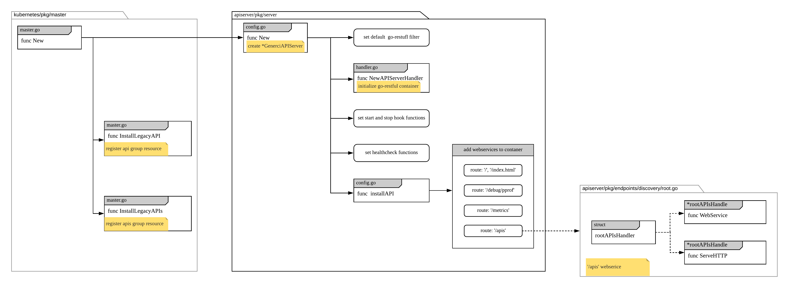

# Overview
after master config creation, kube apiserver is setup by `Complete` and `New` fucntion

# Complete
*kubernetes/pkg/master/master.go*

```go
// Complete fills in any fields not set that are required to have valid data. It's mutating the receiver.
func (cfg *Config) Complete() CompletedConfig {
	c := completedConfig{
		cfg.GenericConfig.Complete(cfg.ExtraConfig.VersionedInformers),
		&cfg.ExtraConfig,
	}

	serviceIPRange, apiServerServiceIP, err := DefaultServiceIPRange(c.ExtraConfig.ServiceIPRange)
	if err != nil {
		klog.Fatalf("Error determining service IP ranges: %v", err)
	}
	if c.ExtraConfig.ServiceIPRange.IP == nil {
		c.ExtraConfig.ServiceIPRange = serviceIPRange
	}
	if c.ExtraConfig.APIServerServiceIP == nil {
		c.ExtraConfig.APIServerServiceIP = apiServerServiceIP
	}

	discoveryAddresses := discovery.DefaultAddresses{DefaultAddress: c.GenericConfig.ExternalAddress}
	discoveryAddresses.CIDRRules = append(discoveryAddresses.CIDRRules,
		discovery.CIDRRule{IPRange: c.ExtraConfig.ServiceIPRange, Address: net.JoinHostPort(c.ExtraConfig.APIServerServiceIP.String(), strconv.Itoa(c.ExtraConfig.APIServerServicePort))})
	c.GenericConfig.DiscoveryAddresses = discoveryAddresses

	if c.ExtraConfig.ServiceNodePortRange.Size == 0 {
		// TODO: Currently no way to specify an empty range (do we need to allow this?)
		// We should probably allow this for clouds that don't require NodePort to do load-balancing (GCE)
		// but then that breaks the strict nestedness of ServiceType.
		// Review post-v1
		c.ExtraConfig.ServiceNodePortRange = kubeoptions.DefaultServiceNodePortRange
		klog.Infof("Node port range unspecified. Defaulting to %v.", c.ExtraConfig.ServiceNodePortRange)
	}

	if c.ExtraConfig.EndpointReconcilerConfig.Interval == 0 {
		c.ExtraConfig.EndpointReconcilerConfig.Interval = DefaultEndpointReconcilerInterval
	}

	if c.ExtraConfig.MasterEndpointReconcileTTL == 0 {
		c.ExtraConfig.MasterEndpointReconcileTTL = DefaultEndpointReconcilerTTL
	}

	if c.ExtraConfig.EndpointReconcilerConfig.Reconciler == nil {
		c.ExtraConfig.EndpointReconcilerConfig.Reconciler = cfg.createEndpointReconciler()
	}

	return CompletedConfig{&c}
}

// create reconciler to update kube-apiserver endpoints
// default is 'lease'
func (c *Config) createEndpointReconciler() reconcilers.EndpointReconciler {
	klog.Infof("Using reconciler: %v", c.ExtraConfig.EndpointReconcilerType)
	switch c.ExtraConfig.EndpointReconcilerType {
	// there are numerous test dependencies that depend on a default controller
	case "", reconcilers.MasterCountReconcilerType:
		//	based on master count
		return c.createMasterCountReconciler()
	case reconcilers.LeaseEndpointReconcilerType:
	   // based on etcd
		return c.createLeaseReconciler()
	case reconcilers.NoneEndpointReconcilerType:
		return c.createNoneReconciler()
	default:
		klog.Fatalf("Reconciler not implemented: %v", c.ExtraConfig.EndpointReconcilerType)
	}
	return nil
}

```

# New
* create generic server 
* complete API registry by installing api from *kubernetes/pkg/api* and apis from *kubernetes/pkg/apis*

```go
// New returns a new instance of Master from the given config.
// Certain config fields will be set to a default value if unset.
// Certain config fields must be specified, including:
//   KubeletClientConfig
func (c completedConfig) New(delegationTarget genericapiserver.DelegationTarget) (*Master, error) {
	if reflect.DeepEqual(c.ExtraConfig.KubeletClientConfig, kubeletclient.KubeletClientConfig{}) {
		return nil, fmt.Errorf("Master.New() called with empty config.KubeletClientConfig")
	}
	// create generic server
	s, err := c.GenericConfig.New("kube-apiserver", delegationTarget)
	if err != nil {
		return nil, err
	}

	// add webservice for '/logs'
	if c.ExtraConfig.EnableLogsSupport {
		routes.Logs{}.Install(s.Handler.GoRestfulContainer)
	}

	m := &Master{
		GenericAPIServer: s,
	}

	// install api
	if c.ExtraConfig.APIResourceConfigSource.VersionEnabled(apiv1.SchemeGroupVersion) {
		legacyRESTStorageProvider := corerest.LegacyRESTStorageProvider{
		...
		m.InstallLegacyAPI(&c, c.GenericConfig.RESTOptionsGetter, legacyRESTStorageProvider)
	}

	// install apis
	...
	m.InstallAPIs(c.ExtraConfig.APIResourceConfigSource, c.GenericConfig.RESTOptionsGetter, restStorageProviders...)

	if c.ExtraConfig.Tunneler != nil {
		m.installTunneler(c.ExtraConfig.Tunneler, corev1client.NewForConfigOrDie(c.GenericConfig.LoopbackClientConfig).Nodes())
	}

	m.GenericAPIServer.AddPostStartHookOrDie("ca-registration", c.ExtraConfig.ClientCARegistrationHook.PostStartHook)

	return m, nil
}
```

## initialize generic server
*apiserver/pkg/server/config.go*

```go
// New creates a new server which logically combines the handling chain with the passed server.
// name is used to differentiate for logging. The handler chain in particular can be difficult as it starts delgating.
// delegationTarget may not be nil.
func (c completedConfig) New(name string, delegationTarget DelegationTarget) (*GenericAPIServer, error) {
	...

	// set default go-restful filters which is defined in DefaultBuildHandlerChain
	handlerChainBuilder := func(handler http.Handler) http.Handler {
		return c.BuildHandlerChainFunc(handler, c.Config)
	}
	
	// create server handler which is a wrapper of go-restful container
	apiServerHandler := NewAPIServerHandler(name, c.Serializer, handlerChainBuilder, delegationTarget.UnprotectedHandler())

	s := &GenericAPIServer{
		...	
		Handler: apiServerHandler,
		listedPathProvider: apiServerHandler,
		DiscoveryGroupManager: discovery.NewRootAPIsHandler(c.DiscoveryAddresses, c.Serializer),
		...
	}

	// ?? not sure what's this for
	for {
		if c.JSONPatchMaxCopyBytes <= 0 {
			break
		}
		existing := atomic.LoadInt64(&jsonpatch.AccumulatedCopySizeLimit)
		if existing > 0 && existing < c.JSONPatchMaxCopyBytes {
			break
		}
		if atomic.CompareAndSwapInt64(&jsonpatch.AccumulatedCopySizeLimit, existing, c.JSONPatchMaxCopyBytes) {
			break
		}
	}

	// set hook function for start and stop
	for k, v := range delegationTarget.PostStartHooks() {
		s.postStartHooks[k] = v
	}

	for k, v := range delegationTarget.PreShutdownHooks() {
		s.preShutdownHooks[k] = v
	}

	genericApiServerHookName := "generic-apiserver-start-informers"
	if c.SharedInformerFactory != nil && !s.isPostStartHookRegistered(genericApiServerHookName) {
		err := s.AddPostStartHook(genericApiServerHookName, func(context PostStartHookContext) error {
			c.SharedInformerFactory.Start(context.StopCh)
			return nil
		})
		if err != nil {
			return nil, err
		}
	}

	// set health check function
	for _, delegateCheck := range delegationTarget.HealthzChecks() {
		skip := false
		for _, existingCheck := range c.HealthzChecks {
			if existingCheck.Name() == delegateCheck.Name() {
				skip = true
				break
			}
		}
		if skip {
			continue
		}

		s.healthzChecks = append(s.healthzChecks, delegateCheck)
	}

	s.listedPathProvider = routes.ListedPathProviders{s.listedPathProvider, delegationTarget}

	// create webservice for list api groups
	installAPI(s, c.Config)

	// use the UnprotectedHandler from the delegation target to ensure that we don't attempt to double authenticator, authorize,
	// or some other part of the filter chain in delegation cases.
	if delegationTarget.UnprotectedHandler() == nil && c.EnableIndex {
		s.Handler.NonGoRestfulMux.NotFoundHandler(routes.IndexLister{
			StatusCode:   http.StatusNotFound,
			PathProvider: s.listedPathProvider,
		})
	}

	return s, nil
}
```

### create go-restful container
*apiserver/pkg/server/handler.go*

```go
func NewAPIServerHandler(name string, s runtime.NegotiatedSerializer, handlerChainBuilder HandlerChainBuilderFn, notFoundHandler http.Handler) *APIServerHandler {
	...

	// create a go-restful container
	gorestfulContainer := restful.NewContainer()
	// actually these two values are default  in go-restful
	gorestfulContainer.ServeMux = http.NewServeMux()
	gorestfulContainer.Router(restful.CurlyRouter{}) // e.g. for proxy/{kind}/{name}/{*}
	// set handler for panic and error
	gorestfulContainer.RecoverHandler(func(panicReason interface{}, httpWriter http.ResponseWriter) {
		logStackOnRecover(s, panicReason, httpWriter)
	})
	gorestfulContainer.ServiceErrorHandler(func(serviceErr restful.ServiceError, request *restful.Request, response *restful.Response) {
		serviceErrorHandler(s, serviceErr, request, response)
	})

	director := director{
		name:               name,
		goRestfulContainer: gorestfulContainer,
		nonGoRestfulMux:    nonGoRestfulMux,
	}

	return &APIServerHandler{
		// HandlerChainBuilderFn is used to wrap the GoRestfulContainer handler using the provided handler chain.
		// It is normally used to apply filtering like authentication and authorization
		FullHandlerChain:   handlerChainBuilder(director),
		GoRestfulContainer: gorestfulContainer,
		NonGoRestfulMux:    nonGoRestfulMux,
		Director:           director,
	}
}
```

### create webservices
*apiserver/pkg/server/config.go*

```go
func installAPI(s *GenericAPIServer, c *Config) {
	// webservice for root path '/', '/index.html' 
	if c.EnableIndex {
		routes.Index{}.Install(s.listedPathProvider, s.Handler.NonGoRestfulMux)
	}
	// webservice for pprof '/debug/pprof'
	if c.EnableProfiling {
		routes.Profiling{}.Install(s.Handler.NonGoRestfulMux)
		if c.EnableContentionProfiling {
			goruntime.SetBlockProfileRate(1)
		}
		// so far, only logging related endpoints are considered valid to add for these debug flags.
		routes.DebugFlags{}.Install(s.Handler.NonGoRestfulMux, "v", routes.StringFlagPutHandler(logs.GlogSetter))
	}
	// webservice for metrics, '/metrics'
	if c.EnableMetrics {
		if c.EnableProfiling {
			routes.MetricsWithReset{}.Install(s.Handler.NonGoRestfulMux)
		} else {
			routes.DefaultMetrics{}.Install(s.Handler.NonGoRestfulMux)
		}
	}

	routes.Version{Version: c.Version}.Install(s.Handler.GoRestfulContainer)

	// create webservice for api groups list, '/apis'
	// and add it to container
	if c.EnableDiscovery {
		s.Handler.GoRestfulContainer.Add(s.DiscoveryGroupManager.WebService())
	}
}
```

#### create api group webservice
*apiserver/pkg/endpoints/discovery/root.go*

```go
// s.DiscoveryGroupManager is a rootAPIsHandler
func NewRootAPIsHandler(addresses Addresses, serializer runtime.NegotiatedSerializer) *rootAPIsHandler {
	// Because in release 1.1, /apis returns response with empty APIVersion, we
	// use stripVersionNegotiatedSerializer to keep the response backwards
	// compatible.
	serializer = stripVersionNegotiatedSerializer{serializer}

	return &rootAPIsHandler{
		addresses:  addresses,
		serializer: serializer,
		apiGroups:  map[string]metav1.APIGroup{},
	}
}

// WebService returns a webservice serving api group discovery.
// Note: during the server runtime apiGroups might change.
func (s *rootAPIsHandler) WebService() *restful.WebService {
	mediaTypes, _ := negotiation.MediaTypesForSerializer(s.serializer)
	ws := new(restful.WebService)
	// const APIGroupPrefix = "/apis"
	ws.Path(APIGroupPrefix)
	ws.Doc("get available API versions")
	ws.Route(ws.GET("/").To(s.restfulHandle).
		Doc("get available API versions").
		Operation("getAPIVersions").
		Produces(mediaTypes...).
		Consumes(mediaTypes...).
		Writes(metav1.APIGroupList{}))
	return ws
}

// handler for '/apis' route
func (s *rootAPIsHandler) ServeHTTP(resp http.ResponseWriter, req *http.Request) {
	s.lock.RLock()
	defer s.lock.RUnlock()

	orderedGroups := []metav1.APIGroup{}
	for _, groupName := range s.apiGroupNames {
		orderedGroups = append(orderedGroups, s.apiGroups[groupName])
	}

	clientIP := utilnet.GetClientIP(req)
	serverCIDR := s.addresses.ServerAddressByClientCIDRs(clientIP)
	groups := make([]metav1.APIGroup, len(orderedGroups))
	for i := range orderedGroups {
		groups[i] = orderedGroups[i]
		groups[i].ServerAddressByClientCIDRs = serverCIDR
	}

	responsewriters.WriteObjectNegotiated(s.serializer, negotiation.DefaultEndpointRestrictions, schema.GroupVersion{}, resp, req, http.StatusOK, &metav1.APIGroupList{Groups: groups})
}


```
