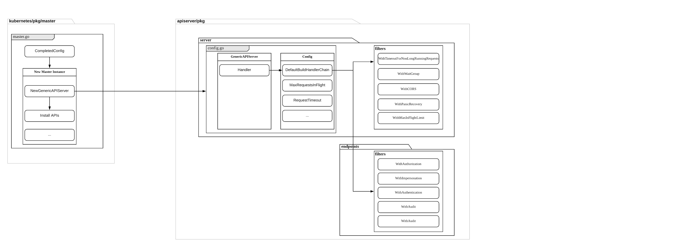

# Table of contents
1. [overview](#overview)
2. [authentication](#authentication)
   * [WithAuthentication](#WithAuthentication)
   * [Authenticator Initialization](#Authenticator-Initialization)
   * [Authenctication Configuration](#Authenctication-Configuration)
   * [Add Authenticators](#Add-Authenticators)
3. [authorization](#auhtorization)
   * [WithAuthorization](#WithAuthorization)
   * [Authorizer Initialization](#Authorizer-Initialization)
   * [Authorization Configuration](#Authorization-Configuration)
   * [Add Authorizers](#Add-Authorizers)


# Overview
user request is handled by filters before resource handler.
recall from **03-master-startup**(`initialize generic server`).
filter handlers are added to handler chain.



```go
func (c completedConfig) New(name string, delegationTarget DelegationTarget) (*GenericAPIServer, error) {
	...

	handlerChainBuilder := func(handler http.Handler) http.Handler {
		return c.BuildHandlerChainFunc(handler, c.Config)
	}
	apiServerHandler := NewAPIServerHandler(name, c.Serializer, handlerChainBuilder, delegationTarget.UnprotectedHandler())
	...
}
```
filter functions are defined in `c.Config`

```go
func NewConfig(codecs serializer.CodecFactory) *Config {
	return &Config{
		Serializer:                  codecs,
		BuildHandlerChainFunc:       DefaultBuildHandlerChain,
		...
	}
}
```
default filters, excute order is from bottom to top. i.e. `WithPanicRecovery` -> `WithAuthorization`

```go
func DefaultBuildHandlerChain(apiHandler http.Handler, c *Config) http.Handler {
	handler := genericapifilters.WithAuthorization(apiHandler, c.Authorization.Authorizer, c.Serializer)
	// limits the number of in-flight requests to buffer size of the passed in channel.
	handler = genericfilters.WithMaxInFlightLimit(handler, c.MaxRequestsInFlight, c.MaxMutatingRequestsInFlight, c.LongRunningFunc)
	// inspect and check requests that attempt to change the user.Info for their requests
	handler = genericapifilters.WithImpersonation(handler, c.Authorization.Authorizer, c.Serializer)
	handler = genericapifilters.WithAudit(handler, c.AuditBackend, c.AuditPolicyChecker, c.LongRunningFunc)
	failedHandler := genericapifilters.Unauthorized(c.Serializer, c.Authentication.SupportsBasicAuth)
	failedHandler = genericapifilters.WithFailedAuthenticationAudit(failedHandler, c.AuditBackend, c.AuditPolicyChecker)
	handler = genericapifilters.WithAuthentication(handler, c.Authentication.Authenticator, failedHandler, c.Authentication.APIAudiences)
	// a simple CORS implementation that wraps an http Handler.
	handler = genericfilters.WithCORS(handler, c.CorsAllowedOriginList, nil, nil, nil, "true")
	// times out non-long-running requests after the time given by timeout.
	handler = genericfilters.WithTimeoutForNonLongRunningRequests(handler, c.LongRunningFunc, c.RequestTimeout)
	// adds all non long-running requests to wait group, which is used for graceful shutdown.
	handler = genericfilters.WithWaitGroup(handler, c.LongRunningFunc, c.HandlerChainWaitGroup)
	/*
		attaches a RequestInfo to the context.
		type RequestInfo struct {
		  ...
	      Path string
	      Verb string
	      APIPrefix  string
	      APIGroup   string
	      APIVersion string
	      Namespace  string
	      Parts []string
       }
	*/
	handler = genericapifilters.WithRequestInfo(handler, c.RequestInfoResolver)
	// wraps an http Handler to recover and log panics.
	handler = genericfilters.WithPanicRecovery(handler)
	return handler
}
```

# Authentication
## WithAuthentication
it basically calls `auth.AuthenticateRequest` to do the job


```go
func WithAuthentication(handler http.Handler, auth authenticator.Request, failed http.Handler, apiAuds authenticator.Audiences) http.Handler {
	if auth == nil {
		klog.Warningf("Authentication is disabled")
		return handler
	}
	return http.HandlerFunc(func(w http.ResponseWriter, req *http.Request) {
		if len(apiAuds) > 0 {
			req = req.WithContext(authenticator.WithAudiences(req.Context(), apiAuds))
		}
		resp, ok, err := auth.AuthenticateRequest(req)
		if err != nil || !ok {
			if err != nil {
				klog.Errorf("Unable to authenticate the request due to an error: %v", err)
			}
			failed.ServeHTTP(w, req)
			return
		}

		// TODO(mikedanese): verify the response audience matches one of apiAuds if
		// non-empty

		// authorization header is not required anymore in case of a successful authentication.
		req.Header.Del("Authorization")

		req = req.WithContext(genericapirequest.WithUser(req.Context(), resp.User))

		authenticatedUserCounter.WithLabelValues(compressUsername(resp.User.GetName())).Inc()

		handler.ServeHTTP(w, req)
	})
}
```
## Authenticator Initialization
`auth authenticator.Request` is from `c.Authentication.Authenticator`.
recall from **02-master-config**

*kubernetes/cmd/kube-apiserver/app/server.go*

```go
func buildGenericConfig(
	s *options.ServerRunOptions,
	proxyTransport *http.Transport,
) () {
    ...
	genericConfig.Authentication.Authenticator, genericConfig.OpenAPIConfig.SecurityDefinitions, err = BuildAuthenticator(s, clientgoExternalClient, versionedInformers)
	...
}

// BuildAuthenticator constructs the authenticator
func BuildAuthenticator(s *options.ServerRunOptions, extclient clientgoclientset.Interface, versionedInformer clientgoinformers.SharedInformerFactory) (authenticator.Request, *spec.SecurityDefinitions, error) {
	authenticatorConfig := s.Authentication.ToAuthenticationConfig()
	if s.Authentication.ServiceAccounts.Lookup {
		authenticatorConfig.ServiceAccountTokenGetter = serviceaccountcontroller.NewGetterFromClient(
			extclient,
			versionedInformer.Core().V1().Secrets().Lister(),
			versionedInformer.Core().V1().ServiceAccounts().Lister(),
			versionedInformer.Core().V1().Pods().Lister(),
		)
	}
	authenticatorConfig.BootstrapTokenAuthenticator = bootstrap.NewTokenAuthenticator(
		versionedInformer.Core().V1().Secrets().Lister().Secrets(v1.NamespaceSystem),
	)

	return authenticatorConfig.New()
}
```
## Authenctication Configuration
recall from **01-entry**, `kubernetes/pkg/kubeapiserver/options/authentication.go`

```go
func NewBuiltInAuthenticationOptions() *BuiltInAuthenticationOptions {
	return &BuiltInAuthenticationOptions{
		TokenSuccessCacheTTL: 10 * time.Second,
		TokenFailureCacheTTL: 0 * time.Second,
	}
}

func (s *BuiltInAuthenticationOptions) WithAll() *BuiltInAuthenticationOptions {
	return s.
		WithAnonymous().
		WithBootstrapToken().
		WithClientCert().
		WithOIDC().
		WithPasswordFile().
		WithRequestHeader().
		WithServiceAccounts().
		WithTokenFile().
		WithWebHook()
}
```
## Add Authenticators
*kubernetes/pkg/kubeapiserver/authenticator/config.go*
based on configurations, add authencticator plugins.

```go
func (config Config) New() (authenticator.Request, *spec.SecurityDefinitions, error) {
	var authenticators []authenticator.Request
	var tokenAuthenticators []authenticator.Token
	securityDefinitions := spec.SecurityDefinitions{}

	// front-proxy, BasicAuth methods, local first, then remote
	// Add the front proxy authenticator if requested
	if config.RequestHeaderConfig != nil {
		requestHeaderAuthenticator, err := headerrequest.NewSecure(
			config.RequestHeaderConfig.ClientCA,
			config.RequestHeaderConfig.AllowedClientNames,
			config.RequestHeaderConfig.UsernameHeaders,
			config.RequestHeaderConfig.GroupHeaders,
			config.RequestHeaderConfig.ExtraHeaderPrefixes,
		)
		if err != nil {
			return nil, nil, err
		}
		authenticators = append(authenticators, authenticator.WrapAudienceAgnosticRequest(config.APIAudiences, requestHeaderAuthenticator))
	}

	// basic auth
	if len(config.BasicAuthFile) > 0 {
		basicAuth, err := newAuthenticatorFromBasicAuthFile(config.BasicAuthFile)
		if err != nil {
			return nil, nil, err
		}
		authenticators = append(authenticators, authenticator.WrapAudienceAgnosticRequest(config.APIAudiences, basicAuth))

		securityDefinitions["HTTPBasic"] = &spec.SecurityScheme{
			SecuritySchemeProps: spec.SecuritySchemeProps{
				Type:        "basic",
				Description: "HTTP Basic authentication",
			},
		}
	}

	// X509 methods
	if len(config.ClientCAFile) > 0 {
		certAuth, err := newAuthenticatorFromClientCAFile(config.ClientCAFile)
		if err != nil {
			return nil, nil, err
		}
		authenticators = append(authenticators, certAuth)
	}

	// Bearer token methods, local first, then remote
	if len(config.TokenAuthFile) > 0 {
		tokenAuth, err := newAuthenticatorFromTokenFile(config.TokenAuthFile)
		if err != nil {
			return nil, nil, err
		}
		tokenAuthenticators = append(tokenAuthenticators, authenticator.WrapAudienceAgnosticToken(config.APIAudiences, tokenAuth))
	}
	if len(config.ServiceAccountKeyFiles) > 0 {
		serviceAccountAuth, err := newLegacyServiceAccountAuthenticator(config.ServiceAccountKeyFiles, config.ServiceAccountLookup, config.APIAudiences, config.ServiceAccountTokenGetter)
		if err != nil {
			return nil, nil, err
		}
		tokenAuthenticators = append(tokenAuthenticators, serviceAccountAuth)
	}
	if config.BootstrapToken {
		if config.BootstrapTokenAuthenticator != nil {
			// TODO: This can sometimes be nil because of
			tokenAuthenticators = append(tokenAuthenticators, authenticator.WrapAudienceAgnosticToken(config.APIAudiences, config.BootstrapTokenAuthenticator))
		}
	}
	...
	if len(tokenAuthenticators) > 0 {
		// Union the token authenticators
		tokenAuth := tokenunion.New(tokenAuthenticators...)
		// Optionally cache authentication results
		if config.TokenSuccessCacheTTL > 0 || config.TokenFailureCacheTTL > 0 {
			tokenAuth = tokencache.New(tokenAuth, true, config.TokenSuccessCacheTTL, config.TokenFailureCacheTTL)
		}
		authenticators = append(authenticators, bearertoken.New(tokenAuth), websocket.NewProtocolAuthenticator(tokenAuth))
		securityDefinitions["BearerToken"] = &spec.SecurityScheme{
			SecuritySchemeProps: spec.SecuritySchemeProps{
				Type:        "apiKey",
				Name:        "authorization",
				In:          "header",
				Description: "Bearer Token authentication",
			},
		}
	}

	if len(authenticators) == 0 {
		if config.Anonymous {
			return anonymous.NewAuthenticator(), &securityDefinitions, nil
		}
		return nil, &securityDefinitions, nil
	}

	authenticator := union.New(authenticators...)

	authenticator = group.NewAuthenticatedGroupAdder(authenticator)

	if config.Anonymous {
		// If the authenticator chain returns an error, return an error (don't consider a bad bearer token
		// or invalid username/password combination anonymous).
		authenticator = union.NewFailOnError(authenticator, anonymous.NewAuthenticator())
	}

	return authenticator, &securityDefinitions, nil
}

```
### Union Authenticator
all authenticators are added to union authenticator.`authenticator := union.New(authenticators...)`,then it's wrapped into `AuthenticatedGroupAdder `
 
`kubernetes/staging/src/k8s.io/apiserver/pkg/authentication/group/authenticated_group_adder.go`

```go
// AuthenticatedGroupAdder adds system:authenticated group when appropriate
type AuthenticatedGroupAdder struct {
	// Authenticator is delegated to make the authentication decision
	Authenticator authenticator.Request
}

// NewAuthenticatedGroupAdder wraps a request authenticator, and adds the system:authenticated group when appropriate.
// Authentication must succeed, the user must not be system:anonymous, the groups system:authenticated or system:unauthenticated must
// not be present
func NewAuthenticatedGroupAdder(auth authenticator.Request) authenticator.Request {
	return &AuthenticatedGroupAdder{auth}
}
```
so `auth authenticator.Request` == `group.NewAuthenticatedGroupAdder(authenticator)`

### AuthenticateRequest
`auth.AuthenticateRequest(req)` will call `AuthenticatedGroupAdder.AuthenticateRequest`

```go
func (g *AuthenticatedGroupAdder) AuthenticateRequest(req *http.Request) (*authenticator.Response, bool, error) {
	r, ok, err := g.Authenticator.AuthenticateRequest(req)
	if err != nil || !ok {
		return nil, ok, err
	}

	if r.User.GetName() == user.Anonymous {
		return r, true, nil
	}
	for _, group := range r.User.GetGroups() {
		if group == user.AllAuthenticated || group == user.AllUnauthenticated {
			return r, true, nil
		}
	}

	r.User = &user.DefaultInfo{
		Name:   r.User.GetName(),
		UID:    r.User.GetUID(),
		Groups: append(r.User.GetGroups(), user.AllAuthenticated),
		Extra:  r.User.GetExtra(),
	}
	return r, true, nil
}
```
it will call union authenticator AuthenticateRequest which will call 
`kubernetes/staging/src/k8s.io/apiserver/pkg/authentication/request/union/union.go`

```go
func (authHandler *unionAuthRequestHandler) AuthenticateRequest(req *http.Request) (*authenticator.Response, bool, error) {
	var errlist []error
	for _, currAuthRequestHandler := range authHandler.Handlers {
		resp, ok, err := currAuthRequestHandler.AuthenticateRequest(req)
		if err != nil {
			if authHandler.FailOnError {
				return resp, ok, err
			}
			errlist = append(errlist, err)
			continue
		}

		if ok {
			return resp, ok, err
		}
	}

	return nil, false, utilerrors.NewAggregate(errlist)
}

```

# Authorization
## WithAuthorization
it basically calls `a.Authorize(attributes)` to do the job

```go
func WithAuthorization(handler http.Handler, a authorizer.Authorizer, s runtime.NegotiatedSerializer) http.Handler {
	if a == nil {
		klog.Warningf("Authorization is disabled")
		return handler
	}
	return http.HandlerFunc(func(w http.ResponseWriter, req *http.Request) {
		ctx := req.Context()
		ae := request.AuditEventFrom(ctx)

		attributes, err := GetAuthorizerAttributes(ctx)
		if err != nil {
			responsewriters.InternalError(w, req, err)
			return
		}
		authorized, reason, err := a.Authorize(attributes)
		// an authorizer like RBAC could encounter evaluation errors and still allow the request, so authorizer decision is checked before error here.
		if authorized == authorizer.DecisionAllow {
			audit.LogAnnotation(ae, decisionAnnotationKey, decisionAllow)
			audit.LogAnnotation(ae, reasonAnnotationKey, reason)
			handler.ServeHTTP(w, req)
			return
		}
		if err != nil {
			audit.LogAnnotation(ae, reasonAnnotationKey, reasonError)
			responsewriters.InternalError(w, req, err)
			return
		}

		klog.V(4).Infof("Forbidden: %#v, Reason: %q", req.RequestURI, reason)
		audit.LogAnnotation(ae, decisionAnnotationKey, decisionForbid)
		audit.LogAnnotation(ae, reasonAnnotationKey, reason)
		responsewriters.Forbidden(ctx, attributes, w, req, reason, s)
	})
}
```

## Authorizer Initialization
`a authorizer.Authorizer` is from `c.Authorization.Authorizer`.
recall from **02-master-config**

*kubernetes/cmd/kube-apiserver/app/server.go*

```go
func buildGenericConfig(
	s *options.ServerRunOptions,
	proxyTransport *http.Transport,
) () {
    ...
	genericConfig.Authorization.Authorizer, genericConfig.RuleResolver, err = BuildAuthorizer(s, versionedInformers)
	...
}

func BuildAuthorizer(s *options.ServerRunOptions, versionedInformers clientgoinformers.SharedInformerFactory) (authorizer.Authorizer, authorizer.RuleResolver, error) {
	authorizationConfig := s.Authorization.ToAuthorizationConfig(versionedInformers)
	return authorizationConfig.New()
}
```

## Authorization Configuration
recall from **01-entry**, `kubernetes/pkg/kubeapiserver/options/authorization.go`
the default authorize mode is `ModeAlwaysAllow`.

```go
func NewBuiltInAuthorizationOptions() *BuiltInAuthorizationOptions {
	return &BuiltInAuthorizationOptions{
		Modes:                       []string{authzmodes.ModeAlwaysAllow},
		WebhookCacheAuthorizedTTL:   5 * time.Minute,
		WebhookCacheUnauthorizedTTL: 30 * time.Second,
	}
}func (s *BuiltInAuthorizationOptions) ToAuthorizationConfig(versionedInformerFactory versionedinformers.SharedInformerFactory) authorizer.Config {
	return authorizer.Config{
		AuthorizationModes:          s.Modes,
		PolicyFile:                  s.PolicyFile,
		WebhookConfigFile:           s.WebhookConfigFile,
		WebhookCacheAuthorizedTTL:   s.WebhookCacheAuthorizedTTL,
		WebhookCacheUnauthorizedTTL: s.WebhookCacheUnauthorizedTTL,
		VersionedInformerFactory:    versionedInformerFactory,
	}
}
```

## Add Authorizers
samilar with authentication, it return a union authorizer and use it do go through each authorizer.

```go
/ New returns the right sort of union of multiple authorizer.Authorizer objects
// based on the authorizationMode or an error.
func (config Config) New() (authorizer.Authorizer, authorizer.RuleResolver, error) {
	if len(config.AuthorizationModes) == 0 {
		return nil, nil, fmt.Errorf("at least one authorization mode must be passed")
	}

	var (
		authorizers   []authorizer.Authorizer
		ruleResolvers []authorizer.RuleResolver
	)

	for _, authorizationMode := range config.AuthorizationModes {
		// Keep cases in sync with constant list in k8s.io/kubernetes/pkg/kubeapiserver/authorizer/modes/modes.go.
		switch authorizationMode {
		case modes.ModeNode:
			graph := node.NewGraph()
			node.AddGraphEventHandlers(
				graph,
				config.VersionedInformerFactory.Core().V1().Nodes(),
				config.VersionedInformerFactory.Core().V1().Pods(),
				config.VersionedInformerFactory.Core().V1().PersistentVolumes(),
				config.VersionedInformerFactory.Storage().V1().VolumeAttachments(),
			)
			nodeAuthorizer := node.NewAuthorizer(graph, nodeidentifier.NewDefaultNodeIdentifier(), bootstrappolicy.NodeRules())
			authorizers = append(authorizers, nodeAuthorizer)

		case modes.ModeAlwaysAllow:
			alwaysAllowAuthorizer := authorizerfactory.NewAlwaysAllowAuthorizer()
			authorizers = append(authorizers, alwaysAllowAuthorizer)
			ruleResolvers = append(ruleResolvers, alwaysAllowAuthorizer)
		case modes.ModeAlwaysDeny:
			alwaysDenyAuthorizer := authorizerfactory.NewAlwaysDenyAuthorizer()
			authorizers = append(authorizers, alwaysDenyAuthorizer)
			ruleResolvers = append(ruleResolvers, alwaysDenyAuthorizer)
		case modes.ModeABAC:
			abacAuthorizer, err := abac.NewFromFile(config.PolicyFile)
			if err != nil {
				return nil, nil, err
			}
			authorizers = append(authorizers, abacAuthorizer)
			ruleResolvers = append(ruleResolvers, abacAuthorizer)
		case modes.ModeWebhook:
			webhookAuthorizer, err := webhook.New(config.WebhookConfigFile,
				config.WebhookCacheAuthorizedTTL,
				config.WebhookCacheUnauthorizedTTL)
			if err != nil {
				return nil, nil, err
			}
			authorizers = append(authorizers, webhookAuthorizer)
			ruleResolvers = append(ruleResolvers, webhookAuthorizer)
		case modes.ModeRBAC:
			rbacAuthorizer := rbac.New(
				&rbac.RoleGetter{Lister: config.VersionedInformerFactory.Rbac().V1().Roles().Lister()},
				&rbac.RoleBindingLister{Lister: config.VersionedInformerFactory.Rbac().V1().RoleBindings().Lister()},
				&rbac.ClusterRoleGetter{Lister: config.VersionedInformerFactory.Rbac().V1().ClusterRoles().Lister()},
				&rbac.ClusterRoleBindingLister{Lister: config.VersionedInformerFactory.Rbac().V1().ClusterRoleBindings().Lister()},
			)
			authorizers = append(authorizers, rbacAuthorizer)
			ruleResolvers = append(ruleResolvers, rbacAuthorizer)
		default:
			return nil, nil, fmt.Errorf("unknown authorization mode %s specified", authorizationMode)
		}
	}

	return union.New(authorizers...), union.NewRuleResolvers(ruleResolvers...), nil
}
```
